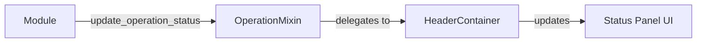
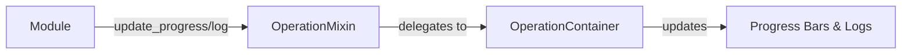
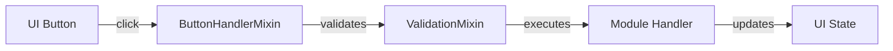
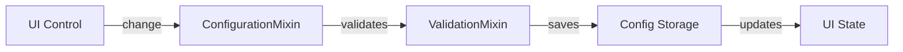
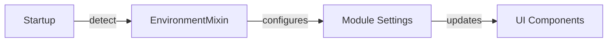

# 🏗️ SmartCash UI Architecture

## 🌳 Component Hierarchy

### Core Components
```
📦 BaseUIModule
├── 🧩 ConfigurationMixin
│   ├── get_config()
│   ├── update_config()
│   ├── save_config()
│   ├── reset_config()
│   └── validate_config()
│
├── 🎛️ OperationMixin
│   ├── Operation Management
│   │   ├── register_operation_handler()
│   │   ├── execute_operation()
│   │   ├── list_operations()
│   │   ├── get_operation_result()
│   │   └── is_operation_running()
│   │
│   ├── Status & Progress
│   │   ├── update_operation_status() → header_container.update_status()
│   │   ├── update_progress() → operation_container.update_progress()
│   │   └── log_operation() → operation_container.log()
│   │
│   ├── Summary Management
│   │   ├── update_summary() → summary_container.set_html()
│   │   ├── show_summary_message() → summary_container.show_message()
│   │   ├── show_summary_status() → summary_container.show_status()
│   │   └── clear_summary()
│   │
│   ├── Dialog Management
│   │   ├── show_operation_dialog() → operation_container.show_dialog()
│   │   ├── clear_operation_dialog()
│   │   ├── show_info_dialog()
│   │   ├── show_warning_dialog()
│   │   ├── show_error_dialog()
│   │   └── show_success_dialog()
│   │
│   └── Lifecycle
│       ├── initialize()
│       ├── get_status()
│       └── cleanup()
│
├── 📝 LoggingMixin
│   ├── log()
│   ├── debug()
│   ├── info()
│   ├── warning()
│   └── error()
│
├── 🔘 ButtonHandlerMixin
│   ├── register_button_handler()
│   ├── handle_button_click()
│   ├── enable_button()
│   └── disable_button()
│
├── ✅ ValidationMixin
│   ├── validate_input()
│   ├── add_validation_rule()
│   └── clear_validation_errors()
│
├── 🎨 DisplayMixin
│   ├── show_message()
│   ├── show_error()
│   └── update_ui_theme()
│
└── 🌍 EnvironmentMixin (optional)
    ├── detect_environment()
    ├── get_environment_paths()
    └── setup_environment()
```

### UI Containers
```
📦 main_container.py (Root Container)
├── add_component() - Add a new component with configurable order
├── remove_component() - Remove a component by name or type
├── update_style() - Update container styling
└── get_container() - Get the underlying container widget

📋 header_container.py (Status Management)
├── update_title() - Update title, subtitle, and/or icon
├── update_status() - Update status message and type
├── show_status() - Show or hide the status panel
└── add_class()/remove_class() - Manage CSS classes

🏗️ operation_container.py (Progress, Logs & Dialogs)
├── Progress Tracking
│   ├── update_progress() - Update progress with message and level
│   ├── set_progress_visibility() - Show/hide specific progress bars
│   ├── complete_progress() - Mark progress as complete
│   ├── error_progress() - Mark progress as errored
│   └── reset_progress() - Reset progress for a level or all levels
│
├── Dialog Management
│   ├── show_dialog() - Show confirmation dialog with callbacks
│   ├── show_info_dialog() - Show informational dialog
│   ├── show_warning_dialog() - Show warning dialog
│   ├── show_error_dialog() - Show error dialog
│   ├── show_success_dialog() - Show success dialog
│   ├── show_custom_dialog() - Show dialog with custom HTML
│   ├── clear_dialog() - Clear current dialog
│   ├── close_dialog() - Close dialog by title
│   └── is_dialog_visible() - Check if any dialog is visible
│
└── Logging
    ├── log() - Log message with specified level
    ├── debug() - Log debug message
    ├── info() - Log info message
    ├── warning() - Log warning message
    ├── error() - Log error message
    ├── critical() - Log critical message
    ├── clear_logs() - Clear all log messages
    └── export_logs() - Export logs as formatted string

📊 summary_container.py (Summary Display)
├── set_content() - Set raw HTML content
├── set_theme() - Change the container's theme
├── set_html() - Set HTML content with optional theme
├── show_message() - Display a message with title and type
├── show_status() - Show status items with values
└── clear() - Clear the container content

📝 form_container.py (Form Handling)
├── create_form_container() - Creates a form with specified layout
├── add_item() - Adds form elements to the container
└── set_layout() - Updates the form layout dynamically

📈 chart_container.py (Data Visualization)
├── add_chart() - Adds a new chart to the container
├── update_chart() - Updates chart data and configuration
├── set_chart_type() - Changes the chart type
└── export_chart() - Exports the chart as an image

🎯 action_container.py (Action Buttons)
├── add_button() - Adds a button with custom properties
├── get_button() - Retrieves a button by ID
├── set_phase() - Updates the primary button's phase
└── set_phases() - Configures available phases for the primary button

🏁 footer_container.py (System Status)
├── add_panel()
├── remove_panel()
├── update_panel()
├── clear_panels()
└── show()
```

## 🏛️ Core Architecture

### BaseUIModule
Base class that integrates all common mixins and provides standard functionality for UI modules. Acts as a config orchestrator, delegating implementation to separate config_handler classes.

**Inherits From:**
- `ConfigurationMixin`
- `OperationMixin`
- `LoggingMixin`
- `ButtonHandlerMixin`
- `ValidationMixin`
- `DisplayMixin`
- `ABC` (abstract base class)

**Key Features:**
- **Config Orchestration**: Delegates all config operations to module-specific config_handler classes
- **Operation Management**: Handles operation lifecycle and progress tracking
- **Button Integration**: Comprehensive button handler registration and management
- **Progress Tracking**: Supports dual and single progress tracking patterns
- **Log Redirection**: All logs properly redirected to operation container
- **Environment Support**: Optional environment detection and management

### Core Containers

#### 🏗️ MainContainer
- Root container that holds all other containers
- Manages layout and container relationships
- Handles window resizing and responsive behavior

#### 📋 HeaderContainer
- Displays status messages and module title
- Shows operation progress indicators
- Manages status bar notifications

#### 🛠️ OperationContainer
- Handles progress tracking and display
- Manages operation logs and output
- Displays interactive dialogs and prompts

#### 📊 SummaryContainer
- Shows rich content and summaries
- Displays status cards and metrics
- Supports HTML/Markdown content

#### 📝 FormContainer
- Manages form inputs and validation
- Handles form layout and grouping
- Supports dynamic form generation

#### 📈 ChartContainer
- Displays data visualizations
- Supports multiple chart types
- Handles data updates and animations

#### 🎯 ActionContainer
- Manages action buttons and controls
- Handles button grouping and layout
- Manages button states and callbacks

#### 🏁 FooterContainer
- Displays system status and messages
- Shows version information
- Handles navigation controls

## 🧠 Core Mixins

### BaseUIModule
- Inherits all mixins below
- Provides unified interface
- Manages component lifecycle
- **configuration_mixin.py**: Configuration management and persistence
- **logging_mixin.py**: Centralized logging functionality
- **validation_mixin.py**: Input validation and sanitization
- **display_mixin.py**: Common display utilities and theming
- **environment_mixin.py**: Environment detection and management

## 🧩 Mixin Details

### ConfigurationMixin
- Manages module configuration
- Handles loading/saving settings
- Provides configuration validation

### LoggingMixin
- Centralized logging
- Log level management
- Log formatting and output

### ButtonHandlerMixin
- Button state management
- Click event handling
- Button enable/disable functionality

### ValidationMixin
- Input validation
- Data sanitization
- Validation rules and messages

### DisplayMixin
- Common UI utilities
- Theme management
- Responsive layout helpers

### EnvironmentMixin (when enabled)
- Environment detection
- Path management
- Environment-specific features

## 🔄 Data Flow

### 1. Status Updates

- **Path**: Module → OperationMixin → HeaderContainer → UI
- **Purpose**: Show current operation state to user
- **Example**: "Processing...", "Operation completed"

### 2. Progress & Logs

- **Path**: Module → OperationMixin → OperationContainer → UI
- **Components**: Progress bars, log messages, operation details
- **Features**: Multi-level progress tracking, log filtering

### 3. User Interactions

- **Flow**: Click → Validation → Execution → UI Update
- **Features**: Input validation, button state management, error handling

### 4. Configuration Changes

- **Flow**: User Input → Validation → Persistence → UI Update
- **Features**: Config validation, auto-save, change tracking

### 5. Environment Detection

- **Flow**: Initialization → Detection → Configuration → UI Adaptation
- **Features**: Auto-detect platform, adjust paths, enable/disable features

## ✅ Key Benefits
- **Clean Separation**: Each component has a single responsibility
- **DRY Code**: No duplicate functionality
- **Maintainable**: Changes are localized
- **Scalable**: Easy to add new features
- **Consistent**: Unified theming and behavior

## 🛠️ Usage Examples

### Status Updates
```python
# Update status in header
self.update_operation_status("Operation completed", "success")
```

### Progress Tracking
```python
# Update progress (0-100)
self.update_progress(75, "Processing data...")
```

### Showing Dialogs
```python
# Show success dialog
self.show_success_dialog(
    "Installation complete!",
    "Success",
    "✅",
    callback=on_dialog_close
)
```

### Button Management
```python
# Disable button during operation
self.disable_button('install')

# Re-enable after completion
self.enable_button('install')
```