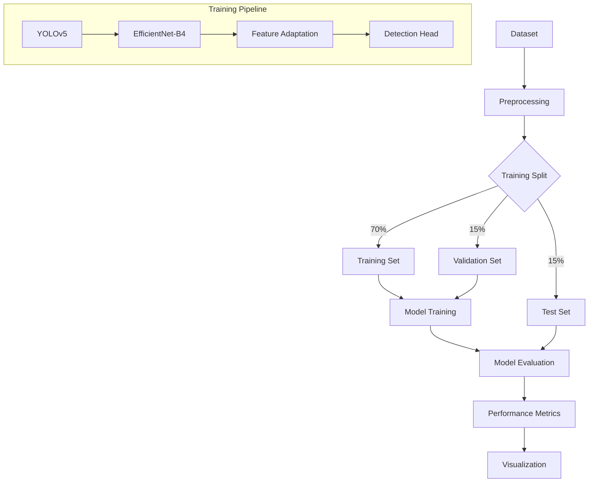
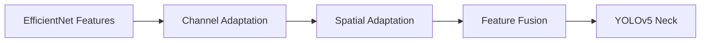
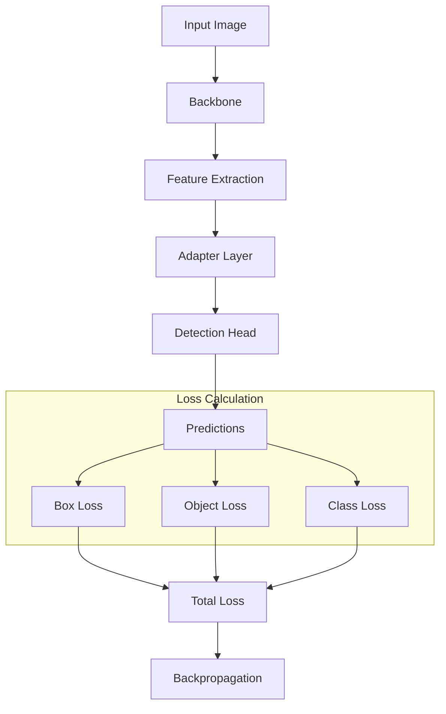

# 📚 Dokumentasi Teknis SmartCash

## 📋 Overview

SmartCash adalah sistem deteksi nilai mata uang yang menggunakan YOLOv5 yang dioptimasi dengan EfficientNet-B4 sebagai backbone. Project ini bertujuan untuk meningkatkan akurasi deteksi nilai mata uang Rupiah dengan mempertimbangkan berbagai kondisi pengambilan gambar.

## 🎯 Tujuan Penelitian

1. Implementasi algoritma YOLOv5 untuk deteksi nilai mata uang Rupiah
2. Evaluasi akurasi YOLOv5 dalam deteksi nilai mata uang Rupiah
3. Implementasi pendekatan kombinasi YOLOv5 dan EfficientNet-B4
4. Evaluasi akurasi pendekatan kombinasi tersebut
5. Optimasi dan analisis peningkatan performa

## 📁 Struktur Project

```
smartcash/
├── configs/                  # Konfigurasi eksperimen
├── data/                    # Dataset storage
├── handlers/                # Data & model handlers
├── models/                  # Model implementations
│   ├── backbones/          # Model backbones
│   └── trainers/           # Training implementations
├── utils/                  # Utility modules
├── notebooks/              # Jupyter notebooks
└── README.md
```

## 📦 Modul-Modul Utama

### 1. Configs
Berisi konfigurasi untuk eksperimen dan parameter model.

- **base_config.yaml**: Konfigurasi dasar yang mencakup:
  - Dataset settings
  - Model parameters
  - Training configuration
  - Hardware utilization
  - Experiment scenarios

### 2. Handlers

#### Data Handlers
- **data_handler.py**: Pengelolaan dataset lokal
  - Verifikasi struktur dan integritas
  - Statistik dataset
  - Setup folder structure

- **roboflow_handler.py**: Integrasi dengan Roboflow
  - Download dan setup dataset
  - Konversi ke format YOLOv5
  - Dataset versioning

- **dataset_cleanup.py**: Pembersihan dataset
  - Penghapusan file augmentasi
  - Validasi integritas
  - Backup management

#### Model Handlers
- **model_handler.py**: Pengelolaan model
  - Training pipeline
  - Experiment tracking
  - Model persistence

- **evaluation_handler.py**: Evaluasi model
  - Metric calculation
  - Result visualization
  - Scenario comparison

### 3. Models

#### Backbones
- **efficient_adapter.py**: Integrasi EfficientNet-B4
  - Feature map adaptation
  - Channel dimension mapping
  - Custom layers

#### Trainers
- **base_trainer.py**: Abstract trainer class
  - Training loop management
  - Callback support
  - Metric tracking

- **yolo_trainer.py**: YOLOv5 trainer
  - Loss calculations
  - Optimization strategy
  - Validation steps

- **efficient_trainer.py**: EfficientNet-YOLOv5 trainer
  - Backbone integration
  - Feature adaptation
  - Custom learning rates

### 4. Utils
- **logger.py**: Custom logging
  - Emoji contextual logs
  - Colored output
  - Progress tracking

- **metrics.py**: Metric calculations
  - Accuracy, Precision, Recall
  - mAP calculation
  - Loss tracking

- **preprocessing.py**: Data preprocessing
  - Image resizing
  - Augmentation
  - Normalization

- **visualization.py**: Result visualization
  - Training plots
  - Evaluation metrics
  - Comparison charts

## 🔄 Workflow



## 📊 Skenario Evaluasi

1. **Baseline (YOLOv5 + CSPDarknet)**
   - Variasi posisi
   - Variasi pencahayaan

2. **Optimized (YOLOv5 + EfficientNet-B4)**
   - Variasi posisi
   - Variasi pencahayaan

## 🛠️ Implementasi Utama

### EfficientNet Adapter



1. **Channel Adaptation**
   - 1x1 convolution untuk menyesuaikan dimensi channel
   - Batch normalization
   - Activation function (SiLU)

2. **Spatial Adaptation**
   - 3x3 convolution untuk menyesuaikan receptive field
   - Feature pyramid integration
   - Skip connections

### Training Pipeline



## 📝 Konfigurasi Eksperimen

Konfigurasi eksperimen diatur melalui `base_config.yaml`:

```yaml
dataset:
  workspace: "detection-twl6q"
  project: "rupiah_emisi-baru"
  version: 3
  
model:
  img_size: [640, 640]
  conf_thres: 0.25
  iou_thres: 0.45
  
training:
  epochs: 100
  batch_size: 16
  warmup_epochs: 3
  lr0: 0.01
```

## 🔍 Evaluasi Performa

Metrik evaluasi mencakup:
- Accuracy
- Precision
- Recall
- F1-Score
- mAP
- Inference Time

## 📈 Visualisasi Hasil

Visualisasi hasil mencakup:
1. Training metrics plot
2. Confusion matrix
3. Precision-Recall curves
4. Inference time comparison
5. Per-class performance analysis

## 🚀 Deployment

Model dapat di-deploy melalui:
1. Jupyter Notebook untuk eksperimen
2. Python script untuk batch processing
3. API endpoint untuk real-time inference

## 📋 Dependencies

Requirement utama:
- PyTorch
- OpenCV
- Albumentations
- Roboflow
- NumPy
- Matplotlib
- Seaborn
- tqdm
- PyYAML
