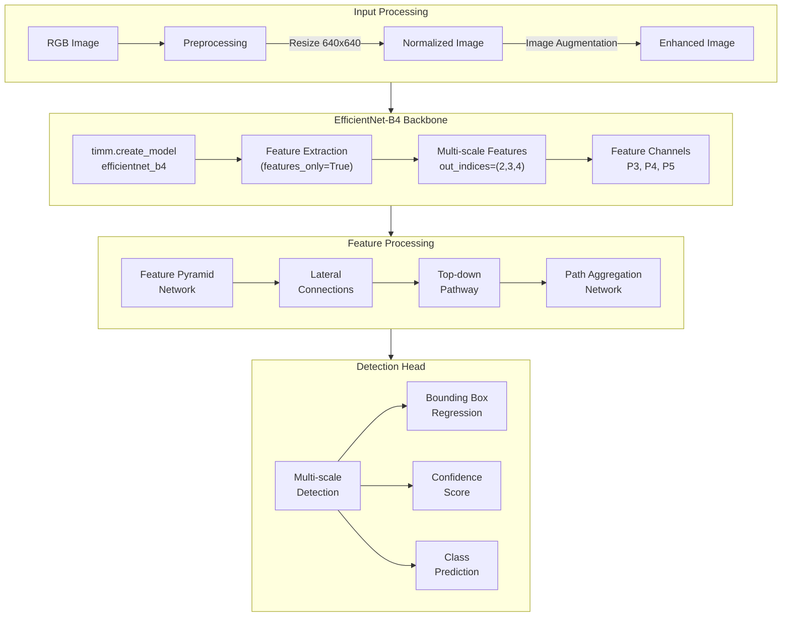

```mermaid
flowchart TD
    subgraph Input["Input Processing"]
        A[RGB Image] --> B[Preprocessing]
        B --> |"Resize 640x640"| C[Normalized Image]
        C --> |"Image Augmentation"| D[Enhanced Image]
    end

    subgraph Backbone["EfficientNet-B4 Backbone"]
        E["timm.create_model
        efficientnet_b4"] --> F["Feature Extraction
        (features_only=True)"]
        F --> G["Multi-scale Features
        out_indices=(2,3,4)"]
        G --> H["Feature Channels
        P3, P4, P5"]
    end

    subgraph Neck["Feature Processing"]
        I["Feature Pyramid
        Network"] --> J["Lateral
        Connections"]
        J --> K["Top-down
        Pathway"]
        K --> L["Path Aggregation
        Network"]
    end

    subgraph Head["Detection Head"]
        M["Multi-scale
        Detection"] --> N["Bounding Box
        Regression"]
        M --> O["Confidence
        Score"]
        M --> P["Class
        Prediction"]
    end

    Input --> Backbone
    Backbone --> Neck
    Neck --> Head
```