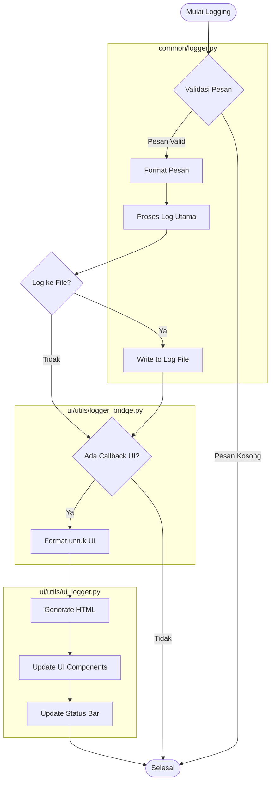

# SmartCash Logger System

## 📋 Gambaran Umum
Sistem logging SmartCash adalah solusi terpadu yang menghubungkan logging backend dengan tampilan UI yang informatif. Dibangun dengan arsitektur modular yang memisahkan logika bisnis dari tampilan, memungkinkan inovasi lebih cepat dan pemeliharaan yang lebih mudah.

## 🏗️ Arsitektur Logging

### Activity Diagram Alur Logging



### Penjelasan Aktivitas dan Fungsi Terkait

#### 1. Validasi Pesan
- **Fungsi Terkait**:
  - `SmartCashLogger.log()` (logger.py)
  - `_validate_message()` (logger.py)
- **Deskripsi**:
  Memeriksa apakah pesan log valid (tidak kosong, tipe data sesuai)
- **Parameter**:
  - `message`: Pesan yang akan divalidasi
  - `level`: Level log (DEBUG, INFO, WARNING, ERROR, CRITICAL)

#### 2. Format Pesan
- **Fungsi Terkait**:
  - `MessageFormatter.format_message()` (logger.py)
  - `_get_formatted_message()` (logger.py)
- **Deskripsi**:
  Memformat pesan dengan timestamp, level log, dan informasi konteks
- **Fitur**:
  - Menambahkan timestamp
  - Menerapkan format konsisten
  - Menyertakan informasi stack trace untuk ERROR/CRITICAL

#### 3. Proses Log Utama
- **Fungsi Terkait**:
  - `SmartCashLogger._process_log()` (logger.py)
  - `_write_to_handlers()` (logger.py)
- **Deskripsi**:
  Memproses log melalui handler yang terdaftar
- **Alur**:
  1. Menentukan apakah log perlu diproses berdasarkan level
  2. Meneruskan ke semua handler yang terdaftar
  3. Memicu callback UI jika ada

#### 4. Format untuk UI
- **Fungsi Terkait**:
  - `UILoggerBridge._format_for_ui()` (logger_bridge.py)
  - `UILogger._log_to_ui()` (ui_logger.py)
- **Deskripsi**:
  Mengubah pesan log menjadi format yang sesuai untuk ditampilkan di UI
- **Fitur**:
  - Menambahkan emoji berdasarkan level log
  - Menerapkan warna yang sesuai
  - Menangani konteks namespace

#### 5. Generate HTML
- **Fungsi Terkait**:
  - `UILogger._generate_html()` (ui_logger.py)
  - `_get_message_style()` (ui_logger.py)
- **Deskripsi**:
  Membuat representasi HTML dari pesan log
- **Fitur**:
  - Styling inline untuk konsistensi tampilan
  - Dukungan untuk dark/light mode
  - Format khusus untuk tipe pesan tertentu

#### 6. Update UI Components
- **Fungsi Terkait**:
  - `UILogger._update_log_panel()` (ui_logger.py)
  - `_scroll_to_bottom()` (ui_logger.py)
- **Deskripsi**:
  Memperbarui komponen UI dengan pesan log baru
- **Fitur**:
  - Auto-scroll ke pesan terbaru
  - Virtual scrolling untuk performa
  - Pembaruan asinkron untuk UI yang responsif

### Komponen Utama dan Tanggung Jawab

1. **common/logger.py**
   - `SmartCashLogger`: Inti sistem logging
   - `MessageFormatter`: Format konsisten untuk semua pesan
   - `LogLevel`: Enum level logging standar

2. **ui/utils/logger_bridge.py**
   - `UILoggerBridge`: Jembatan antara logging dan UI
   - `log_to_ui_safe`: Fungsi aman untuk logging ke UI

3. **ui/utils/ui_logger.py**
   - `UILogger`: Render log ke UI
   - `_log_to_ui`: Proses internal untuk update UI

4. **ui/utils/ui_logger_namespace.py**
   - Manajemen konteks logging
   - Kustomisasi tampilan berdasarkan namespace

5. **ui/utils/logging_utils.py**
   - Fungsi utilitas logging
   - Helper untuk format dan konversi

## 🔧 Penggunaan Dasar

### Inisialisasi Logger
```python
from smartcash.ui.utils.ui_logger import UILogger

# Inisialisasi logger
logger = UILogger(name="NamaModul", log_level=logging.INFO, ui_components=ui_dict)
```

### Level Log
- `debug()`: Informasi detail untuk debugging
- `info()`: Informasi umum
- `warning()`: Peringatan
- `error()`: Kesalahan yang perlu diperhatikan

Contoh penggunaan:
```python
logger.debug("Pesan debug")
logger.info("Informasi penting")
logger.warning("Peringatan")
logger.error("Terjadi kesalahan")
```

## 🎨 Format Tampilan
Setiap pesan log akan ditampilkan dengan format:
- **Warna** berdasarkan level log
- **Emoji** untuk visual yang lebih baik
- **Timestamp** untuk pelacakan waktu
- **Nama modul** sumber log

## ⚙️ Konfigurasi

### Parameter Inisialisasi
- `name`: Nama logger (biasanya nama modul)
- `log_level`: Level log (default: INFO)
- `log_dir`: Direktori penyimpanan log file
- `ui_components`: Komponen UI untuk menampilkan log

### Komponen UI yang Didukung
- `log_output`: Panel untuk menampilkan log
- `status`: Status bar untuk pesan penting
- `output`: Output utama aplikasi

## 📂 Penyimpanan Log
Log disimpan dalam format:
```
logs/
  ├── NamaModul_YYYYMMDD_HHMMSS.log
  └── ...
```

## 🔄 Fitur Khusus

### Suppress Output
Menyembunyikan output standar yang tidak diinginkan:
```python
logger.setup_aggressive_log_suppression()
```

### Log ke File
Selain ke UI, log juga disimpan ke file untuk keperluan debugging.

## 🚨 Penanganan Error
Semua error dalam proses logging ditangani secara internal dan tidak akan mengganggu alur aplikasi utama.

## 📝 Best Practices
1. Gunakan level log yang sesuai
2. Sertakan konteks yang cukup dalam pesan log
3. Hindari logging informasi sensitif
4. Gunakan nama modul yang deskriptif
5. Pertimbangkan performa saat logging dalam loop ketat

## 🔍 Contoh Output
```
[14:30:45] ℹ️  [INFO] ModulA: Proses dimulai
[14:30:46] ⚠️  [WARN] ModulB: Peringatan: Nilai di luar batas
[14:30:47] ❌ [ERROR] ModulC: Gagal memproses data
```
