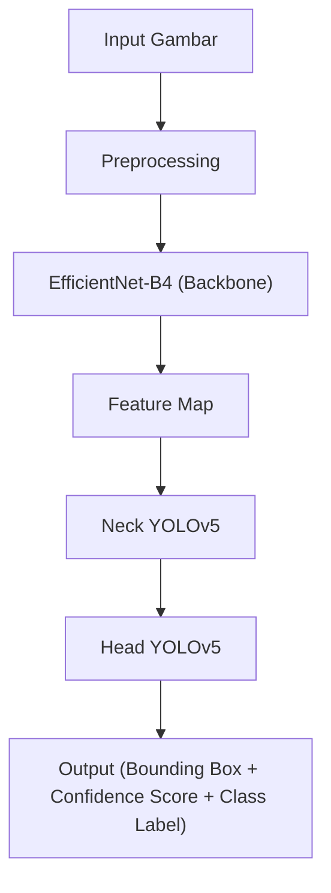
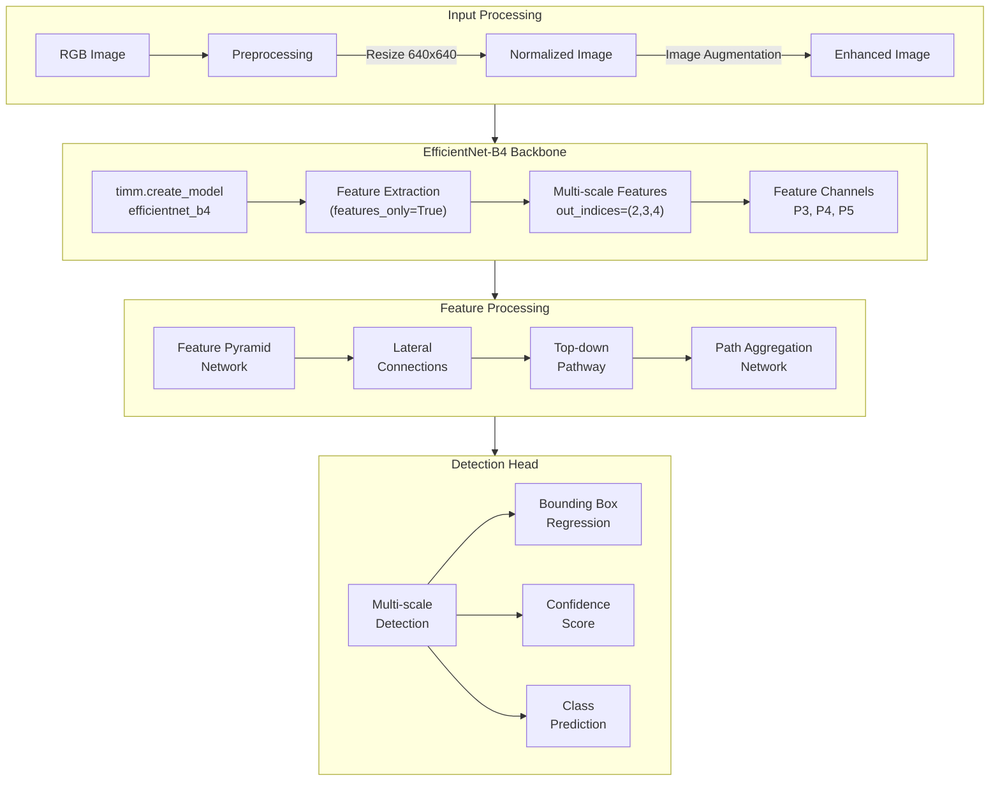

Berikut adalah ringkasan tahapan pengenalan objek menggunakan EfficientNet-B4 sebagai backbone dalam arsitektur YOLOv5, beserta diagram Mermaidnya:

### Ringkasan Tahapan

1. **Tahap Input Gambar**:
   - Gambar mentah (uang kertas rupiah) dimasukkan ke dalam sistem deteksi.
   - Gambar mengalami preprocessing (resize, normalisasi, augmentasi) untuk memastikan ukurannya sesuai dengan input yang diharapkan oleh YOLOv5 dan EfficientNet-B4.

2. **Backbone EfficientNet-B4**:
   - EfficientNet-B4 menggantikan backbone YOLOv5 (CSPDarknet) untuk mengekstraksi fitur dari gambar input.
   - EfficientNet-B4 mengekstrak fitur melalui serangkaian lapisan konvolusi (MBConv) yang lebih efisien.
   - Fitur yang diekstrak mencakup pola-pola penting pada uang kertas rupiah, seperti angka nominal, tekstur uang, gambar, dan simbol watermark atau keamanan.
   - Compound Scaling membuat fitur yang diekstrak lebih detail dan multi-level, membantu mendeteksi objek kecil dan variasi pencahayaan dengan lebih baik.
   - Hasil ekstraksi fitur adalah feature map yang dikirimkan ke Neck YOLOv5.

3. **Neck YOLOv5**:
   - Neck (FPN atau PANet) menggabungkan fitur multi-level yang dihasilkan EfficientNet-B4.
   - Ini memungkinkan model menangani objek dengan berbagai ukuran dan resolusi.

4. **Prediksi di Head YOLOv5**:
   - Head YOLOv5 memproses fitur dari Neck untuk memprediksi:
     - Bounding Box (posisi dan ukuran objek).
     - Confidence Score (tingkat keyakinan deteksi).
     - Kelas Objek (misalnya nominal uang: "50.000" atau "100.000").

### Diagram Mermaid

Diagram ini menggambarkan alur kerja dari input gambar hingga output prediksi objek menggunakan arsitektur YOLOv5 dengan EfficientNet-B4 sebagai backbone.
Berikut diagram lebih detilnya:

