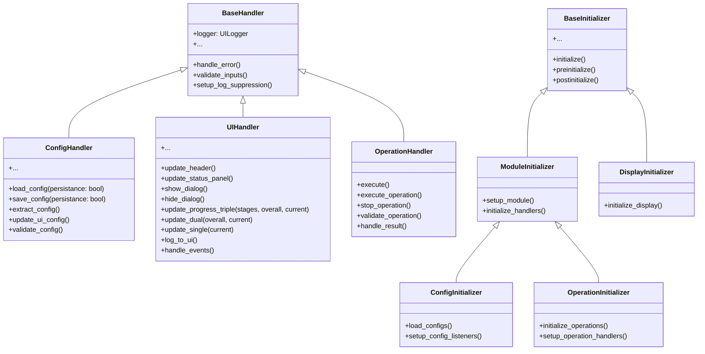

# Core Component Inheritance Structure (Simplified)

## Key Components
This is not fixed, you can expand it

### Handlers
- **BaseHandler**: Core error handling and logging
  - `ConfigHandler`: Manages configuration operations
  - `UIHandler`: Handles UI component management
  - `OperationHandler`: Manages business logic operations

### Initializers
- **BaseInitializer**: Core initialization logic
  - `ModuleInitializer`: Base for module-specific initialization
    - `ConfigInitializer`: Handles configuration initialization
    - `OperationInitializer`: Manages operation setup
  - `DisplayInitializer`: Handles UI display initialization

## Usage
This diagram illustrates the inheritance structure used throughout the SmartCash UI system, ensuring consistent patterns for error handling, configuration management, and UI component initialization.
