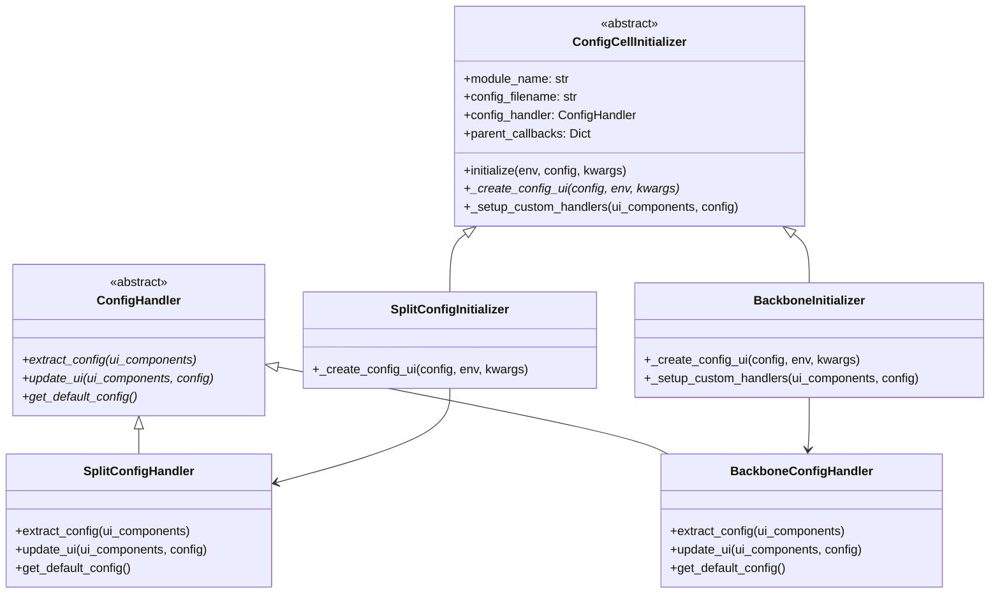

# 📋 Panduan UI ConfigCellInitializer - Pola & Struktur SmartCash

## 🎯 **Identifikasi Pola Kesamaan**

### 🔄 **Pola Arsitektur Umum**
Kedua modul (`ui/dataset/split` dan `ui/backbone`) mengikuti pola yang sama:

```
📁 ui/{domain}/{module}/
├── {module}_init.py          # Entry point dengan ConfigCellInitializer
├── components/               # UI components (form, layout, handlers)
│   ├── ui_form.py           # Form creation
│   ├── ui_layout.py         # Layout assembly
│   └── selection_change.py   # Event handlers (opsional)
└── handlers/                # Business logic handlers
    ├── config_handler.py    # ConfigHandler implementation
    ├── defaults.py          # Default configurations
    ├── config_extractor.py  # Extract UI → Config
    └── config_updater.py    # Update Config → UI
```

### 🎨 **Pola Inheritance & Factory**
- **ConfigCellInitializer**: Abstract base class untuk semua config cells
- **ConfigHandler**: Business logic untuk extract/update config
- **Factory Function**: `create_{module}_config_cell()` untuk instantiation

---

## 🏗️ **Struktur Umum ConfigCellInitializer**

### 📋 **1. Entry Point Pattern**
```python
# {module}_init.py
class {Module}ConfigInitializer(ConfigCellInitializer):
    def __init__(self, module_name='{module}', config_filename='{module}_config', 
                 config_handler_class=None, parent_module=None):
        super().__init__(module_name, config_filename, config_handler_class, parent_module)
    
    def _create_config_ui(self, config: Dict[str, Any], env=None, **kwargs) -> Dict[str, Any]:
        # Import reusable components
        from .components.ui_form import create_{module}_form
        from .components.ui_layout import create_{module}_layout
        
        # Create & assemble UI
        form_components = create_{module}_form(config)
        layout_components = create_{module}_layout(form_components)
        ui_components = {**form_components, **layout_components}
        
        # Setup custom handlers (opsional)
        return ui_components

class {Module}ConfigHandler(ConfigHandler):
    def extract_config(self, ui_components): ...
    def update_ui(self, ui_components, config): ...
    def get_default_config(self): ...

# Factory function
def create_{module}_config_cell(env=None, config=None, parent_module=None, **kwargs):
    return create_config_cell({Module}ConfigInitializer, '{module}', '{module}_config', 
                              config_handler_class={Module}ConfigHandler, **kwargs)
```

### 🎛️ **2. Components Pattern**
```python
# components/ui_form.py
def create_{module}_form(config: Dict[str, Any]) -> Dict[str, Any]:
    """Create form widgets berdasarkan config"""
    return {
        'widget_name': ipywidgets.Widget(...),
        # ... other widgets
    }

# components/ui_layout.py  
def create_{module}_layout(form_components: Dict[str, Any]) -> Dict[str, Any]:
    """Assemble layout dari form components"""
    return {
        'main_layout': ipywidgets.VBox([...]),
        'save_button': ipywidgets.Button(description='💾 Simpan'),
        'reset_button': ipywidgets.Button(description='🔄 Reset'),
        # ... layout components
    }
```

### 🔧 **3. Handlers Pattern**
```python
# handlers/config_handler.py
class {Module}ConfigHandler(ConfigHandler):
    def extract_config(self, ui_components: Dict[str, Any]) -> Dict[str, Any]:
        """Extract config dari UI components"""
        from .config_extractor import extract_{module}_config
        return extract_{module}_config(ui_components)
    
    def update_ui(self, ui_components: Dict[str, Any], config: Dict[str, Any]) -> None:
        """Update UI dari config"""
        from .config_updater import update_{module}_ui
        update_{module}_ui(ui_components, config)
    
    def get_default_config(self) -> Dict[str, Any]:
        """Get default config"""
        from .defaults import get_default_{module}_config
        return get_default_{module}_config()
```

---

## 🔄 **Flow Diagram**

```mermaid
graph TD
    A[Cell Execution] --> B[create_{module}_config_cell]
    B --> C[ConfigCellInitializer.__init__]
    C --> D[Load Config from YAML]
    D --> E[_create_config_ui]
    E --> F[create_{module}_form]
    F --> G[create_{module}_layout]
    G --> H[Setup Event Handlers]
    H --> I[Display UI]
    
    I --> J[User Interaction]
    J --> K[Event Triggered]
    K --> L{Event Type}
    
    L -->|Save| M[extract_config]
    L -->|Reset| N[get_default_config]
    L -->|Change| O[Custom Handler]
    
    M --> P[ConfigManager.save]
    N --> Q[update_ui]
    O --> R[Parent Callbacks]
    
    P --> S[Success Status]
    Q --> S
    R --> S
```

---

## 🎯 **Class Diagram**



---

## 🎨 **Pola Implementasi Spesifik**

### 🔹 **1. Split Dataset Pattern**
```python
# Fokus: Slider interactions untuk ratio split
def _create_config_ui(self, config, env=None, **kwargs):
    form_components = create_split_form(config)  # Train/Valid/Test sliders
    layout_components = create_split_layout(form_components)
    ui_components = {**form_components, **layout_components}
    
    # Custom: Setup slider handlers untuk real-time ratio updates
    setup_slider_handlers(ui_components)
    return ui_components
```

### 🔹 **2. Backbone Selection Pattern** 
```python
# Fokus: Dropdown selection dengan dynamic info updates
def _create_config_ui(self, config, env=None, **kwargs):
    form_components = create_backbone_form(config)  # Dropdown + info
    return create_backbone_layout(form_components)

def _setup_custom_handlers(self, ui_components, config, env=None, **kwargs):
    # Custom: Backbone selection change handlers
    setup_backbone_selection_handlers(ui_components, config)
```

---

## 🎯 **Best Practices & Guidelines**

### ✅ **DO's**
- **SRP (Single Responsibility)**: Setiap file handle satu concern
- **DRY Code**: Reuse components di `ui/components/**`
- **Consistent Naming**: `create_{module}_*`, `setup_{module}_*` 
- **Error Handling**: Use `handle_ui_exception()` dari base class
- **Parent Integration**: Support parent_callbacks untuk inter-module communication

### ❌ **DON'Ts**
- **Nested Fallbacks**: Simple warning instead of complex fallbacks
- **Threading**: Never use threading dalam UI components
- **Direct YAML Access**: Always use ConfigManager
- **UI Flooding**: Control concurrent logs output

---

## 🚀 **Template Implementasi Baru**

### 📋 **Checklist untuk Module Baru**
1. **📁 Create Directory Structure**
   ```
   ui/{domain}/{module}/
   ├── {module}_init.py
   ├── components/
   └── handlers/
   ```

2. **🎯 Implement ConfigCellInitializer**
   - Inherit dari `ConfigCellInitializer`
   - Implement `_create_config_ui()`
   - Optional: `_setup_custom_handlers()`

3. **🎛️ Create Components**
   - `ui_form.py`: Widget creation
   - `ui_layout.py`: Layout assembly
   - Custom handlers (opsional)

4. **🔧 Implement ConfigHandler**  
   - `extract_config()`: UI → Config
   - `update_ui()`: Config → UI
   - `get_default_config()`: Default values

5. **🏭 Factory Function**
   - `create_{module}_config_cell()`
   - Integration dengan parent modules

### 🎨 **Quick Start Template**

```python
# {module}_init.py
from smartcash.ui.initializers.config_cell_initializer import ConfigCellInitializer, create_config_cell
from smartcash.ui.handlers.config_handlers import ConfigHandler

class {Module}ConfigInitializer(ConfigCellInitializer):
    def __init__(self, module_name='{module}', config_filename='{module}_config', 
                 config_handler_class=None, parent_module=None):
        super().__init__(module_name, config_filename, config_handler_class, parent_module)
    
    def _create_config_ui(self, config, env=None, **kwargs):
        try:
            from .components.ui_form import create_{module}_form
            from .components.ui_layout import create_{module}_layout
            
            form_components = create_{module}_form(config)
            return create_{module}_layout(form_components)
            
        except Exception as e:
            return self.handle_ui_exception(e, context="UI {module} configuration")

class {Module}ConfigHandler(ConfigHandler):
    def extract_config(self, ui_components): 
        # Implement extraction logic
        pass
    def update_ui(self, ui_components, config): 
        # Implement UI update logic  
        pass
    def get_default_config(self): 
        # Return default config
        pass

def create_{module}_config_cell(env=None, config=None, parent_module=None, **kwargs):
    return create_config_cell({Module}ConfigInitializer, '{module}', '{module}_config',
                              config_handler_class={Module}ConfigHandler, **kwargs)
```

---

## 🎯 **Kesimpulan**

Pattern ConfigCellInitializer di SmartCash memberikan:
- **🔄 Consistency**: Struktur dan flow yang seragam
- **🎯 Modularity**: Clear separation of concerns  
- **🚀 Reusability**: Shared components dan utilities
- **🔧 Extensibility**: Easy integration dengan parent modules
- **⚡ Performance**: Optimized dengan one-liner style dan DRY principles

Pattern ini memungkinkan rapid development UI configuration yang robust dan maintainable untuk sistem YOLOv5-EfficientNet-B4 SmartCash. 🎉