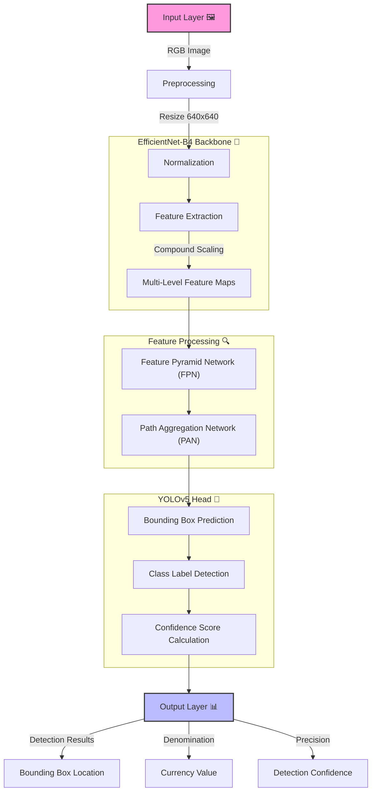
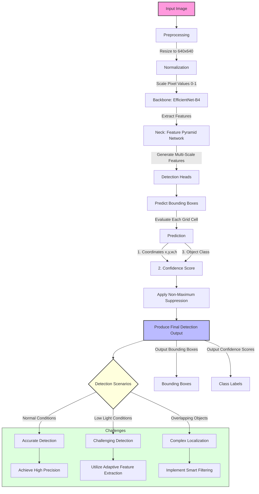
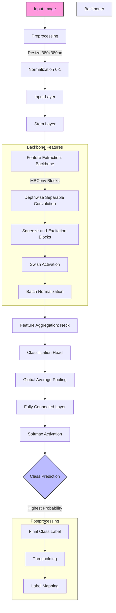
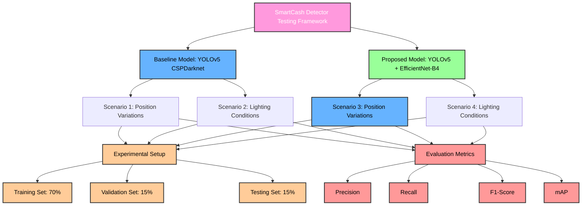

# SmartCash Denomination Detector 💵🔍

The SmartCash Denomination Detector workflow utilizes a combination of EfficientNet-B4 for feature extraction and YOLOv5 for object detection. This hybrid approach aims to improve the accuracy and efficiency of detecting currency denominations by leveraging advanced neural network architectures.

## Reference Workflow 📚

### YOLOv5 Workflow 🚀

### EfficientNet-B4 Workflow 🧠

### EfficientNet-B4 YOLOv5 Approaches 🔄

```mermaid
flowchart TD
    subgraph "Approach A: EfficientNet-B4 as Additional Classification"
    A1["Input Image"] --> A2["YOLOv5 Detection"]
    A2 --> A3["Crop Bounding Box"]
    A3 --> A4["Normalize RoI 380x380"]
    A4 --> A5["EfficientNet-B4 Classification"]
    A5 --> A6["Detailed Class Prediction"]
    end

    subgraph "Approach B: EfficientNet-B4 as Backbone"
    B1["Input Image"] --> B2["Preprocess"]
    B2 --> B3["EfficientNet-B4 Feature Extraction"]
    B3 --> B4["YOLOv5 Neck (FPN/PANet)"]
    B4 --> B5["YOLOv5 Head"]
    B5 --> B6["Object Detection Output"]
    end

    style A1 fill:#f9d,stroke:#333,stroke-width:2px
    style B1 fill:#f9d,stroke:#333,stroke-width:2px
    style A6 fill:#000,stroke:#fff,stroke-width:2px
    style B6 fill:#000,stroke:#fff,stroke-width:2px
```

### Testing Scenarios 🧪
