#Environment Configuration Activity Diagram

```mermaid
stateDiagram-v2
    [*] --> CheckDirectory
    
    state "UI Initialization" as UIInit {
        [*] --> CreateContainer
        CreateContainer --> AddHeader
        AddHeader --> AddColabPanel
        AddColabPanel --> AddHelpInfo
        AddHelpInfo --> AddButtons
        AddButtons --> AddStatusOutput
        AddStatusOutput --> [*]
    }
    
    CheckDirectory --> UIInit: Directory exists
    CheckDirectory --> DisplayError: Directory missing
    DisplayError --> [*]
    
    UIInit --> DetectEnvironment
    
    state "Environment Detection" as DetectEnvironment {
        [*] --> CheckColabEnv
        CheckColabEnv --> UpdateColabPanel
        UpdateColabPanel --> ShowDriveButton: Is Colab
        UpdateColabPanel --> HideDriveButton: Is Local
        ShowDriveButton --> [*]
        HideDriveButton --> [*]
    }
    
    DetectEnvironment --> WaitForUserAction
    
    state "Wait For User Action" as WaitForUserAction {
        [*] --> ListenForEvents
        ListenForEvents --> DriveButtonClick: Drive Button Clicked
        ListenForEvents --> DirButtonClick: Directory Button Clicked
    }
    
    state "Drive Connection" as DriveConn {
        [*] --> MountDrive
        MountDrive --> CreateSymlinks: Success
        MountDrive --> ShowDriveError: Failure
        
        CreateSymlinks --> SyncConfigs
        SyncConfigs --> DisplayDriveTree
        
        state "DisplayDriveTree" as DisplayDriveTree {
            [*] --> GetDrivePath
            GetDrivePath --> GenerateRawTree
            GenerateRawTree --> FilterDriveTree: Use env_manager method
            GenerateRawTree --> FallbackTreeGen: No env_manager
            FallbackTreeGen --> FilterDriveTree
            FilterDriveTree --> RemoveNonSmartCashPaths
            RemoveNonSmartCashPaths --> FormatTreeWithHTML
            FormatTreeWithHTML --> DisplayInOutputPanel
            DisplayInOutputPanel --> [*]
        }
        
        DisplayDriveTree --> UpdateConfig
        
        ShowDriveError --> [*]
        UpdateConfig --> [*]
    }
    
    state "Directory Setup" as DirSetup {
        [*] --> CreateDirectories
        CreateDirectories --> DisplayDirectoryTree
        DisplayDirectoryTree --> UpdateDirectoryConfig
        UpdateDirectoryConfig --> [*]
    }
    
    DriveButtonClick --> DriveConn
    DirButtonClick --> DirSetup
    
    DriveConn --> WaitForUserAction
    DirSetup --> WaitForUserAction
    
    WaitForUserAction --> [*]
```

This activity diagram shows the SmartCash environment configuration workflow:

- **Initial Check**: Verifies the SmartCash directory exists before proceeding
- **UI Initialization**: Creates all UI components including containers, panels, buttons and outputs
- **Environment Detection**: Identifies the environment (Colab/local) and updates the UI accordingly
  - Shows Drive connection button only in Colab environment
  - Displays appropriate info panel

- **User Interaction**: Waits for the user to click either:
  - Drive Connection button: Mounts Google Drive, creates symlinks, syncs configs and displays the directory tree
  - Directory Setup button: Creates the project directory structure and displays it

Each state transitions to the next based on user actions or system conditions. The UI remains responsive to further interactions after completing each operation.