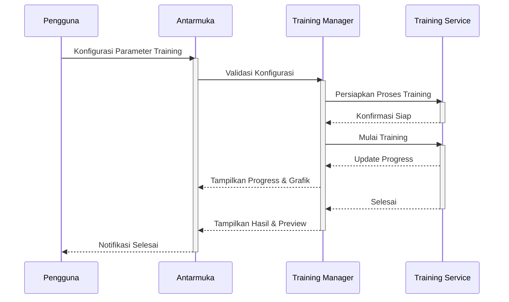
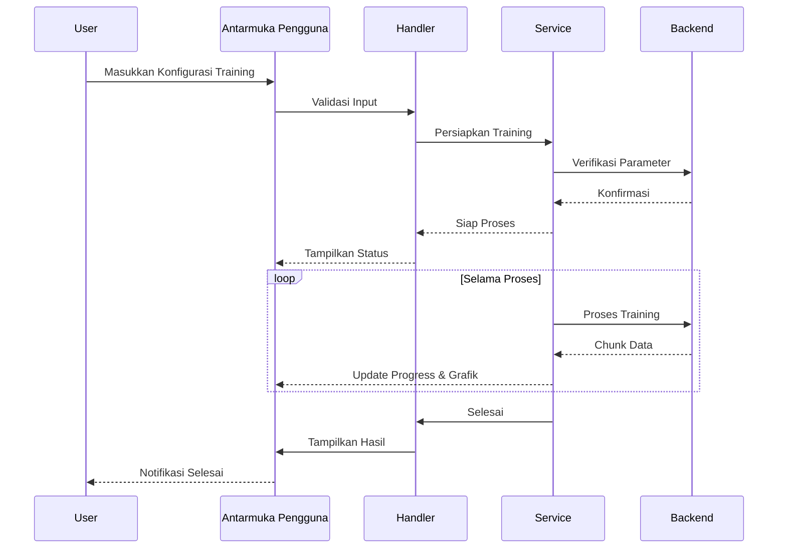

# 1.11 Training Module SmartCash

## Deskripsi

Modul Training SmartCash menyediakan antarmuka dan pipeline terintegrasi untuk pelatihan model machine learning berbasis arsitektur backbone yang telah dipilih. Modul ini mendukung konfigurasi parameter pelatihan seperti learning rate, batch size, optimizer, epoch, dan callback, serta integrasi dengan modul preprocessing, augmentation, dan backbone.

Antarmuka pengguna memungkinkan pemantauan proses pelatihan secara real-time melalui progress bar, grafik loss/accuracy, dan preview hasil intermediate. Modul ini mendukung resume training, early stopping, checkpointing otomatis, dan logging detail setiap epoch.

Keamanan dan konsistensi data dijaga dengan validasi parameter sebelum pelatihan dimulai. Setiap perubahan konfigurasi pelatihan akan meminta konfirmasi eksplisit dari pengguna dan dicatat dalam log operasi. Sistem log terintegrasi memberikan transparansi penuh atas setiap eksperimen pelatihan.

Manajemen versi model pelatihan memungkinkan pengguna melacak, membandingkan, dan mengembalikan model ke versi sebelumnya. Metadata lengkap, termasuk parameter, waktu eksekusi, dan hasil evaluasi, disimpan untuk setiap sesi pelatihan. Modul juga mendukung export model ke format yang kompatibel dengan berbagai framework machine learning.

## Alur Kerja

## Alur Operasi

Proses training dimulai dengan inisialisasi modul dan verifikasi parameter yang dimasukkan pengguna. Sistem akan menampilkan opsi konfigurasi pelatihan dan integrasi dengan modul lain. Sebelum eksekusi, modul memeriksa validitas parameter dan meminta konfirmasi jika ada perubahan signifikan.

Setelah konfirmasi, proses training berjalan di latar belakang dengan optimasi multi-thread jika diperlukan. Pengguna dapat memantau kemajuan melalui progress bar, grafik, dan preview hasil secara real-time. Setiap langkah divalidasi untuk memastikan model terlatih dengan baik.

Model hasil training disimpan dalam struktur folder yang terorganisir, lengkap dengan metadata dan log operasi. Pengguna dapat mengakses riwayat pelatihan, membandingkan hasil, dan mengembalikan ke versi sebelumnya jika diperlukan. Modul juga mendukung export model ke format yang kompatibel dengan berbagai framework machine learning.

## Diagram Urutan Operasi Training

