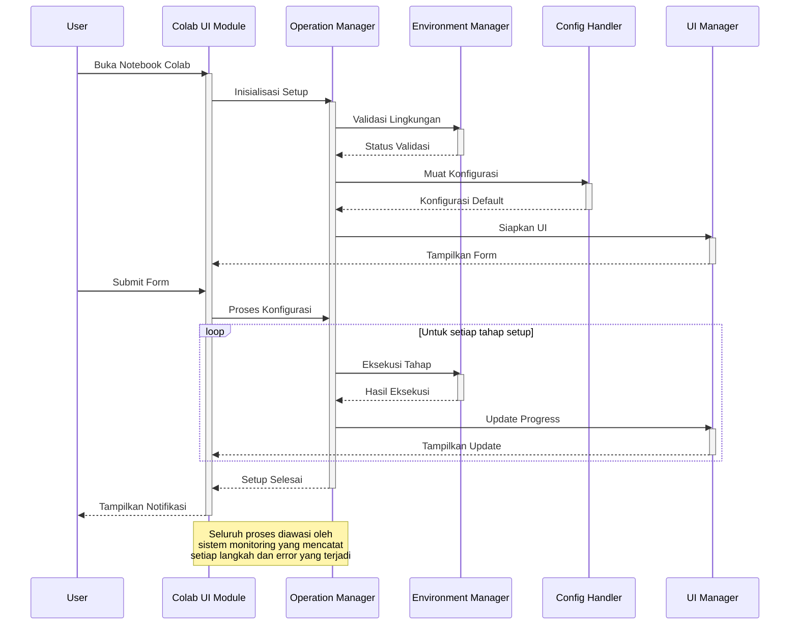

# 1.2 Konfigurasi Lingkungan Google Colab

## Deskripsi

Modul setup Google Colab pada SmartCash dirancang untuk menyederhanakan proses konfigurasi lingkungan pengembangan di platform komputasi awan. Alur kerja yang terstruktur memandu pengguna melalui serangkaian tahapan penting, mulai dari inisialisasi hingga verifikasi akhir. Setiap langkah dalam proses ini dikelola dengan penanganan kesalahan yang kokoh, memastikan pengalaman yang lancar bahkan ketika menghadapi masalah teknis.

Sistem ini mengintegrasikan berbagai komponen inti seperti manajer operasi untuk mengoordinasikan tugas-tugas berurutan, penangan konfigurasi untuk pengaturan khusus lingkungan, dan elemen antarmuka pengguna yang interaktif. Pendekatan modular memungkinkan pemeliharaan yang lebih mudah dan perluasan fungsionalitas di masa depan, sementara tetap mempertahankan antarmuka yang konsisten dan mudah digunakan.

## Diagram Urutan Proses Setup

## Monitoring Lingkungan

Sistem secara kontinu memantau kondisi lingkungan selama proses setup berlangsung. Pemantauan mencakup:
- Ketersediaan dan akses ke Google Drive
- Ruang penyimpanan yang tersedia
- Izin akses yang diperlukan
- Status koneksi jaringan
- Kesesuaian versi dependensi

Pemantauan ini memastikan bahwa semua prasyarat terpenuhi sebelum melanjutkan ke tahap berikutnya, mengurangi kemungkinan kegagalan karena masalah lingkungan.

## Alur Proses Setup

Proses setup diawali dengan deteksi menyeluruh terhadap lingkungan sistem, di mana modul akan memindai konfigurasi yang ada, memverifikasi akses ke Google Colab, dan memeriksa ketersediaan semua modul yang diperlukan. Begitu lingkungan terverifikasi, sistem melanjutkan dengan inisialisasi antarmuka pengguna, memuat komponen-komponen UI yang diperlukan sambil secara paralel menyiapkan sistem logging dan pelacakan yang akan memantau seluruh proses setup.

Setelah antarmuka siap, proses beralih ke penyiapan dasar dengan membuat struktur direktori yang diperlukan, mengatur variabel lingkungan, dan mengonfigurasi path sistem. Langkah ini diikuti dengan integrasi Google Drive yang mencakup verifikasi kredensial pengguna, penyiapan mount point, dan validasi akses ke direktori yang diperlukan untuk memastikan koneksi yang aman dan andal dengan penyimpanan cloud.

Tahap konfigurasi lanjutan kemudian mengambil alih, melakukan sinkronisasi pengaturan, menerapkan konfigurasi khusus yang diperlukan, dan memvalidasi integritas seluruh file konfigurasi. Sebelum dinyatakan selesai, sistem akan menjalankan serangkaian tes validasi menyeluruh yang memeriksa setiap aspek instalasi, memastikan semua komponen berfungsi dengan baik, dan menghasilkan laporan setup komprehensif yang merinci setiap langkah proses dan status akhirnya.

