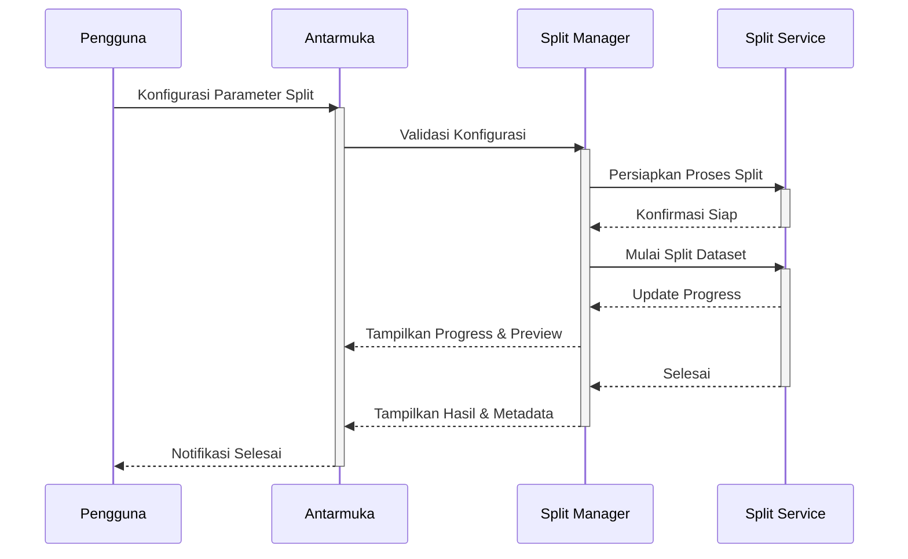
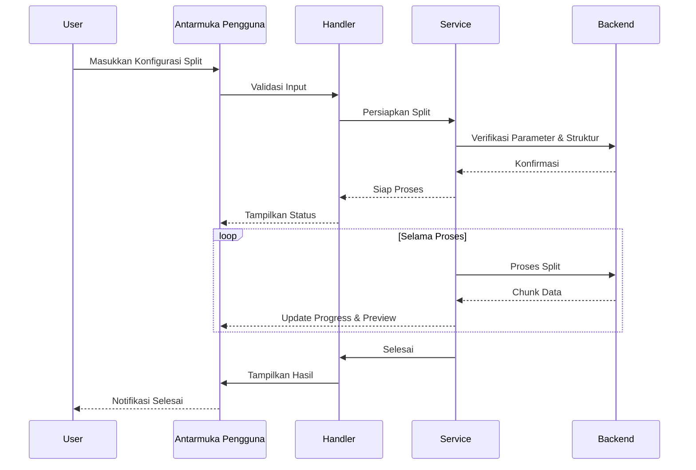

# 1.5 Dataset Split

## Deskripsi

Modul Dataset Split SmartCash menyediakan antarmuka dan pipeline untuk membagi dataset menjadi subset seperti train, validation, dan test secara fleksibel dan terstandarisasi. Modul ini mendukung berbagai strategi pembagian, seperti random split, stratified split berdasarkan label, dan custom split sesuai kebutuhan pengguna.

Antarmuka pengguna memungkinkan konfigurasi parameter pembagian, preview distribusi data, dan validasi hasil split sebelum data disimpan. Modul ini mendukung integrasi dengan modul preprocessing dan augmentation, serta pencatatan metadata setiap proses split.

Keamanan dan konsistensi data dijaga dengan validasi parameter dan struktur dataset sebelum proses split dilakukan. Setiap perubahan atau pembagian dataset akan meminta konfirmasi eksplisit dari pengguna dan dicatat dalam log operasi. Sistem log terintegrasi memberikan transparansi penuh atas setiap proses pembagian data.

Manajemen versi hasil split memungkinkan pengguna melacak, membandingkan, dan mengembalikan ke versi sebelumnya jika diperlukan. Metadata lengkap, termasuk parameter, waktu eksekusi, dan distribusi data, disimpan untuk setiap proses split. Modul juga mendukung export hasil split ke format yang kompatibel dengan berbagai framework machine learning.

## Alur Kerja

## Alur Operasi

Proses split dataset dimulai dengan inisialisasi modul dan verifikasi parameter yang dimasukkan pengguna. Sistem akan menampilkan opsi konfigurasi split, preview distribusi data, dan validasi hasil. Sebelum eksekusi, modul memeriksa validitas parameter dan struktur dataset serta meminta konfirmasi jika ada perubahan signifikan.

Setelah konfirmasi, proses split berjalan di latar belakang dengan optimasi multi-thread jika diperlukan. Pengguna dapat memantau kemajuan melalui progress bar dan preview hasil secara real-time. Setiap langkah divalidasi untuk memastikan distribusi data sesuai dengan konfigurasi.

Hasil split disimpan dalam struktur folder yang terorganisir, lengkap dengan metadata dan log operasi. Pengguna dapat mengakses riwayat split, membandingkan hasil, dan mengembalikan ke versi sebelumnya jika diperlukan. Modul juga mendukung export hasil split ke format yang kompatibel dengan berbagai framework machine learning.

## Diagram Urutan Operasi Split

