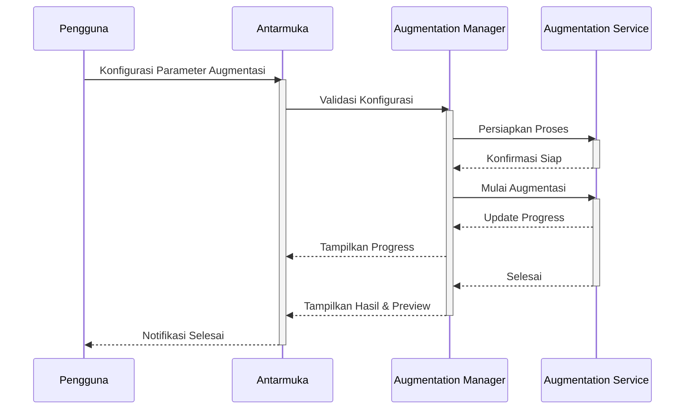
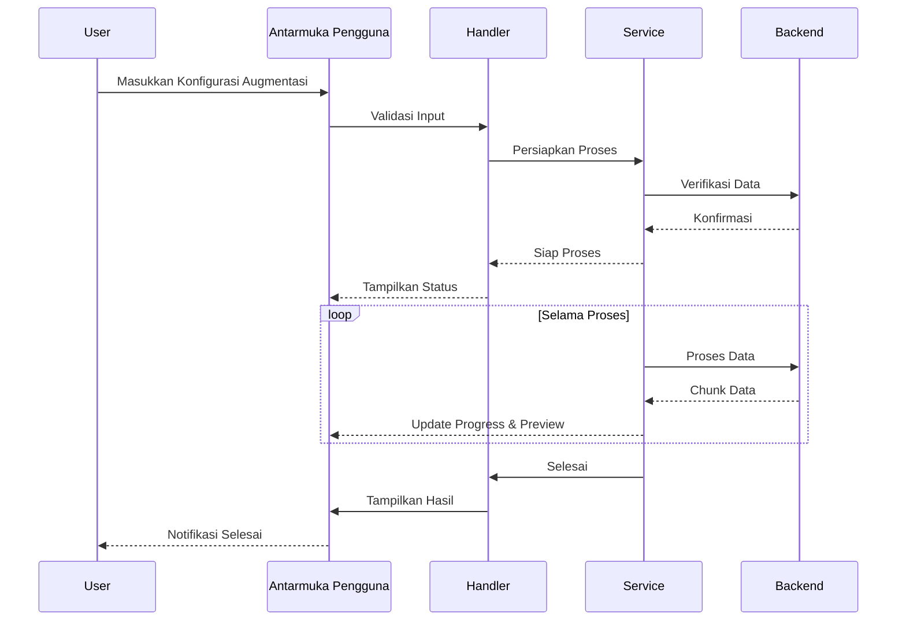

# 1.7 Augmentation Module

## Deskripsi

Modul Augmentation SmartCash menyediakan solusi terintegrasi untuk melakukan augmentasi data pada dataset gambar dan anotasi sebelum digunakan dalam pelatihan atau evaluasi model machine learning. Modul ini dirancang untuk lingkungan Jupyter/Colab, memudahkan pengguna dalam memperluas variasi data secara efisien dan aman.

Antarmuka pengguna yang intuitif memungkinkan konfigurasi berbagai teknik augmentasi seperti rotasi, flipping, scaling, cropping, brightness/contrast adjustment, blur, noise injection, dan transformasi geometri lainnya. Modul ini mendukung augmentasi berbasis konfigurasi, baik secara manual maupun otomatis, serta dapat diterapkan pada seluruh dataset atau subset tertentu.

Keamanan data tetap menjadi prioritas utama. Setiap operasi augmentasi yang berpotensi menimpa data asli akan meminta konfirmasi eksplisit dari pengguna. Sistem log terintegrasi mencatat setiap langkah augmentasi, memberikan transparansi dan kemudahan audit.

Modul ini mendukung augmentasi multi-thread untuk mempercepat proses pada dataset berukuran besar. Validasi hasil augmentasi dilakukan secara otomatis untuk memastikan konsistensi dan integritas data. Preview hasil augmentasi tersedia sebelum data disimpan secara permanen.

Manajemen versi augmentasi memungkinkan pengguna melacak perubahan dan membandingkan hasil antar konfigurasi. Metadata lengkap, termasuk parameter dan waktu eksekusi, disimpan untuk setiap proses augmentasi. Modul juga mendukung export hasil augmentasi ke format yang kompatibel dengan berbagai framework machine learning.

## Alur Kerja

## Alur Operasi

Proses augmentasi dimulai dengan inisialisasi modul dan verifikasi parameter yang dimasukkan pengguna. Sistem akan menampilkan opsi konfigurasi teknik augmentasi dan target data. Sebelum eksekusi, modul memeriksa integritas data dan meminta konfirmasi jika operasi akan menimpa data asli.

Setelah konfirmasi, proses augmentasi berjalan di latar belakang dengan optimasi multi-thread. Pengguna dapat memantau kemajuan melalui progress bar dan preview hasil secara real-time. Setiap langkah augmentasi divalidasi untuk memastikan hasil sesuai dengan konfigurasi.

Hasil augmentasi disimpan dalam struktur folder yang terorganisir, lengkap dengan metadata dan log operasi. Pengguna dapat mengakses riwayat proses, membandingkan hasil, dan mengembalikan data ke versi sebelumnya jika diperlukan. Modul juga mendukung export hasil augmentasi ke format yang kompatibel dengan berbagai framework machine learning.

## Diagram Urutan Operasi Augmentasi

