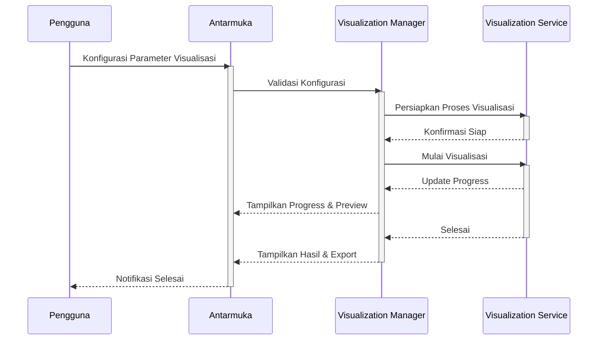
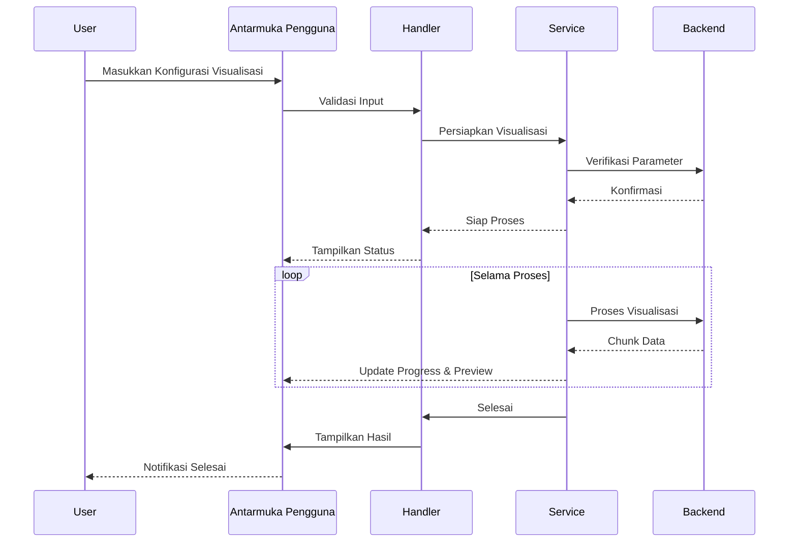

# 1.8 Dataset Visualization Module

## Deskripsi

Modul Dataset Visualization SmartCash menyediakan antarmuka dan pipeline untuk visualisasi dataset, anotasi, dan hasil preprocessing/augmentasi dalam ekosistem SmartCash. Modul ini mendukung berbagai teknik visualisasi seperti grid image, overlay bounding box, class distribution chart, dan preview transformasi data.

Antarmuka pengguna memungkinkan pemilihan subset dataset, konfigurasi parameter visualisasi, dan preview hasil secara interaktif. Modul ini mendukung visualisasi batch, per-class analysis, dan export hasil visualisasi ke format gambar atau laporan.

Keamanan dan konsistensi data dijaga dengan validasi parameter sebelum visualisasi dimulai. Setiap perubahan konfigurasi visualisasi akan meminta konfirmasi eksplisit dari pengguna dan dicatat dalam log operasi. Sistem log terintegrasi memberikan transparansi penuh atas setiap proses visualisasi.

Manajemen versi hasil visualisasi memungkinkan pengguna melacak, membandingkan, dan mengembalikan hasil ke versi sebelumnya jika diperlukan. Metadata lengkap, termasuk parameter, waktu eksekusi, dan hasil visualisasi, disimpan untuk setiap sesi visualisasi. Modul juga mendukung export hasil visualisasi ke format yang kompatibel dengan berbagai kebutuhan pelaporan.

## Alur Kerja

## Alur Operasi

Proses visualisasi dimulai dengan inisialisasi modul dan verifikasi parameter yang dimasukkan pengguna. Sistem akan menampilkan opsi konfigurasi visualisasi dan preview hasil. Sebelum eksekusi, modul memeriksa validitas parameter dan meminta konfirmasi jika ada perubahan signifikan.

Setelah konfirmasi, proses visualisasi berjalan di latar belakang dengan optimasi multi-thread jika diperlukan. Pengguna dapat memantau kemajuan melalui progress bar dan preview hasil secara real-time. Setiap langkah divalidasi untuk memastikan hasil visualisasi akurat dan informatif.

Hasil visualisasi disimpan dalam struktur folder yang terorganisir, lengkap dengan metadata dan log operasi. Pengguna dapat mengakses riwayat visualisasi, membandingkan hasil, dan mengembalikan ke versi sebelumnya jika diperlukan. Modul juga mendukung export hasil visualisasi ke format yang kompatibel dengan berbagai kebutuhan pelaporan.

## Diagram Urutan Operasi Visualisasi

