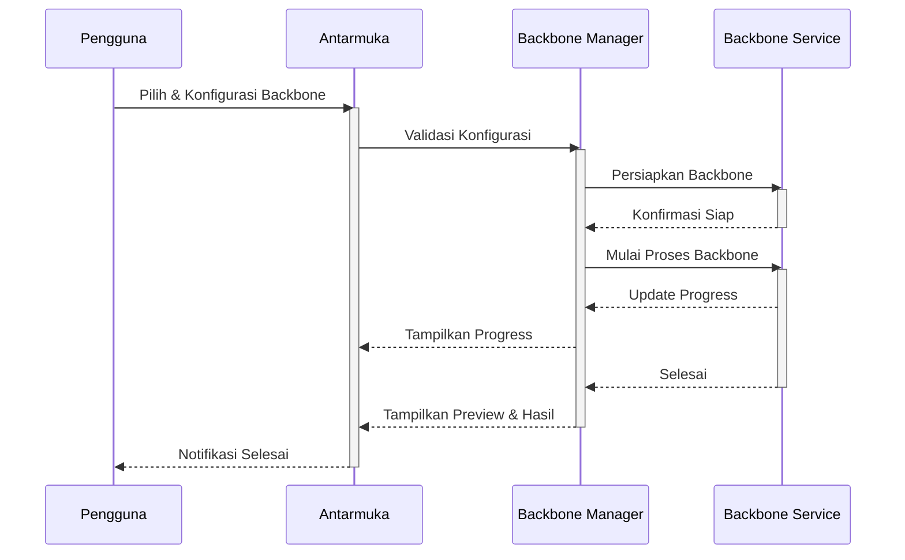
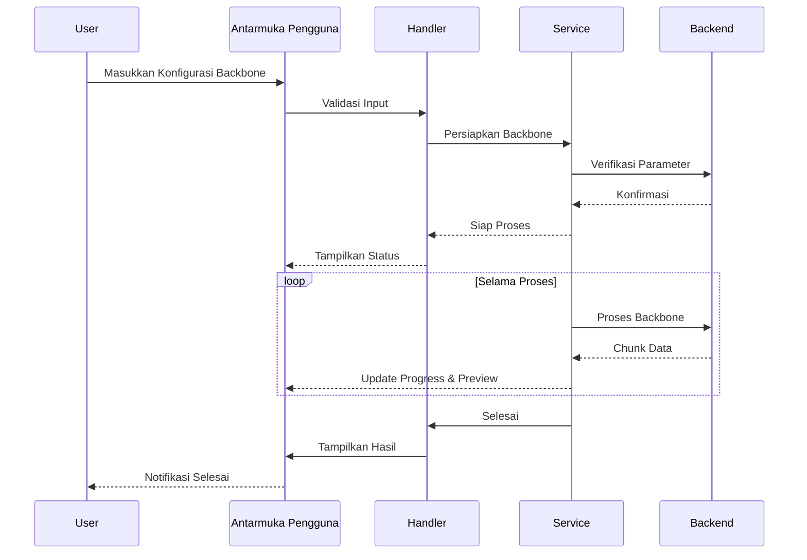

# Backbone Module SmartCash

## Deskripsi

Modul Backbone SmartCash menyediakan fondasi arsitektur untuk pemrosesan data dan pelatihan model machine learning. Modul ini bertanggung jawab atas pemilihan, konfigurasi, dan manajemen backbone neural network yang digunakan dalam pipeline SmartCash, seperti EfficientNet, ResNet, YOLO, dan backbone lain yang relevan untuk tugas deteksi dan klasifikasi.

Antarmuka pengguna yang intuitif memungkinkan pemilihan backbone, penyesuaian parameter (seperti jumlah layer, ukuran input, pretrained weights), serta integrasi dengan modul preprocessing dan augmentation. Modul ini mendukung pengujian berbagai backbone secara otomatis untuk menemukan konfigurasi optimal sesuai kebutuhan proyek.

Keamanan dan konsistensi model dijaga dengan validasi parameter sebelum backbone digunakan dalam pelatihan. Setiap perubahan konfigurasi backbone akan meminta konfirmasi eksplisit dari pengguna dan dicatat dalam log operasi. Sistem log terintegrasi memberikan transparansi penuh atas setiap perubahan dan eksperimen yang dilakukan.

Modul ini mendukung manajemen versi backbone, sehingga pengguna dapat melacak, membandingkan, dan mengembalikan konfigurasi backbone sebelumnya. Metadata lengkap, termasuk parameter, waktu eksekusi, dan hasil evaluasi, disimpan untuk setiap backbone yang digunakan. Preview arsitektur dan performa backbone tersedia sebelum proses pelatihan dimulai.

## Alur Kerja

## Alur Operasi

Proses backbone dimulai dengan inisialisasi modul dan verifikasi parameter yang dimasukkan pengguna. Sistem akan menampilkan opsi pemilihan backbone, konfigurasi parameter, dan integrasi dengan modul lain. Sebelum eksekusi, modul memeriksa validitas parameter dan meminta konfirmasi jika ada perubahan signifikan.

Setelah konfirmasi, proses backbone berjalan di latar belakang dengan optimasi multi-thread jika diperlukan. Pengguna dapat memantau kemajuan melalui progress bar dan preview arsitektur secara real-time. Setiap langkah divalidasi untuk memastikan backbone siap digunakan dalam pelatihan.

Konfigurasi backbone disimpan dalam struktur folder yang terorganisir, lengkap dengan metadata dan log operasi. Pengguna dapat mengakses riwayat konfigurasi, membandingkan hasil, dan mengembalikan ke versi sebelumnya jika diperlukan. Modul juga mendukung export konfigurasi backbone ke format yang kompatibel dengan berbagai framework machine learning.

## Diagram Urutan Operasi Backbone

