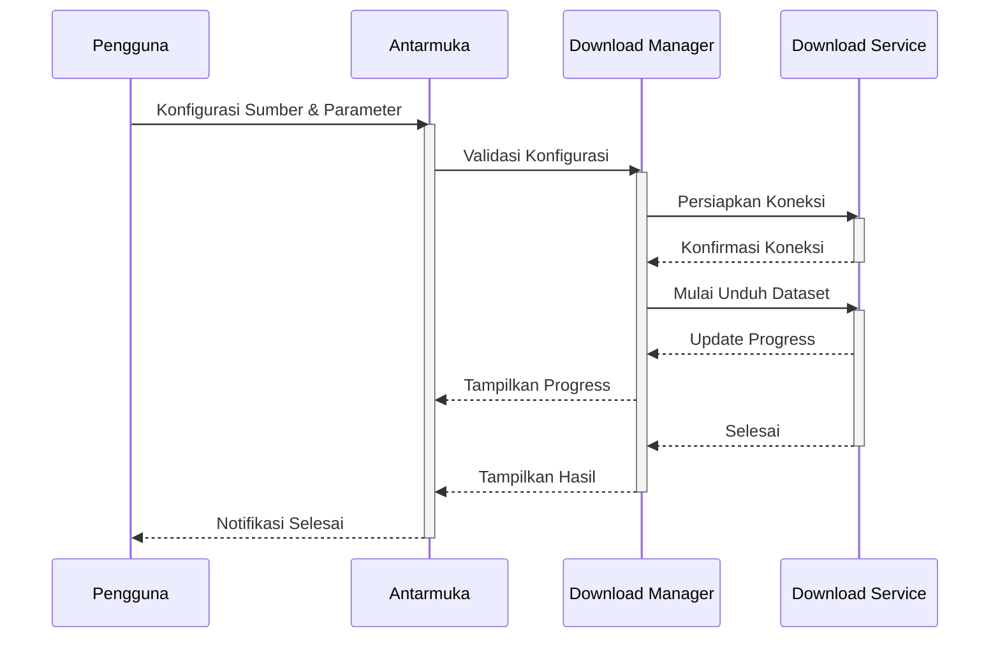
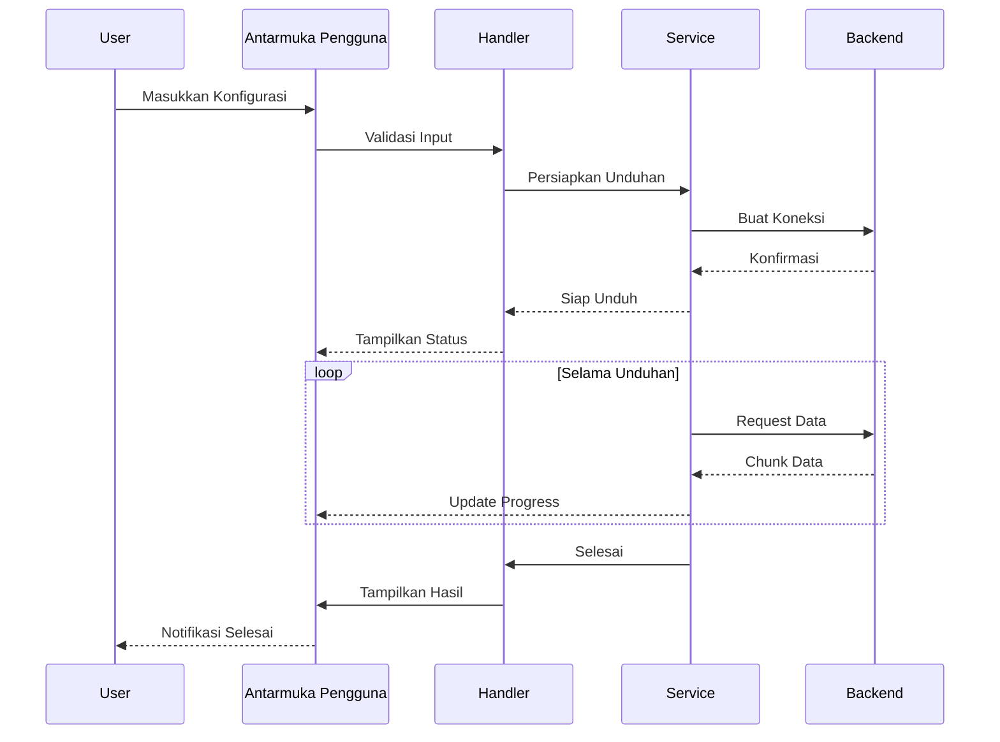

# Dataset Downloader SmartCash

## Deskripsi

Modul Dataset Downloader SmartCash menyediakan solusi terpadu untuk mengunduh, mengekstrak, membackup, dan membersihkan dataset yang diperoleh dari API Roboflow. Dikembangkan khusus untuk lingkungan komputasi berbasis Jupyter/Colab, modul ini menawarkan pengalaman pengguna yang aman dan efisien dalam mengelola dataset machine learning.

Dataset yang diunduh akan secara otomatis disimpan di Google Drive pengguna melalui integrasi yang mulus. Setiap dataset diorganisir dalam struktur folder yang jelas dengan format `/SmartCash/datasets/[nama_dataset]/[versi]`, memudahkan pelacakan dan manajemen berbagai versi dataset. Sistem ini secara otomatis membuat backup versi sebelumnya sebelum melakukan pembaruan, memastikan keamanan data. Untuk mempercepat akses, modul juga menyediakan penyimpanan cache lokal yang dioptimalkan.

Keamanan menjadi prioritas utama dalam modul ini. Setiap operasi kritis seperti pengunduhan ulang dataset yang sudah ada atau pembersihan dataset akan memerlukan konfirmasi eksplisit dari pengguna, mencegah kehilangan data yang tidak disengaja. Integrasi dengan API Roboflow dilengkapi dengan lapisan keamanan tambahan termasuk enkripsi kredensial dan manajemen koneksi yang andal. Sistem ini secara otomatis menangani koneksi yang terputus dengan mekanisme auto-retry dan menerapkan limitasi kecepatan unduh untuk menghindari pembatasan API.

Modul ini mendukung berbagai format dataset populer seperti COCO, YOLO, Pascal VOC, dan TFRecord, dengan kemampuan konversi otomatis di antara berbagai format tersebut. File-file terkompresi dalam format ZIP, TAR, atau RAR dapat langsung diproses dan divalidasi integritasnya. Setiap dataset yang diunduh akan melalui proses validasi struktur untuk memastikan konsistensi dan kelengkapan data.

Sistem manajemen versi yang terintegrasi memungkinkan pelacakan perubahan pada dataset dari waktu ke waktu. Pengguna dapat dengan mudah kembali ke versi sebelumnya jika diperlukan, sementara log operasi yang terperinci memberikan transparansi penuh atas setiap perubahan yang dilakukan. Untuk menangani dataset berukuran besar, modul ini mengimplementasikan unduhan multi-thread yang dioptimalkan, dilengkapi dengan kompresi otomatis untuk menghemat ruang penyimpanan. Setiap file yang diunduh divalidasi menggunakan checksum untuk memastikan integritas data dan mencegah korupsi file.

## Alur Kerja

## Alur Operasi

Proses pengunduhan dataset dimulai dengan inisialisasi modul yang memverifikasi ketersediaan kredensial Roboflow dan koneksi ke Google Drive. Pengguna dapat memilih dataset melalui antarmuka yang intuitif, di mana sistem akan secara otomatis menampilkan informasi versi dan ukuran dataset yang tersedia. Sebelum memulai pengunduhan, sistem akan memeriksa ketersediaan ruang penyimpanan dan meminta konfirmasi jika dataset dengan nama yang sama sudah ada.

Setelah konfirmasi, sistem memulai proses unduhan dengan membangun koneksi aman ke server Roboflow. Proses unduhan berjalan di latar belakang menggunakan multiple threads untuk mempercepat transfer data, sementara pengguna dapat memantau kemajuan melalui progress bar yang informatif. Setiap file yang diunduh langsung divalidasi menggunakan checksum untuk memastikan integritas data.

Setelah pengunduhan selesai, sistem secara otomatis mengekstrak file terkompresi dan memvalidasi struktur dataset sesuai format yang dipilih. Jika diperlukan, konversi format akan dilakukan untuk memastikan kompatibilitas dengan framework machine learning yang digunakan. Semua file disimpan dalam struktur folder yang terorganisir di Google Drive, dengan pencatatan metadata lengkap termasuk versi, tanggal pengunduhan, dan informasi validasi.

Untuk memastikan keandalan, sistem menerapkan mekanisme pemulihan otomatis jika terjadi gangguan koneksi. Pengguna dapat menjeda dan melanjutkan pengunduhan kapan saja, dan sistem akan secara otomatis melanjutkan dari titik terakhir yang berhasil diunduh. Setiap operasi yang dilakukan dicatat dalam log terperinci yang dapat diakses melalui antarmuka pengguna, memberikan transparansi penuh atas seluruh proses pengunduhan dan manajemen dataset.

## Diagram Urutan Operasi Unduhan

