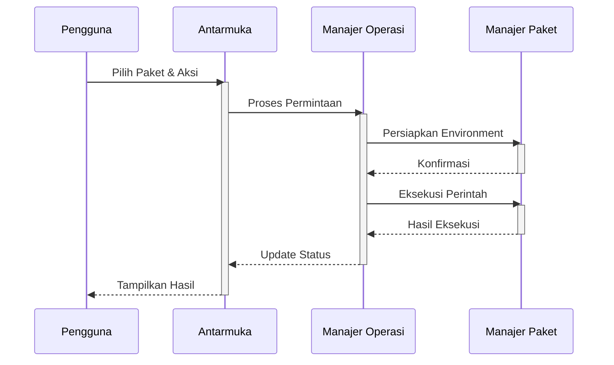
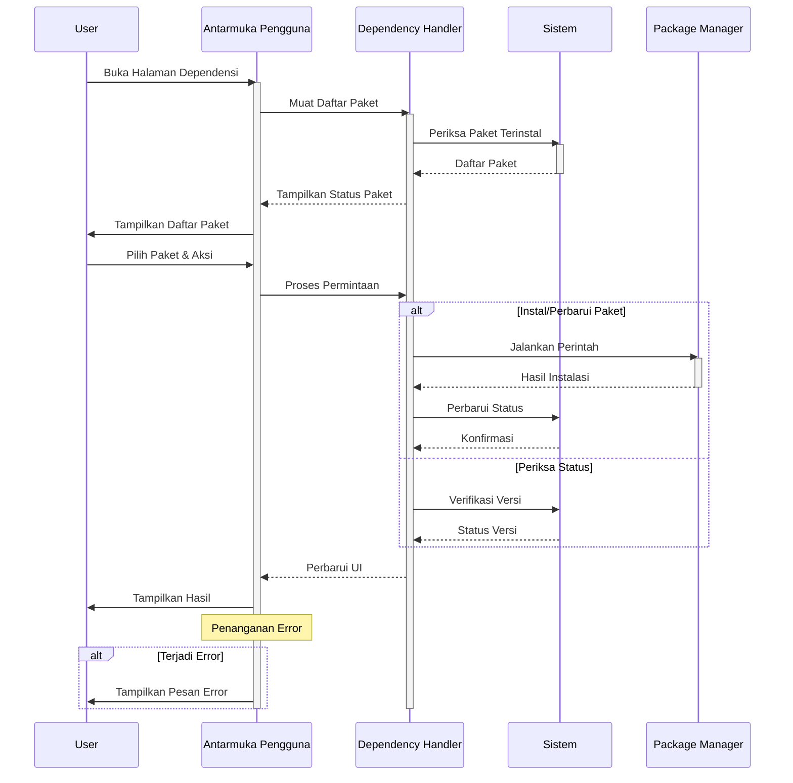

# Manajemen Dependensi SmartCash

## Deskripsi

Modul manajemen dependensi SmartCash hadir sebagai solusi komprehensif untuk mengatasi tantangan kompleksitas pengelolaan paket Python dalam lingkungan komputasi ilmiah berbasis Jupyter/Colab. Modul ini dirancang khusus untuk menyederhanakan alur kerja pengembangan dengan menyediakan antarmuka terpadu yang memudahkan instalasi, pembaruan, dan manajemen dependensi secara efisien. Dalam ekosistem data science yang kaya akan library dengan berbagai ketergantungan, modul ini berperan penting dalam memastikan konsistensi dan kompatibilitas antar paket.

Proses manajemen dependensi dimulai dengan pemindaian otomatis terhadap paket yang dibutuhkan, diikuti dengan validasi kompatibilitas versi dan resolusi konflik yang mungkin timbul. Sistem ini mengintegrasikan manajemen environment virtual untuk mengisolasi dependensi tiap proyek, memungkinkan pengembangan yang lebih bersih dan terstruktur. Dengan dukungan operasi asinkron, modul ini memastikan antarmuka tetap responsif bahkan saat menangani operasi yang memakan waktu seperti instalasi paket berukuran besar atau pembaruan komponen sistem.

## Alur Kerja

## Diagram Urutan Manajemen Dependensi

## Alur Kerja

Proses manajemen dependensi dimulai dengan inisialisasi menyeluruh di mana sistem memuat konfigurasi dependensi yang diperlukan sambil secara bersamaan menginisialisasi komponen antarmuka pengguna. Selama tahap ini, sistem secara otomatis memindai dan memverifikasi status semua paket yang terinstal, memastikan lingkungan pengembangan siap untuk operasi lebih lanjut.

Setelah inisialisasi selesai, pengguna dapat melakukan berbagai operasi manajemen dependensi melalui antarmuka yang intuitif. Untuk instalasi paket baru, sistem akan mengunduh dan mengonfigurasi semua dependensi yang diperlukan, sementara opsi pembaruan memungkinkan peningkatan ke versi terbaru dengan penanganan otomatis terhadap potensi konflik versi. Fitur penghapusan memberikan cara yang aman untuk membersihkan paket yang tidak digunakan, dan fungsi pemeriksaan terintegrasi memungkinkan verifikasi cepat terhadap status dan kompatibilitas semua komponen yang terpasang.

Seluruh alur kerja didukung oleh sistem manajemen status yang canggih yang terus-menerus memantau setiap operasi yang berjalan. Sistem ini memberikan umpan balik visual secara real-time kepada pengguna, menampilkan kemajuan operasi dan peringatan apa pun yang mungkin muncul. Setiap tindakan yang dilakukan dicatat secara rinci dalam log audit, menciptakan jejak audit yang komprehensif yang dapat digunakan untuk pemecahan masalah atau analisis di masa mendatang. Pendekatan terstruktur ini memastikan manajemen dependensi yang andal dan dapat dilacak di seluruh siklus hidup pengembangan proyek.
