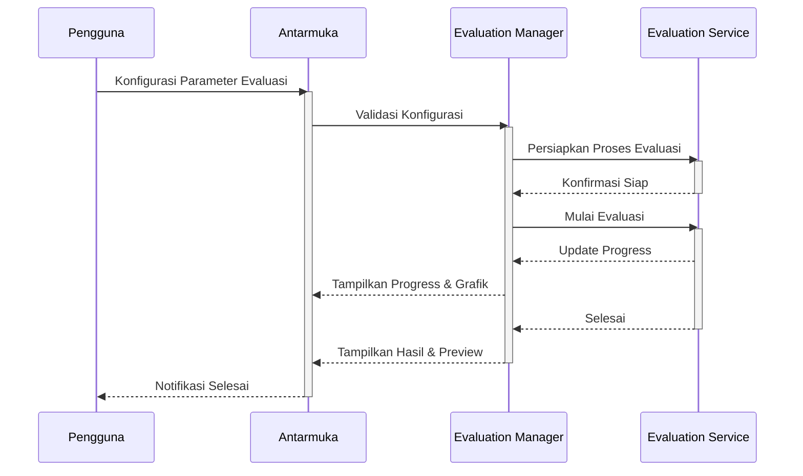
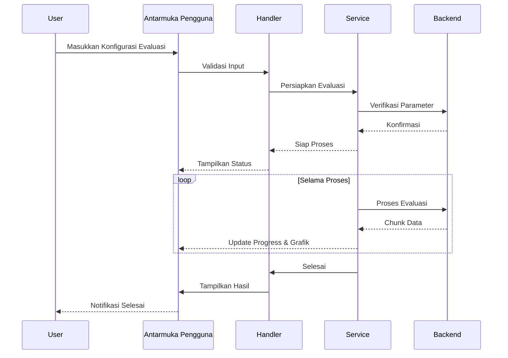

# Evaluation Module SmartCash

## Deskripsi

Modul Evaluation SmartCash menyediakan pipeline dan antarmuka terintegrasi untuk evaluasi model machine learning yang telah dilatih. Modul ini mendukung berbagai metrik evaluasi seperti accuracy, precision, recall, F1-score, confusion matrix, serta visualisasi hasil prediksi dan error analysis.

Antarmuka pengguna memungkinkan pemilihan dataset evaluasi, konfigurasi parameter evaluasi, dan preview hasil evaluasi secara interaktif. Modul ini mendukung evaluasi batch, per-class analysis, dan export hasil evaluasi ke format yang kompatibel dengan framework machine learning atau laporan.

Keamanan dan konsistensi data dijaga dengan validasi parameter sebelum evaluasi dimulai. Setiap perubahan konfigurasi evaluasi akan meminta konfirmasi eksplisit dari pengguna dan dicatat dalam log operasi. Sistem log terintegrasi memberikan transparansi penuh atas setiap eksperimen evaluasi.

Manajemen versi hasil evaluasi memungkinkan pengguna melacak, membandingkan, dan mengembalikan hasil ke versi sebelumnya. Metadata lengkap, termasuk parameter, waktu eksekusi, dan hasil evaluasi, disimpan untuk setiap sesi evaluasi. Modul juga mendukung export hasil evaluasi ke format yang kompatibel dengan berbagai framework dan kebutuhan pelaporan.

## Alur Kerja

## Alur Operasi

Proses evaluasi dimulai dengan inisialisasi modul dan verifikasi parameter yang dimasukkan pengguna. Sistem akan menampilkan opsi konfigurasi evaluasi dan integrasi dengan modul lain. Sebelum eksekusi, modul memeriksa validitas parameter dan meminta konfirmasi jika ada perubahan signifikan.

Setelah konfirmasi, proses evaluasi berjalan di latar belakang dengan optimasi multi-thread jika diperlukan. Pengguna dapat memantau kemajuan melalui progress bar, grafik, dan preview hasil secara real-time. Setiap langkah divalidasi untuk memastikan hasil evaluasi akurat dan informatif.

Hasil evaluasi disimpan dalam struktur folder yang terorganisir, lengkap dengan metadata dan log operasi. Pengguna dapat mengakses riwayat evaluasi, membandingkan hasil, dan mengembalikan ke versi sebelumnya jika diperlukan. Modul juga mendukung export hasil evaluasi ke format yang kompatibel dengan berbagai framework dan kebutuhan pelaporan.

## Diagram Urutan Operasi Evaluasi

