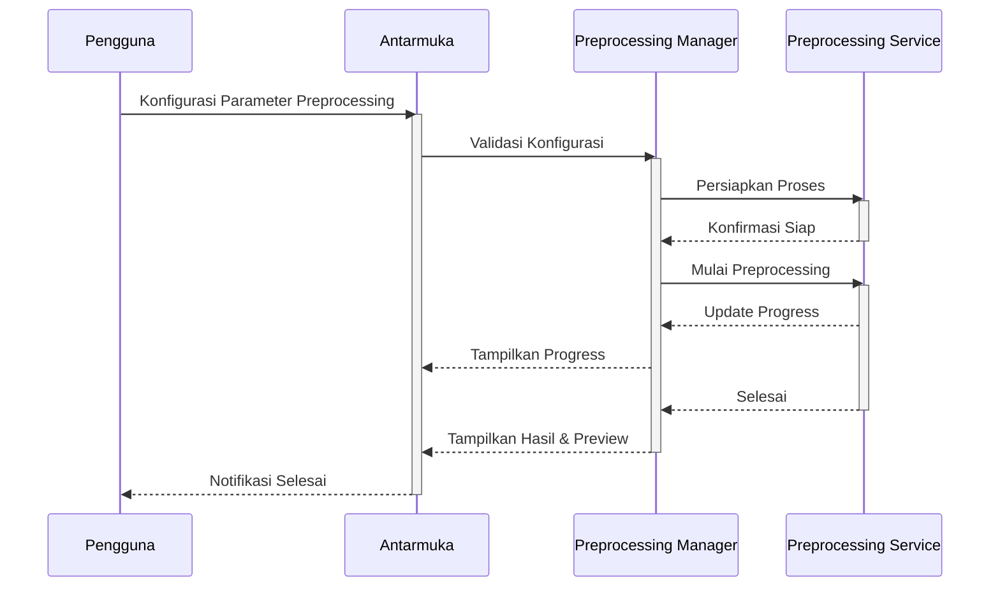
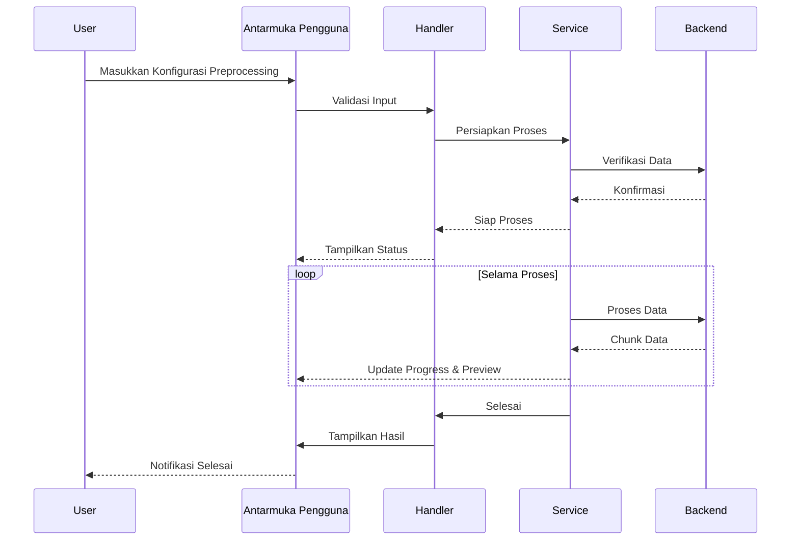

# Preprocessing Module SmartCash

## Deskripsi

Modul Preprocessing SmartCash menyediakan solusi komprehensif untuk memproses, membersihkan, dan menyiapkan data sebelum digunakan dalam pelatihan atau evaluasi model machine learning. Dirancang khusus untuk lingkungan Jupyter/Colab, modul ini memudahkan pengguna dalam melakukan transformasi data secara efisien dan aman.

Setiap proses preprocessing didukung oleh antarmuka pengguna yang intuitif, memungkinkan konfigurasi parameter seperti augmentasi, normalisasi, dan pembagian dataset (train/valid/test) secara fleksibel. Modul ini mendukung berbagai format data populer dan dapat melakukan konversi otomatis sesuai kebutuhan framework yang digunakan.

Keamanan dan integritas data menjadi prioritas utama. Setiap operasi yang berpotensi mengubah atau menghapus data akan meminta konfirmasi eksplisit dari pengguna. Sistem log terintegrasi mencatat setiap langkah preprocessing, memberikan transparansi penuh dan kemudahan audit.

Modul ini mendukung berbagai teknik preprocessing seperti resize, crop, rotasi, flipping, normalisasi, dan augmentasi berbasis konfigurasi. Proses dapat dijalankan secara batch dengan optimasi multi-thread untuk mempercepat eksekusi pada dataset berukuran besar. Validasi struktur dan konsistensi data dilakukan secara otomatis setelah setiap operasi.

Manajemen versi preprocessing memungkinkan pengguna melacak perubahan dan kembali ke versi sebelumnya jika diperlukan. Metadata lengkap, termasuk parameter dan waktu eksekusi, disimpan untuk setiap proses. Modul juga menyediakan preview hasil preprocessing sebelum data disimpan secara permanen.

## Alur Kerja

## Alur Operasi

Proses preprocessing dimulai dengan inisialisasi modul dan verifikasi parameter yang dimasukkan pengguna. Sistem akan menampilkan opsi konfigurasi seperti jenis augmentasi, metode normalisasi, dan pembagian dataset. Sebelum eksekusi, modul memeriksa integritas data dan meminta konfirmasi jika operasi akan mengubah data asli.

Setelah konfirmasi, proses preprocessing berjalan di latar belakang dengan optimasi multi-thread. Pengguna dapat memantau kemajuan melalui progress bar dan preview hasil secara real-time. Setiap langkah preprocessing divalidasi untuk memastikan hasil sesuai dengan konfigurasi.

Hasil preprocessing disimpan dalam struktur folder yang terorganisir, lengkap dengan metadata dan log operasi. Pengguna dapat mengakses riwayat proses, membandingkan hasil, dan mengembalikan data ke versi sebelumnya jika diperlukan. Modul juga mendukung export hasil preprocessing ke format yang kompatibel dengan berbagai framework machine learning.

## Diagram Urutan Operasi Preprocessing

