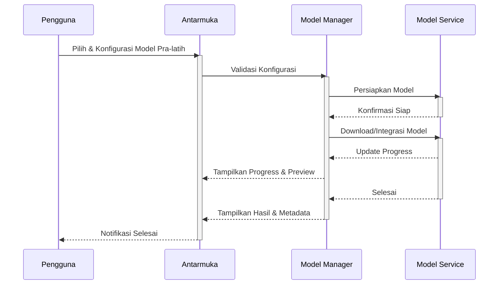
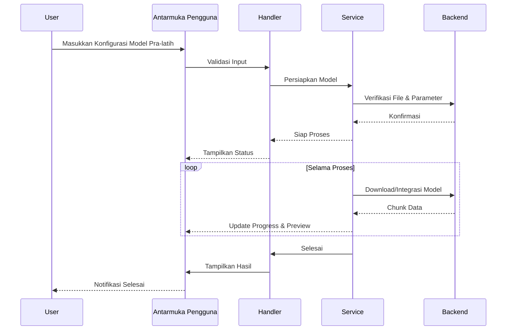

# Pretrained Model Module SmartCash

## Deskripsi

Modul Pretrained Model SmartCash menyediakan antarmuka dan pipeline untuk integrasi, manajemen, dan pemanfaatan model pra-latih (pretrained) dalam ekosistem SmartCash. Modul ini mendukung pemilihan berbagai model pra-latih populer seperti EfficientNet, YOLO, ResNet, dan model lain yang relevan, baik untuk transfer learning maupun inferensi langsung.

Antarmuka pengguna memungkinkan pemilihan model, konfigurasi parameter, dan preview arsitektur serta performa model sebelum digunakan. Modul ini mendukung download otomatis model dari sumber resmi, validasi integritas file, dan pencatatan metadata model.

Keamanan dan konsistensi dijaga dengan validasi parameter dan file model sebelum digunakan. Setiap perubahan atau penggantian model pra-latih akan meminta konfirmasi eksplisit dari pengguna dan dicatat dalam log operasi. Sistem log terintegrasi memberikan transparansi penuh atas setiap proses integrasi dan pemanfaatan model.

Manajemen versi model pra-latih memungkinkan pengguna melacak, membandingkan, dan mengembalikan ke versi sebelumnya jika diperlukan. Metadata lengkap, termasuk parameter, waktu eksekusi, dan hasil evaluasi, disimpan untuk setiap model yang digunakan. Modul juga mendukung export model ke format yang kompatibel dengan berbagai framework machine learning.

## Alur Kerja

## Alur Operasi

Proses integrasi model pra-latih dimulai dengan inisialisasi modul dan verifikasi parameter yang dimasukkan pengguna. Sistem akan menampilkan opsi pemilihan model, konfigurasi parameter, dan preview arsitektur. Sebelum eksekusi, modul memeriksa validitas file dan parameter serta meminta konfirmasi jika ada perubahan signifikan.

Setelah konfirmasi, proses download dan integrasi model berjalan di latar belakang dengan optimasi multi-thread jika diperlukan. Pengguna dapat memantau kemajuan melalui progress bar dan preview hasil secara real-time. Setiap langkah divalidasi untuk memastikan model siap digunakan.

Model pra-latih disimpan dalam struktur folder yang terorganisir, lengkap dengan metadata dan log operasi. Pengguna dapat mengakses riwayat model, membandingkan hasil, dan mengembalikan ke versi sebelumnya jika diperlukan. Modul juga mendukung export model ke format yang kompatibel dengan berbagai framework machine learning.

## Diagram Urutan Operasi Model Pra-latih

