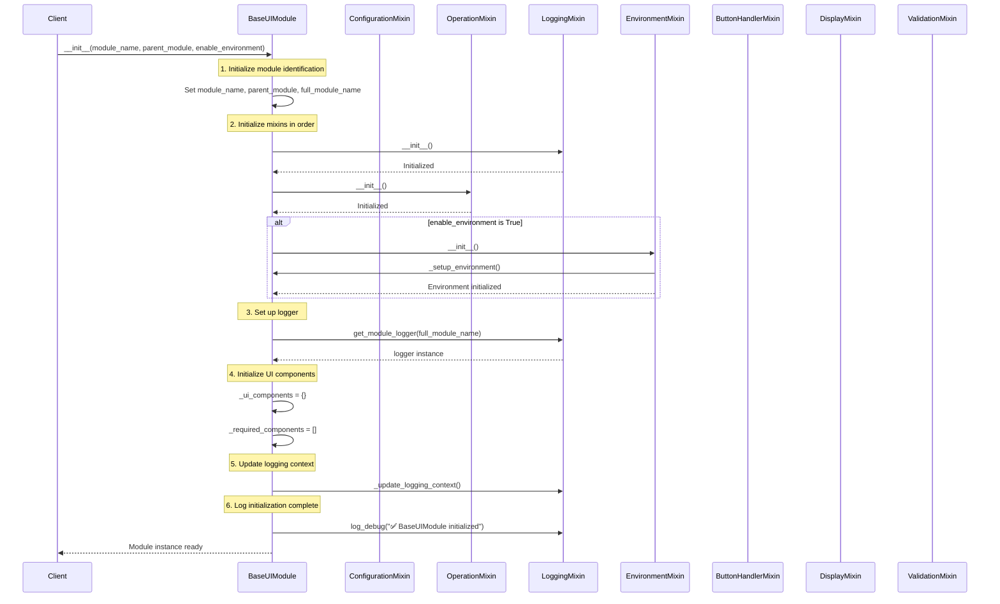

# UI Module Initialization Sequence

This document illustrates the initialization flow between `BaseUIModule` and its mixins.

## Key Initialization Steps

1. **Module Identification**
   - Sets up basic module identification (name, parent, full name)

2. **Mixin Initialization**
   - `LoggingMixin` is initialized first for error handling
   - `OperationMixin` is initialized for operation management
   - `EnvironmentMixin` is conditionally initialized if enabled

3. **Logger Setup**
   - Creates a module-specific logger using the full module name
   - Sets up logging context for the module

4. **UI Components**
   - Initializes empty UI components dictionary
   - Sets up required components list

5. **Post-Initialization**
   - Updates logging context with module-specific information
   - Logs successful initialization

## Mixin Dependencies

- `LoggingMixin`: Required by all other mixins for logging
- `OperationMixin`: Depends on `LoggingMixin`
- `EnvironmentMixin`: Optional, depends on `LoggingMixin`
- `ButtonHandlerMixin`: Depends on `LoggingMixin` and `OperationMixin`
- `DisplayMixin`: Depends on `LoggingMixin`
- `ValidationMixin`: Depends on `LoggingMixin`

## Notes

- The initialization order is critical due to dependencies between mixins
- `LoggingMixin` is always initialized first to ensure proper error handling
- Environment support is optional and conditionally initialized
- The module is marked as initialized only after all components are ready
