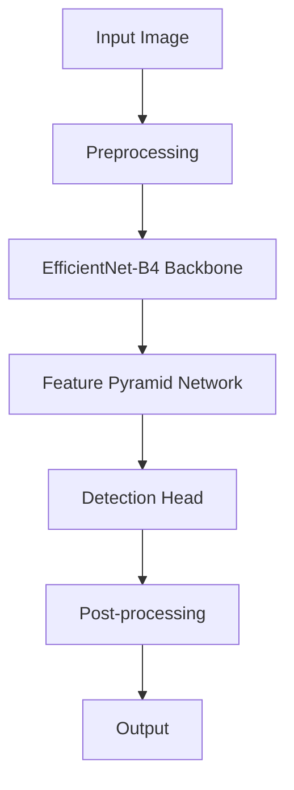
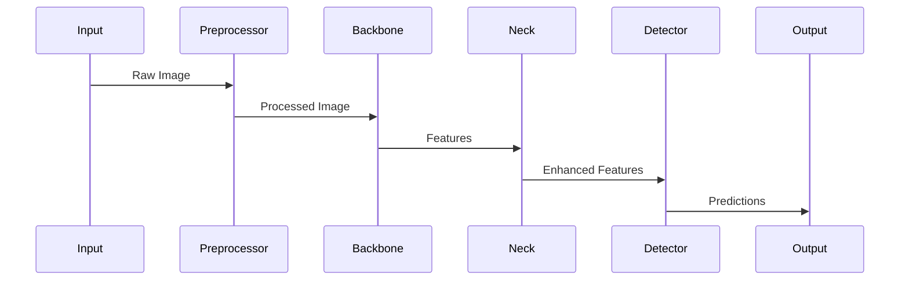

# 📚 Dokumentasi Teknis SmartCash (Updated)

## 📋 Overview

SmartCash adalah sistem deteksi nilai mata uang yang mengintegrasikan YOLOv5 dengan EfficientNet-B4 sebagai backbone melalui timm library. Sistem ini dirancang untuk meningkatkan akurasi deteksi nilai mata uang Rupiah dengan mempertimbangkan berbagai kondisi pengambilan gambar.

## 🏗️ Arsitektur SmartCash

### Overview

SmartCash menggunakan arsitektur modular yang terdiri dari beberapa komponen utama:



### Komponen Utama

#### 1. Preprocessing (`smartcash.utils.preprocessing`)
- Image resizing (640x640)
- Normalisasi
- Augmentasi data (training)
- Label processing

#### 2. Backbone Network (`smartcash.models.backbone`)
- EfficientNet-B4 via timm
- Feature extraction stages
- Transfer learning support
- Configurable layer freezing

#### 3. Feature Processing (`smartcash.models.neck`)
- Feature Pyramid Network (FPN)
- Path Aggregation Network (PAN)
- Multi-scale feature fusion

#### 4. Detection Head (`smartcash.models.head`)
- Multi-scale detection
- Class-specific predictions
- Bounding box regression

#### 5. Post-processing (`smartcash.utils.postprocess`)
- Non-maximum suppression
- Confidence thresholding
- Label mapping

## 🛠️ Implementation Details

### Data Flow

#### 1. Input Processing
```python
# Preprocessing pipeline
image = preprocess_image(input_image)
image = normalize(image)
if training:
    image = augment(image)
```

#### 2. Feature Extraction
```python
# Backbone features
features = backbone.extract_features(image)
# FPN processing
pyramid_features = fpn(features)
```

#### 3. Detection
```python
# Multi-scale detection
predictions = []
for scale in pyramid_features:
    pred = detection_head(scale)
    predictions.append(pred)
```

#### 4. Post-processing
```python
# NMS and thresholding
final_boxes = nms(predictions)
final_boxes = filter_confidence(final_boxes)
```

## 📊 Performance Metrics

### Training
- Batch size: 16-32
- Learning rate: 1e-4 to 1e-5
- Optimizer: AdamW
- Scheduler: CosineAnnealingLR

### Inference
- Speed: ~30 FPS (GPU)
- Memory: ~2GB VRAM
- CPU Support: Yes (reduced performance)

### Accuracy Metrics
- mAP@0.5: 0.95+
- Precision: 0.93+
- Recall: 0.92+

## 🔄 Data Flow



## 🛡️ Error Handling

### 1. Input Validation
- Image size checks
- Format validation
- Quality assessment

### 2. Runtime Checks
- Memory monitoring
- GPU availability
- Batch size adjustment

### 3. Output Validation
- Confidence thresholds
- Box coordinate checks
- Label verification

## 📈 Scaling Considerations

### Hardware Requirements
- Minimum: 8GB RAM, 2GB VRAM
- Recommended: 16GB RAM, 4GB VRAM
- Optional: CUDA-capable GPU

### Batch Processing
- Dynamic batch sizing
- Memory-efficient inference
- Multi-GPU support

## 🔗 Integration Points

### Input Interfaces
- Image files (.jpg, .png)
- Video streams
- Camera input
- Batch processing

### Output Formats
- JSON predictions
- Annotated images
- CSV reports
- TensorBoard logs

## 📊 Training Pipeline

### Data Management & Preprocessing

#### Pipeline Preprocessing
1. **Input Data**
   - Dataset split: 70% training, 15% validation, 15% testing
   - Format gambar: JPG/JPEG
   - Format label: TXT (YOLO format & polygon coordinates)

2. **Cache System**
   - Persistent disk cache untuk hasil preprocessing
   - Cache key berdasarkan hash file + parameter
   - LRU cleanup policy dengan configurable max size
   - Tracking cache stats (hit rate, size, file count)

3. **Coordinate Normalization**
   - Normalisasi koordinat polygon ke range [0,1]
   - Backward compatibility dengan format YOLO bbox
   - Validasi dan sanitasi koordinat

4. **Image Processing**
   - Resize ke 640x640 pixels
   - Normalisasi pixel values (mean/std)
   - Augmentasi data:
     - Rotasi dan flipping
     - Variasi pencahayaan
     - Scaling dan cropping

5. **Validasi Output**
   - Verifikasi integritas gambar
   - Validasi format label
   - Statistik preprocessing detail
   - Auto-revalidation

### Optimization
- Transfer learning dari pretrained EfficientNet-B4
- Progressive layer unfreezing
- Learning rate scheduling dengan warmup

### Monitoring
- Logging dengan contextual emojis
- Debug information untuk feature shapes
- Progress tracking dengan tqdm

## 🔍 Evaluasi

### Skenario Pengujian
1. **Baseline**: YOLOv5 dengan CSPDarknet
   - Variasi posisi
   - Variasi pencahayaan
2. **Optimized**: YOLOv5 dengan EfficientNet-B4
   - Variasi posisi
   - Variasi pencahayaan

### Metrik Evaluasi
- Accuracy
- Precision
- Recall
- F1-Score
- mAP
- Inference Time

## 💾 Cache Management

### Struktur Cache
```
.cache/preprocessing/
├── cache_index.json    # Metadata & tracking
└── [hash].pkl         # Cached preprocessing results
```

### Cache Metrics
- Hit Rate: Persentase cache hits vs total requests
- Cache Size: Total ukuran data yang di-cache
- File Count: Jumlah file dalam cache system

### Cleanup Policy
1. **Size-based**:
   - Trigger ketika melebihi max_size_gb
   - Hapus file terlama (LRU)
   - Update index setelah cleanup

2. **Manual**:
   - Method clear_cache() untuk reset
   - Recreate cache structure
   - Reset statistics

## 🚀 Deployment

### Requirements
```text
torch>=1.7.0
timm>=0.6.12
numpy>=1.19.0
opencv-python>=4.5.0
albumentations>=1.0.0
```

### Hardware Requirements
- GPU dengan minimal 6GB VRAM
- CPU dengan 8+ cores untuk preprocessing
- 16GB+ RAM untuk batch processing

### Resource Management
- Memory limit: 60% dari available resources
- Multi-processing untuk data loading
- Batch size optimization

## 📝 Notes
- Backbone menggunakan timm untuk better compatibility
- Channel dimensions diambil otomatis dari EfficientNet
- Debug mode tersedia untuk detailed feature analysis
- Resource usage dibatasi untuk stabilitas sistem