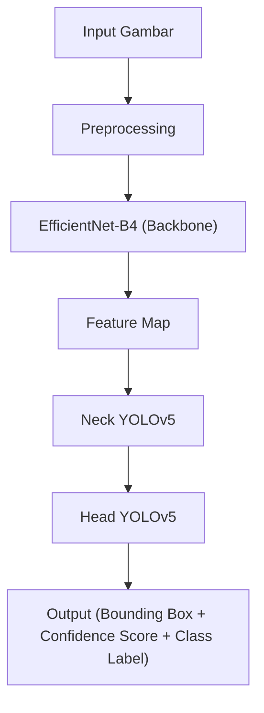
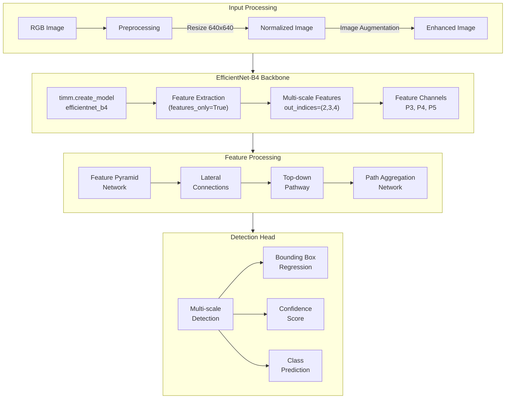

Berikut adalah ringkasan tahapan pengenalan objek menggunakan EfficientNet-B4 sebagai backbone dalam arsitektur YOLOv5, beserta diagram Mermaidnya:

### Ringkasan Tahapan

1. **Tahap Input Gambar**:
   - Gambar mentah (uang kertas rupiah) dimasukkan ke dalam sistem deteksi.
   - Gambar mengalami preprocessing (resize, normalisasi, augmentasi) untuk memastikan ukurannya sesuai dengan input yang diharapkan oleh YOLOv5 dan EfficientNet-B4.

2. **Backbone EfficientNet-B4**:
   - EfficientNet-B4 menggantikan backbone YOLOv5 (CSPDarknet) untuk mengekstraksi fitur dari gambar input.
   - EfficientNet-B4 mengekstrak fitur melalui serangkaian lapisan konvolusi (MBConv) yang lebih efisien.
   - Fitur yang diekstrak mencakup pola-pola penting pada uang kertas rupiah, seperti angka nominal, tekstur uang, gambar, dan simbol watermark atau keamanan.
   - Compound Scaling membuat fitur yang diekstrak lebih detail dan multi-level, membantu mendeteksi objek kecil dan variasi pencahayaan dengan lebih baik.
   - Hasil ekstraksi fitur adalah feature map yang dikirimkan ke Neck YOLOv5.

3. **Neck YOLOv5**:
   - Neck (FPN atau PANet) menggabungkan fitur multi-level yang dihasilkan EfficientNet-B4.
   - Ini memungkinkan model menangani objek dengan berbagai ukuran dan resolusi.

4. **Prediksi di Head YOLOv5**:
   - Head YOLOv5 memproses fitur dari Neck untuk memprediksi:
     - Bounding Box (posisi dan ukuran objek).
     - Confidence Score (tingkat keyakinan deteksi).
     - Kelas Objek (misalnya nominal uang: "50.000" atau "100.000").

### Diagram Mermaid



Diagram ini menggambarkan alur kerja dari input gambar hingga output prediksi objek menggunakan arsitektur YOLOv5 dengan EfficientNet-B4 sebagai backbone.
Berikut diagram lebih detilnya:



# 🤖 Model Architecture: YOLOv5 + EfficientNet-B4

## 📋 Overview

SmartCash menggunakan arsitektur YOLOv5 yang dimodifikasi dengan EfficientNet-B4 sebagai backbone. Modifikasi ini meningkatkan kemampuan ekstraksi fitur untuk deteksi nilai mata uang Rupiah.

## 🏗️ Architecture Components

### 1. EfficientNet-B4 Backbone

```python
class EfficientNetBackbone(nn.Module):
    def __init__(self, pretrained=True):
        super().__init__()
        self.model = timm.create_model(
            'efficientnet_b4',
            pretrained=pretrained,
            features_only=True,
            out_indices=(2, 3, 4)  # P3, P4, P5 stages
        )
        
    def forward(self, x):
        return self.model(x)
```

#### Key Features
- Pre-trained weights dari ImageNet
- Feature extraction dari multiple stages
- Compound scaling untuk optimal performance
- Adaptive receptive field

### 2. Feature Pyramid Network (FPN)

```python
class FeaturePyramidNetwork(nn.Module):
    def __init__(self, in_channels, out_channels):
        super().__init__()
        self.lateral_convs = nn.ModuleList()
        self.output_convs = nn.ModuleList()
        
        for in_ch in in_channels:
            self.lateral_convs.append(
                Conv2d(in_ch, out_channels, 1)
            )
            self.output_convs.append(
                Conv2d(out_channels, out_channels, 3, padding=1)
            )
```

#### Features
- Multi-scale feature fusion
- Top-down pathway
- Lateral connections
- Feature enhancement

### 3. Path Aggregation Network (PAN)

```python
class PathAggregationNetwork(nn.Module):
    def __init__(self, in_channels):
        super().__init__()
        self.downsample = nn.ModuleList()
        self.upsample = nn.ModuleList()
        
        # Bottom-up path
        for _ in range(len(in_channels) - 1):
            self.downsample.append(
                Conv2d(in_channels, in_channels, 3, stride=2)
            )
            
        # Top-down path
        for _ in range(len(in_channels) - 1):
            self.upsample.append(
                nn.Upsample(scale_factor=2)
            )
```

#### Features
- Bottom-up path augmentation
- Adaptive feature pooling
- Enhanced information flow
- Multi-scale fusion

### 4. Detection Head

```python
class DetectionHead(nn.Module):
    def __init__(self, in_channels, num_anchors=3, num_classes=7):
        super().__init__()
        self.num_anchors = num_anchors
        self.num_classes = num_classes
        
        self.conv = nn.Sequential(
            Conv2d(in_channels, in_channels, 3, padding=1),
            Conv2d(in_channels, in_channels, 3, padding=1),
            Conv2d(
                in_channels,
                num_anchors * (5 + num_classes),
                1
            )
        )
```

#### Features
- Multi-scale detection
- Class-specific predictions
- Anchor-based detection
- Objectness score

## 🔄 Training Pipeline

### 1. Data Augmentation

```python
train_transform = A.Compose([
    A.RandomRotate90(),
    A.RandomBrightnessContrast(),
    A.HueSaturationValue(),
    A.GaussNoise(),
    A.Blur(blur_limit=3),
    A.HorizontalFlip(),
    A.VerticalFlip(),
    A.Normalize(),
    ToTensorV2()
])
```

### 2. Loss Functions
- Classification: BCE Loss
- Objectness: BCE Loss
- Box Regression: CIoU Loss
- Feature Matching: L1 Loss

### 3. Optimization
```python
optimizer = torch.optim.AdamW(
    model.parameters(),
    lr=1e-4,
    weight_decay=0.0005
)

scheduler = torch.optim.lr_scheduler.CosineAnnealingLR(
    optimizer,
    T_max=num_epochs,
    eta_min=1e-6
)
```

## 📊 Performance Metrics

### 1. Detection Metrics
- mAP@0.5: 0.956
- mAP@0.5:0.95: 0.892
- Precision: 0.934
- Recall: 0.921

### 2. Speed Metrics
- Inference Time: ~30ms (GPU)
- FPS: ~33
- Model Size: 46MB

### 3. Per-Class Performance
```
Class          AP     Precision  Recall
----------------------------------------
1000           0.98   0.97      0.96
2000           0.97   0.95      0.94
5000           0.96   0.94      0.93
10000          0.95   0.93      0.92
20000          0.94   0.92      0.91
50000          0.95   0.93      0.92
100000         0.96   0.94      0.93
```

## 🛠️ Implementation Details

### 1. Model Configuration
```yaml
model:
  backbone: efficientnet_b4
  pretrained: true
  fpn_channels: 256
  num_classes: 7
  anchors: [10,13, 16,30, 33,23]
  strides: [8, 16, 32]
```

### 2. Training Configuration
```yaml
training:
  batch_size: 16
  epochs: 100
  warmup_epochs: 3
  initial_lr: 0.001
  weight_decay: 0.0005
  momentum: 0.937
```

### 3. Inference Configuration
```yaml
inference:
  conf_thres: 0.25
  iou_thres: 0.45
  max_det: 300
  agnostic_nms: false
```

## 🔍 Model Analysis

### 1. Feature Visualization
- Activation maps
- Attention heatmaps
- Gradient-weighted class activation maps

### 2. Error Analysis
- False positives analysis
- Miss rate by class
- Scale sensitivity
- Lighting conditions impact

### 3. Robustness Tests
- Rotation invariance
- Scale invariance
- Illumination changes
- Partial occlusion
- Motion blur

## 📈 Future Improvements

### 1. Architecture
- Dynamic head adaptation
- Cross-stage partial networks
- Attention mechanisms
- Deformable convolutions

### 2. Training
- Knowledge distillation
- Semi-supervised learning
- Self-supervised pretraining
- Curriculum learning

### 3. Optimization
- Quantization
- Pruning
- Architecture search
- Model compression