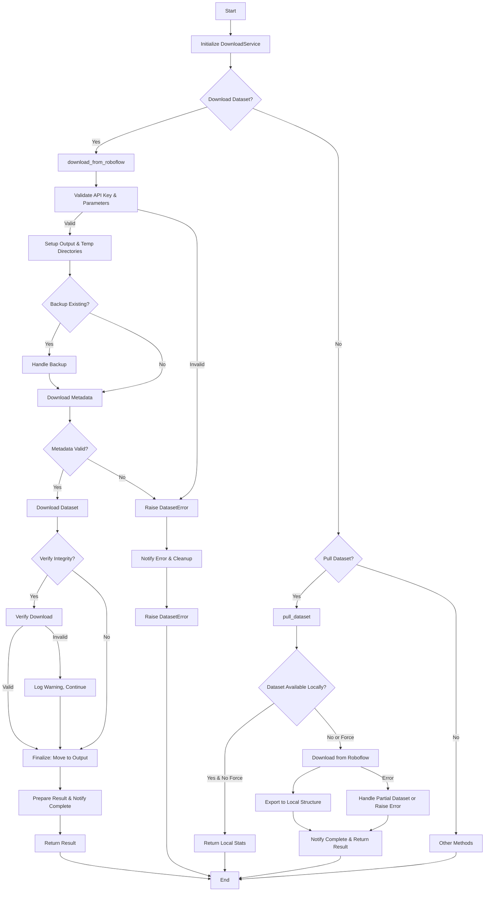

```mermaid
graph TD
    A[Start] --> B[Initialize DownloadService]
    B --> C{Download Dataset?}
    C -->|Yes| D[download_from_roboflow]
    C -->|No| E{Pull Dataset?}
    
    D --> F[Validate API Key & Parameters]
    F -->|Valid| G[Setup Output & Temp Directories]
    F -->|Invalid| H[Raise DatasetError]
    G --> I{Backup Existing?}
    I -->|Yes| J[Handle Backup]
    I -->|No| K[Download Metadata]
    J --> K
    K --> L{Metadata Valid?}
    L -->|Yes| M[Download Dataset]
    L -->|No| H
    M --> N{Verify Integrity?}
    N -->|Yes| O[Verify Download]
    N -->|No| P[Finalize: Move to Output]
    O -->|Valid| P
    O -->|Invalid| Q[Log Warning, Continue]
    Q --> P
    P --> R[Prepare Result & Notify Complete]
    R --> S[Return Result]
    H --> T[Notify Error & Cleanup]
    T --> U[Raise DatasetError]
    
    E -->|Yes| V[pull_dataset]
    E -->|No| W[Other Methods]
    V --> X{Dataset Available Locally?}
    X -->|Yes & No Force| Y[Return Local Stats]
    X -->|No or Force| Z[Download from Roboflow]
    Z --> AA[Export to Local Structure]
    AA --> BB[Notify Complete & Return Result]
    Z -->|Error| CC[Handle Partial Dataset or Raise Error]
    CC --> BB
    
    W --> DD[End]
    S --> DD
    U --> DD
    Y --> DD
    BB --> DD
```