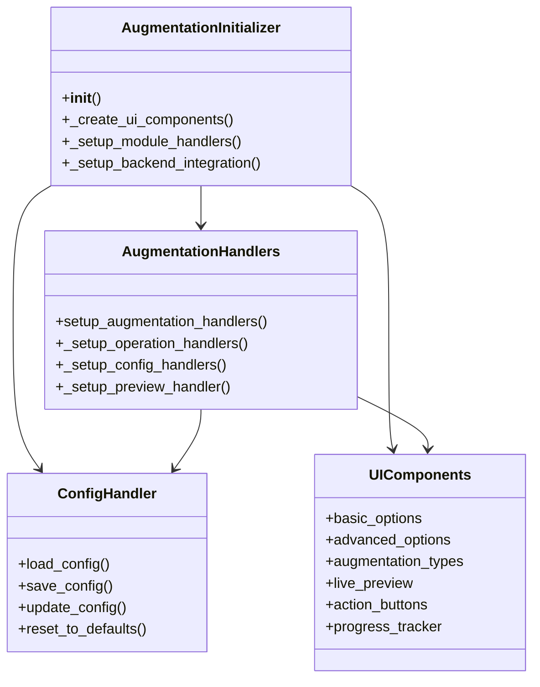

# Modul Dataset Augmentation

## Daftar Isi
- [Gambaran Umum](#gambaran-umum)
- [Struktur Direktori](#struktur-direktori)
- [Komponen Utama](#komponen-utama)
- [Alur Kerja](#alur-kerja)
- [Diagram](#diagram)
- [Best Practices](#best-practices)
- [Troubleshooting](#troubleshooting)

## Gambaran Umum
Modul Dataset Augmentation menyediakan antarmuka untuk meningkatkan kualitas dan kuantitas dataset gambar dengan berbagai teknik augmentasi. Modul ini menawarkan fitur live preview, konfigurasi fleksibel, dan integrasi dengan backend untuk pemrosesan yang efisien.

## Struktur Direktori
```
smartcash/ui/dataset/augmentation/
├── __init__.py
├── components/           # Komponen UI
│   ├── __init__.py
│   ├── advanced_opts_widget.py    # Opsi lanjutan
│   ├── augtypes_opts_widget.py    # Tipe augmentasi
│   ├── basic_opts_widget.py       # Opsi dasar
│   ├── live_preview_widget.py     # Preview langsung
│   └── ui_components.py           # Komponen UI utama
├── handlers/             # Penangan logika bisnis
│   ├── __init__.py
│   ├── augmentation_handlers.py   # Handler utama
│   ├── config_extractor.py        # Ekstraksi konfigurasi
│   ├── config_handler.py          # Manajemen konfigurasi
│   ├── config_updater.py          # Pembaruan konfigurasi
│   └── defaults.py               # Nilai default
├── utils/                # Utilitas pendukung
│   ├── __init__.py
│   ├── button_manager.py         # Manajemen tombol
│   ├── config_handlers.py        # Handler konfigurasi
│   ├── dialog_utils.py           # Utilitas dialog
│   ├── style_utils.py            # Gaya UI
│   └── ui_utils.py               # Fungsi bantu UI
└── augmentation_initializer.py   # Inisialisasi modul
```

## Komponen Utama

### 1. AugmentationInitializer
- **Lokasi**: `augmentation_initializer.py`
- **Fungsi**: Inisialisasi modul augmentasi
- **Fitur**:
  - Membuat komponen UI
  - Mengatur integrasi backend
  - Mengelola konfigurasi

### 2. UI Components
- **Lokasi**: `components/`
- **Fitur**:
  - Opsi dasar dan lanjutan
  - Pemilihan tipe augmentasi
  - Live preview hasil augmentasi
  - Panel status dan log

### 3. AugmentationHandlers
- **Lokasi**: `handlers/augmentation_handlers.py`
- **Fungsi**: Menangani logika bisnis augmentasi
- **Fitur**:
  - Validasi input
  - Eksekusi augmentasi
  - Manajemen dialog konfirmasi
  - Penanganan hasil

### 4. ConfigHandler
- **Lokasi**: `handlers/config_handler.py`
- **Fungsi**: Mengelola konfigurasi augmentasi
- **Fitur**:
  - Load/save konfigurasi
  - Validasi parameter
  - Sinkronisasi dengan UI

## Alur Kerja

1. **Inisialisasi**
   - Memuat konfigurasi
   - Membuat komponen UI
   - Menyiapkan integrasi backend

2. **Konfigurasi**
   - Pengaturan parameter augmentasi
   - Validasi input
   - Preview hasil

3. **Eksekusi**
   - Konfirmasi operasi
   - Proses augmentasi
   - Pelacakan progress

4. **Hasil**
   - Tampilkan hasil
   - Simpan konfigurasi
   - Log aktivitas

## Diagram

### Class Diagram


### Sequence Diagram - Proses Augmentasi


### Flow Diagram


## Best Practices

1. **Manajemen State**
   - Pastikan state UI selalu sinkron dengan konfigurasi
   - Handle state yang tidak valid dengan tepat
   - Reset state setelah operasi selesai

2. **Validasi Input**
   - Validasi semua input sebelum diproses
   - Berikan pesan error yang jelas
   - Batasi nilai input sesuai kebutuhan

3. **Manajemen Sumber Daya**
   - Bebaskan resource setelah digunakan
   - Batasi ukuran preview
   - Gunakan threading untuk operasi berat

4. **Feedback**
   - Berikan feedback yang jelas untuk setiap aksi
   - Tampilkan progress yang akurat
   - Log semua operasi penting

## Troubleshooting

### Preview Tidak Muncul
1. Periksa konfigurasi backend
2. Pastikan path gambar sumber valid
3. Cek log untuk pesan error

### Proses Augmentasi Lambat
1. Kurangi ukuran batch
2. Nonaktifkan opsi augmentasi yang tidak diperlukan
3. Periksa beban sistem

### Hasil Tidak Sesuai Harapan
1. Periksa parameter augmentasi
2. Validasi format input
3. Pastikan model augmentasi kompatibel

### Error Konfigurasi
1. Periksa file konfigurasi
2. Pastikan nilai dalam rentang yang valid
3. Reset ke default jika diperlukan

---

Dokumentasi terakhir diperbarui: 21 Juni 2025
