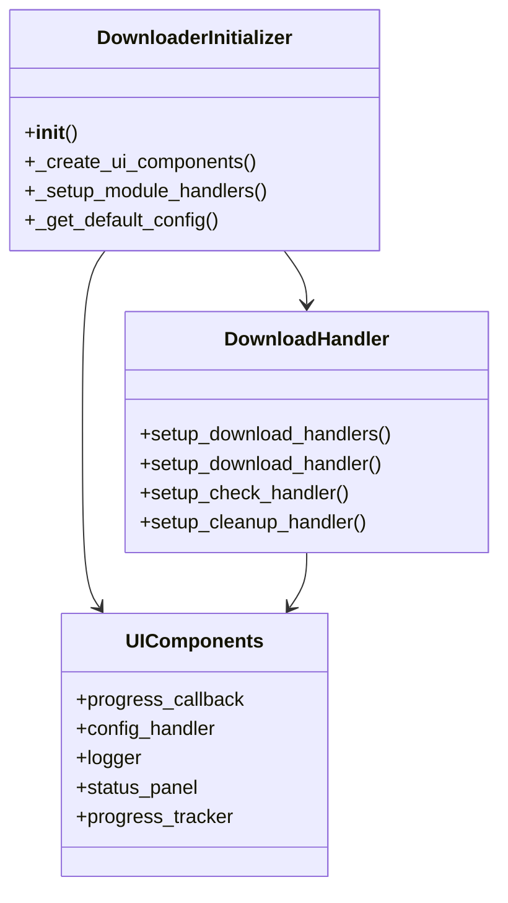
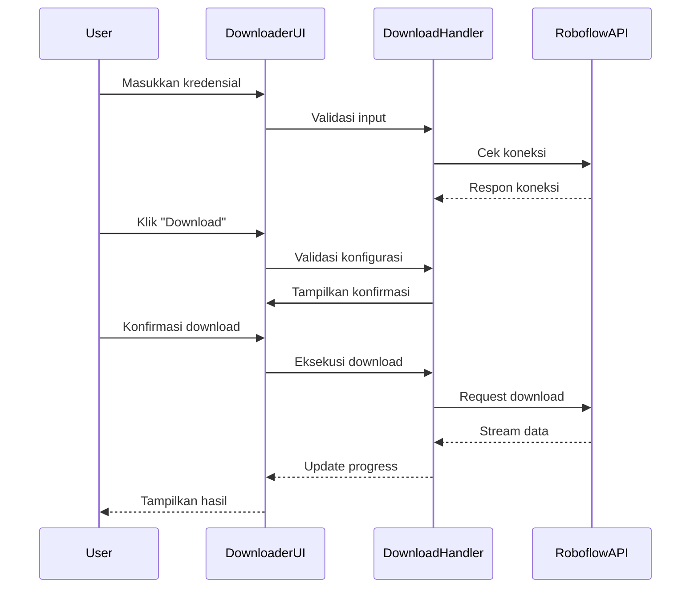
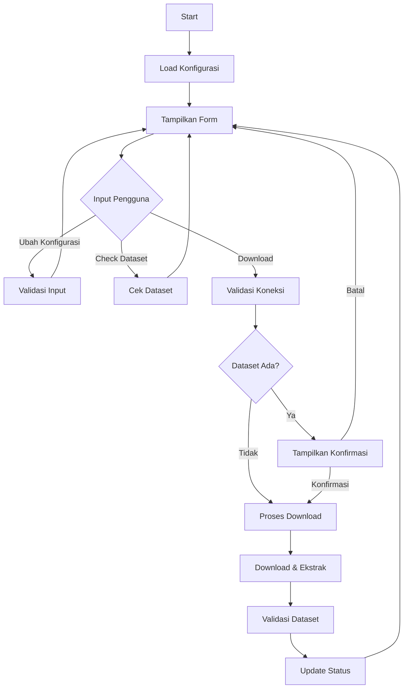

# Modul Dataset Downloader

**Versi Dokumen**: 1.0.0  
**Terakhir Diperbarui**: 4 Juli 2024  
**Kompatibilitas**: SmartCash v1.0.0+

## Daftar Isi
- [Gambaran Umum](#gambaran-umum)
- [Struktur Direktori](#struktur-direktori)
- [Komponen Utama](#komponen-utama)
- [Alur Kerja](#alur-kerja)
- [Diagram](#diagram)
- [Best Practices](#best-practices)
- [Troubleshooting](#troubleshooting)

## Gambaran Umum
Modul Dataset Downloader menyediakan antarmuka untuk mengunduh dataset dari Roboflow dengan fitur manajemen dataset yang lengkap. Modul ini mendukung konfigurasi koneksi, pengecekan dataset yang sudah ada, dan manajemen ruang penyimpanan.

## Struktur Direktori
```
smartcash/ui/dataset/downloader/
├── __init__.py
├── components/               # Komponen UI
│   ├── __init__.py
│   ├── input_options.py     # Form input dan konfigurasi
│   └── ui_components.py     # Komponen UI utama
├── operations/             # Operasi bisnis
│   ├── __init__.py
│   ├── manager.py          # Manajer operasi
│   ├── download_operation.py  # Operasi download
│   ├── check_operation.py     # Operasi pengecekan
│   └── cleanup_operation.py   # Operasi pembersihan
├── utils/                   # Utilitas pendukung
│   ├── backend_utils.py     # Fungsi backend
│   ├── button_manager.py    # Manajemen tombol
│   ├── colab_secrets.py     # Pengelolaan kredensial
│   ├── dialog_utils.py      # Utilitas dialog
│   ├── progress_utils.py    # Utilitas progress
│   ├── ui_utils.py          # Fungsi bantu UI
│   └── validation_utils.py  # Validasi input
└── downloader_initializer.py # Inisialisasi modul
```

## Komponen Utama

### 1. DownloaderInitializer
- **Lokasi**: `downloader_initializer.py`
- **Fungsi**: Inisialisasi modul downloader
- **Fitur**:
  - Membuat komponen UI
  - Mengatur handler
  - Mengelola konfigurasi

### 2. UI Components
- **Lokasi**: `components/`
- **Fitur**:
  - Form konfigurasi koneksi Roboflow
  - Panel status dan progress
  - Tombol aksi (Download, Check, Cleanup)
  - Area konfirmasi operasi

### 3. DownloaderOperationManager
- **Lokasi**: `operations/manager.py`
- **Fungsi**: Mengelola semua operasi downloader
- **Fitur**:
  - Mengkoordinasikan operasi download, check, dan cleanup
  - Manajemen status UI
  - Penanganan error terpusat
  - Integrasi dengan komponen UI

### 4. Operation Handlers
- **Lokasi**: `operations/`
- **Fungsi**: Menangani operasi spesifik
- **Jenis Operasi**:
  - `download_operation.py`: Operasi download dataset
  - `check_operation.py`: Operasi pengecekan dataset
  - `cleanup_operation.py`: Operasi pembersihan dataset

## Alur Kerja

1. **Inisialisasi**
   - DownloaderUIModule memuat komponen UI
   - DownloaderConfigHandler memuat konfigurasi
   - DownloaderOperationManager diinisialisasi dengan komponen UI

2. **Konfigurasi**
   - User mengisi form konfigurasi
   - Input divalidasi oleh validation_utils
   - Konfigurasi disimpan oleh DownloaderConfigHandler

3. **Operasi**
   - User memicu operasi (download/check/cleanup)
   - DownloaderOperationManager menangani operasi yang sesuai
   - Progress dan status ditampilkan di operation container
   - Hasil operasi dilaporkan ke user

4. **Manajemen**
   - User dapat memeriksa dataset yang sudah didownload
   - User dapat membersihkan dataset yang tidak diperlukan
   - Log aktivitas disimpan untuk keperluan audit

## Diagram

### Class Diagram


### Sequence Diagram - Proses Download


### Flow Diagram


## Best Practices

1. **Manajemen Koneksi**
   - Simpan kredensial dengan aman
   - Validasi koneksi sebelum download
   - Handle timeout dengan baik

2. **Manajemen Penyimpanan**
   - Cek ruang disk sebelum download
   - Bersihkan file sementara
   - Backup konfigurasi

3. **Feedback Pengguna**
   - Tampilkan progress real-time
   - Berikan pesan error yang jelas
   - Konfirmasi operasi kritis

4. **Performansi**
   - Gunakan streaming untuk file besar
   - Batasi penggunaan memori
   - Optimalkan kecepatan download

## Troubleshooting

### Koneksi Gagal
1. Periksa koneksi internet
2. Verifikasi kredensial Roboflow
3. Cek firewall/proxy

### Download Gagal
1. Periksa ruang disk
2. Verifikasi izin akses
3. Cek log error

### Dataset Tidak Valid
1. Verifikasi format dataset
2. Periksa integritas file
3. Cek versi dataset

### Performa Lambat
1. Periksa kecepatan internet
2. Kurangi ukuran batch
3. Nonaktifkan fitur tidak perlu

---

Dokumentasi terakhir diperbarui: 21 Juni 2025
