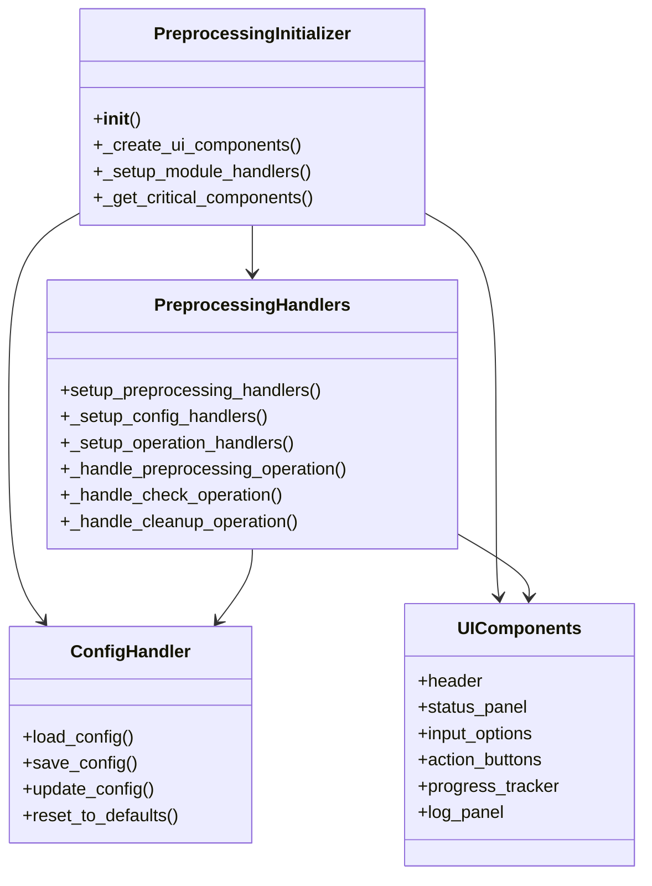
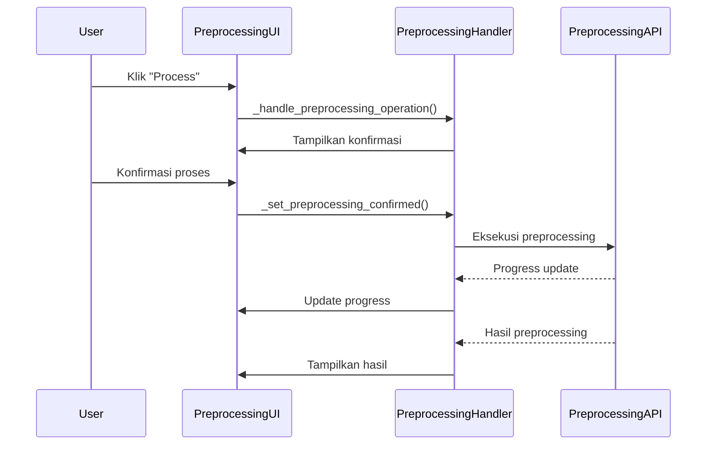
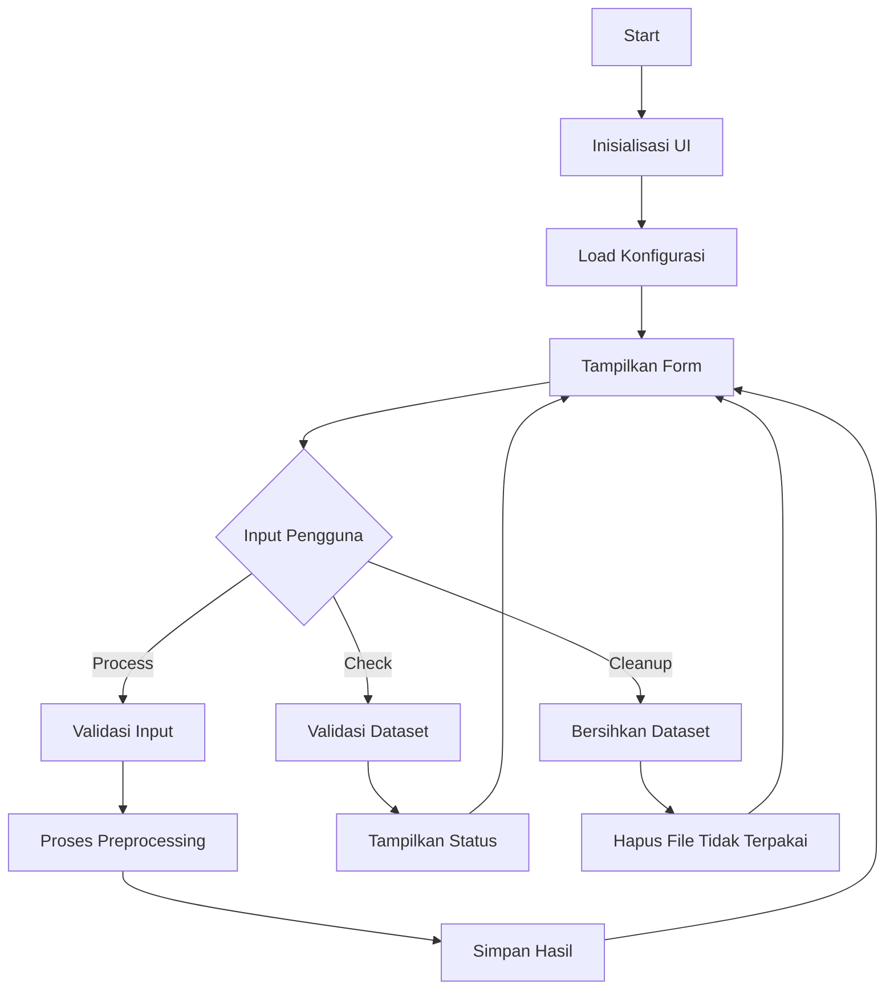

# Modul Dataset Preprocessing

**Versi Dokumen**: 1.0.0  
**Terakhir Diperbarui**: 4 Juli 2024  
**Kompatibilitas**: SmartCash v1.0.0+

## Daftar Isi
- [Gambaran Umum](#gambaran-umum)
- [Struktur Direktori](#struktur-direktori)
- [Komponen Utama](#komponen-utama)
- [Alur Kerja](#alur-kerja)
- [Diagram](#diagram)
- [Best Practices](#best-practices)
- [Troubleshooting](#troubleshooting)

## Gambaran Umum
Modul Dataset Preprocessing menyediakan antarmuka untuk memproses dataset gambar dengan normalisasi YOLO. Modul ini menangani konversi, validasi, dan pembersihan dataset dengan dukungan progress tracking dan manajemen konfigurasi yang terintegrasi.

## Struktur Direktori
```
smartcash/ui/dataset/preprocessing/
├── __init__.py
├── components/           # Komponen UI
│   ├── __init__.py
│   ├── input_options.py     # Opsi input preprocessing
│   └── ui_components.py     # Komponen UI utama
├── handlers/             # Penangan logika bisnis
│   ├── __init__.py
│   ├── config_extractor.py  # Ekstraksi konfigurasi
│   ├── config_handler.py    # Manajemen konfigurasi
│   ├── config_updater.py    # Pembaruan konfigurasi
│   ├── defaults.py         # Nilai default
│   └── preprocessing_handlers.py  # Handler utama
├── utils/                # Utilitas pendukung
│   ├── __init__.py
│   └── ui_utils.py        # Fungsi bantu UI
└── preprocessing_initializer.py  # Inisialisasi modul
```

## Komponen Utama

### 1. PreprocessingInitializer
- **Lokasi**: `preprocessing_initializer.py`
- **Fungsi**: Inisialisasi modul preprocessing
- **Fitur**:
  - Membuat komponen UI
  - Mengatur handler
  - Mengelola konfigurasi
  - Menyediakan API publik

### 2. UI Components
- **Lokasi**: `components/`
- **Fitur**:
  - Header dan status panel
  - Opsi input preprocessing
  - Tombol aksi (Process, Check, Cleanup)
  - Panel log dan progress tracking

### 3. PreprocessingHandlers
- **Lokasi**: `handlers/preprocessing_handlers.py`
- **Fungsi**: Menangani logika bisnis preprocessing
- **Fitur**:
  - Validasi input
  - Eksekusi preprocessing
  - Pembersihan dataset
  - Manajemen konfirmasi

### 4. ConfigHandler
- **Lokasi**: `handlers/config_handler.py`
- **Fungsi**: Mengelola konfigurasi preprocessing
- **Fitur**:
  - Load/save konfigurasi
  - Validasi konfigurasi
  - Sinkronisasi dengan UI

## Alur Kerja

1. **Inisialisasi**
   - Memuat konfigurasi
   - Membuat komponen UI
   - Menyiapkan handler

2. **Konfigurasi**
   - Pengaturan parameter preprocessing
   - Validasi input
   - Penyimpanan konfigurasi

3. **Eksekusi**
   - Proses preprocessing
   - Validasi dataset
   - Pembersihan file tidak terpakai

4. **Pelacakan**
   - Monitoring progress
   - Pencatatan aktivitas
   - Penanganan error

## Diagram

### Class Diagram


### Sequence Diagram - Proses Preprocessing


### Flow Diagram


## Best Practices

1. **Manajemen Status**
   - Selalu periksa status konfirmasi sebelum eksekusi
   - Update UI sesuai state terkini
   - Handle state yang tidak valid dengan tepat

2. **Error Handling**
   - Tangkap dan log semua exception
   - Berikan pesan error yang informatif
   - Kembalikan ke state yang valid setelah error

3. **Konfigurasi**
   - Validasi semua input konfigurasi
   - Berikan nilai default yang aman
   - Simpan konfigurasi secara otomatis

4. **UI/UX**
   - Berikan feedback yang jelas untuk setiap aksi
   - Non-aktifkan tombol saat proses berjalan
   - Tampilkan progress yang informatif

## Troubleshooting

### Konfigurasi Tidak Tersimpan
1. Periksa izin akses file
2. Pastikan direktori konfigurasi ada
3. Cek log untuk pesan error

### Proses Preprocessing Gagal
1. Periksa format dataset
2. Pastikan ruang disk mencukupi
3. Verifikasi koneksi API (jika ada)

### UI Tidak Responsif
1. Periksa log untuk error JavaScript
2. Pastikan tidak ada proses yang berjalan lama di thread UI
3. Cek penggunaan memori

---

Dokumentasi terakhir diperbarui: 21 Juni 2025
