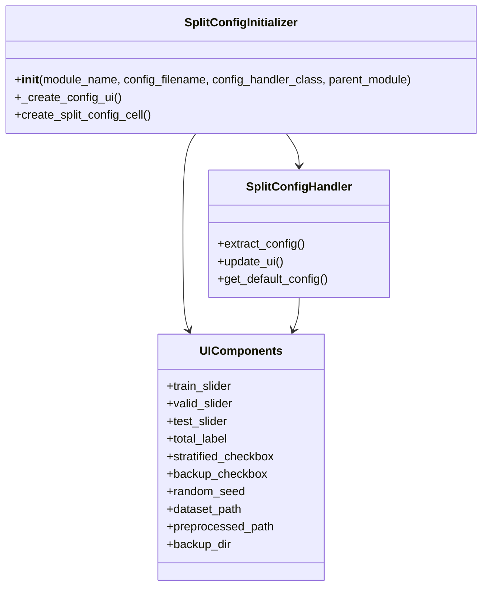
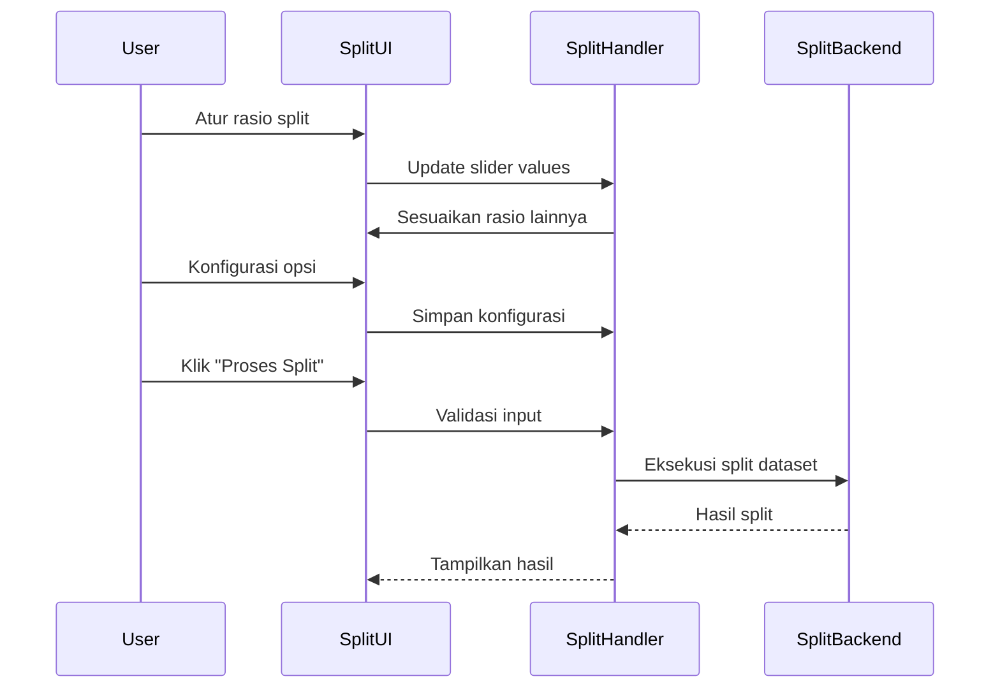
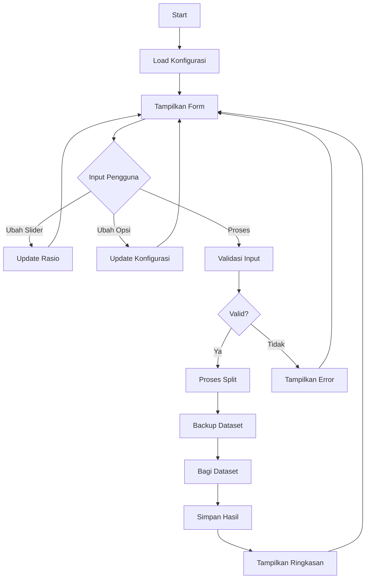

# Modul Dataset Split

**Versi Dokumen**: 1.0.0  
**Terakhir Diperbarui**: 4 Juli 2024  
**Kompatibilitas**: SmartCash v1.0.0+

## Daftar Isi
- [Gambaran Umum](#gambaran-umum)
- [Struktur Direktori](#struktur-direktori)
- [Komponen Utama](#komponen-utama)
- [Alur Kerja](#alur-kerja)
- [Diagram](#diagram)
- [Best Practices](#best-practices)
- [Troubleshooting](#troubleshooting)

## Gambaran Umum
Modul Dataset Split menyediakan antarmuka untuk membagi dataset menjadi beberapa subset (train, validation, test) dengan rasio yang dapat dikonfigurasi. Modul ini mendukung pembagian stratified dan menyediakan opsi backup otomatis.

## Struktur Direktori
```
smartcash/ui/dataset/split/
├── __init__.py
├── components/           # Komponen UI
│   ├── __init__.py
│   ├── ui_form.py       # Form input dan konfigurasi
│   └── ui_layout.py     # Tataletak UI
├── handlers/            # Penangan logika bisnis
│   ├── __init__.py
│   ├── config_extractor.py  # Ekstraksi konfigurasi
│   ├── config_updater.py    # Pembaruan konfigurasi
│   ├── defaults.py         # Nilai default
│   └── slider_handlers.py  # Handler slider interaktif
└── split_init.py         # Inisialisasi modul
```

## Komponen Utama

### 1. SplitConfigInitializer
- **Lokasi**: `split_init.py`
- **Fungsi**: Inisialisasi modul split dataset
- **Fitur**:
  - Membuat komponen UI
  - Mengatur handler
  - Mengelola konfigurasi

### 2. UI Components
- **Lokasi**: `components/`
- **Fitur**:
  - Slider untuk rasio train/validation/test
  - Opsi stratified split
  - Pengaturan path dataset
  - Opsi backup
  - Input random seed

### 3. SliderHandlers
- **Lokasi**: `handlers/slider_handlers.py`
- **Fungsi**: Menangani interaksi slider
- **Fitur**:
  - Auto-adjustment rasio
  - Validasi total rasio
  - Update tampilan total

### 4. ConfigHandler
- **Lokasi**: `handlers/config_*.py`
- **Fungsi**: Mengelola konfigurasi
- **Fitur**:
  - Ekstraksi konfigurasi dari UI
  - Update UI dari konfigurasi
  - Penyimpanan dan pemuatan konfigurasi

## Alur Kerja

1. **Inisialisasi**
   - Memuat konfigurasi yang tersimpan
   - Membuat komponen UI
   - Menyiapkan handler interaksi

2. **Konfigurasi**
   - Atur rasio split
   - Pilih opsi stratified
   - Tentukan path dataset
   - Atur opsi backup

3. **Validasi**
   - Pastikan total rasio = 1.0
   - Validasi path dataset
   - Konfirmasi operasi

4. **Eksekusi**
   - Backup dataset (jika diaktifkan)
   - Proses pembagian dataset
   - Simpan hasil split

## Diagram

### Class Diagram


### Sequence Diagram - Proses Split


### Flow Diagram


## Best Practices

1. **Manajemen Rasio**
   - Pastikan total rasio selalu 1.0
   - Gunakan slider untuk memudahkan penyesuaian
   - Berikan feedback visual untuk rasio yang tidak valid

2. **Backup Data**
   - Selalu backup dataset sebelum split
   - Beri timestamp pada backup
   - Sediakan opsi untuk menonaktifkan backup

3. **Validasi**
   - Validasi path dataset
   - Pastikan ruang disk mencukupi
   - Berikan pesan error yang jelas

4. **Performansi**
   - Gunakan progress bar untuk operasi panjang
   - Optimalkan pembacaan/penulisan file
   - Handle interrupt dengan baik

## Troubleshooting

### Rasio Tidak Valid
1. Pastikan total rasio = 1.0
2. Periksa nilai minimum/maksimum slider
3. Cek event handler slider

### Gagal Membaca Dataset
1. Verifikasi path dataset
2. Periksa izin akses
3. Pastikan format dataset didukung

### Error Backup
1. Periksa ruang disk
2. Verifikasi izin tulis
3. Cek path backup yang valid

### Performa Lambat
1. Kurangi ukuran batch
2. Nonaktifkan backup jika tidak diperlukan
3. Gunakan SSD untuk dataset besar

---

Dokumentasi terakhir diperbarui: 21 Juni 2025
