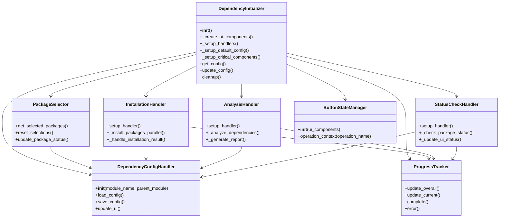
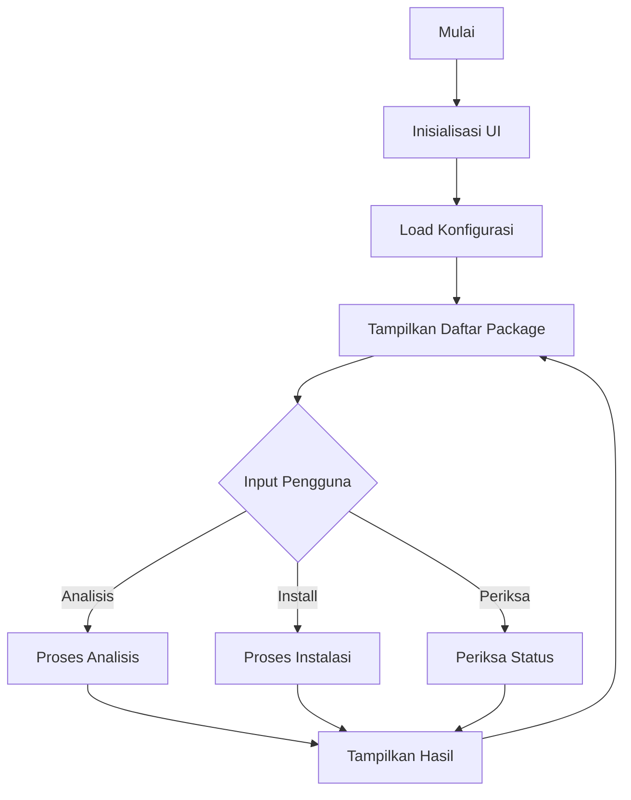
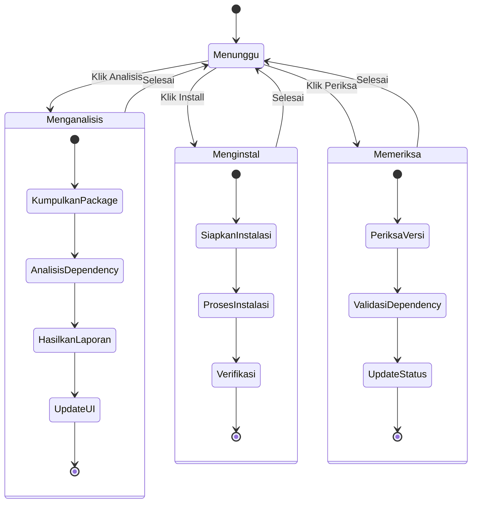

# Modul Manajemen Dependency

## Daftar Isi
- [Gambaran Umum](#gambaran-umum)
- [Struktur Direktori](#struktur-direktori)
- [Komponen Utama](#komponen-utama)
- [Alur Kerja](#alur-kerja)
- [Diagram Alir](#diagram-alir)
- [Penggunaan](#penggunaan)
- [Best Practices](#best-practices)

## Gambaran Umum
Modul manajemen dependency menyediakan antarmuka pengguna untuk mengelola package Python yang dibutuhkan oleh aplikasi SmartCash. Modul ini memungkinkan pengguna untuk menganalisis, menginstal, dan memantau status package dengan fitur pelacakan progres dan pencatatan yang komprehensif.

## Struktur Direktori
```
ui/setup/dependency/
├── __init__.py
├── components/           # Komponen UI
│   ├── __init__.py
│   ├── package_selector.py
│   └── ui_components.py
├── handlers/            # Penangan logika bisnis
│   ├── __init__.py
│   ├── analysis_handler.py
│   ├── config_handler.py
│   └── installation_handler.py
└── utils/               # Utilitas pendukung
    ├── __init__.py
    ├── package_utils.py
    └── system_info_utils.py
```

## Komponen Utama

### 1. Inisialisasi (`dependency_init.py`)
- Titik masuk utama sistem manajemen dependency
- Menginisialisasi antarmuka pengguna
- Mengelola konfigurasi
- Menyediakan API publik untuk modul lain

### 2. Komponen UI (`components/`)
- **package_selector.py**: Tampilan grid untuk memilih package
- **ui_components.py**: Tampilan utama termasuk:
  - Grid pemilihan package
  - Input package kustom
  - Tombol aksi (Install, Analyze, Check)
  - Pelacak progres
  - Tampilan log

### 3. Handler (`handlers/`)
- **analysis_handler.py**: Menganalisis dependency package
- **config_handler.py**: Mengelola penyimpanan konfigurasi
- **installation_handler.py**: Menangani instalasi package
- **status_check_handler.py**: Memeriksa status package

### 4. Utilitas (`utils/`)
- **package_utils.py**: Fungsi manajemen package
- **system_info_utils.py**: Pengumpulan informasi sistem
- **report_generator_utils.py**: Pembuatan laporan

## Alur Kerja

1. **Inisialisasi**
   - Memuat konfigurasi yang tersimpan
   - Menyiapkan antarmuka pengguna
   - Memeriksa status sistem

2. **Analisis**
   - Pengguna memilih package
   - Sistem menganalisis dependency
   - Menghasilkan laporan kompatibilitas

3. **Instalasi**
   - Persiapan lingkungan
   - Proses instalasi package
   - Verifikasi instalasi
   - Pencatatan hasil

4. **Pemeriksaan**
   - Memeriksa versi package
   - Memvalidasi dependency
   - Menghasilkan status sistem

## Diagram Alir

### Class Diagram


### Diagram Alir Utama


### Diagram Aktivitas


## Best Practices

1. **Manajemen Error**
   - Selalu tangkap dan catat eksepsi
   - Berikan pesan error yang informatif
   - Kembalikan ke state yang stabil setelah error

2. **Kinerja**
   - Gunakan operasi asinkron untuk tugas berat
   - Batasi pembaruan UI yang tidak perlu
   - Cache hasil yang sering digunakan

3. **Keamanan**
   - Validasi semua input pengguna
   - Gunakan environment yang terisolasi untuk instalasi
   - Batasi izin akses file

4. **Pemeliharaan**
   - Dokumentasikan semua fungsi publik
   - Gunakan tipe hint untuk kejelasan
   - Tulis unit test untuk logika bisnis

---

Dokumentasi terakhir diperbarui: 21 Juni 2025
