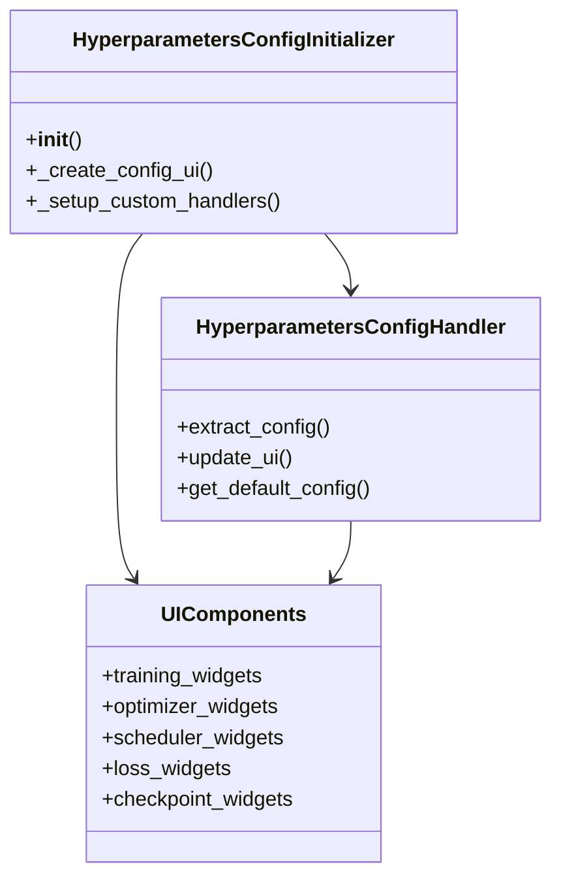
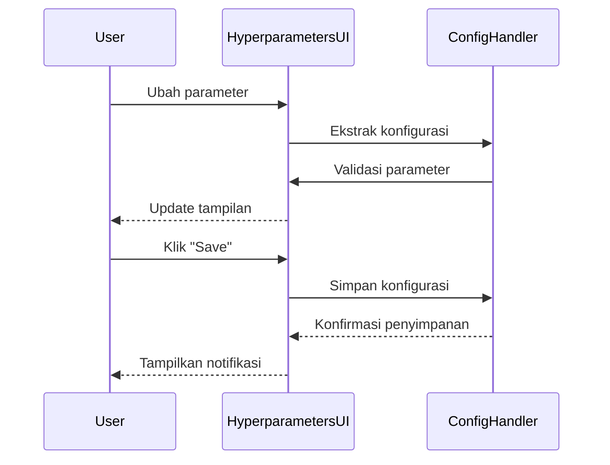
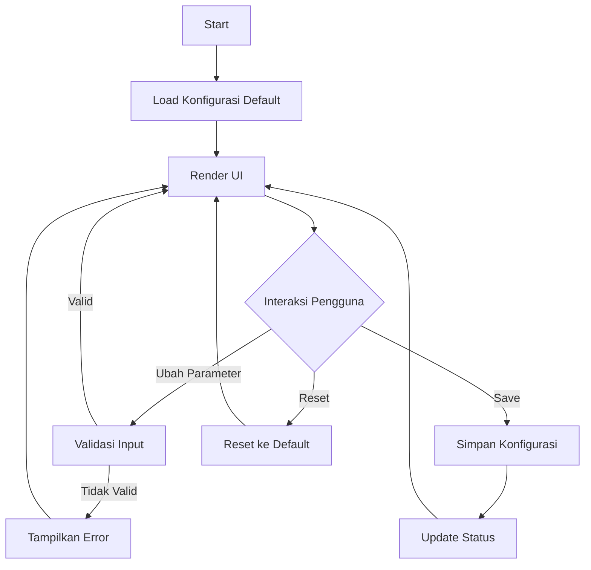

# Modul Hyperparameters Configuration

## Daftar Isi
- [Gambaran Umum](#gambaran-umum)
- [Struktur Direktori](#struktur-direktori)
- [Komponen Utama](#komponen-utama)
- [Alur Kerja](#alur-kerja)
- [Diagram](#diagram)
- [Best Practices](#best-practices)
- [Troubleshooting](#troubleshooting)

## Gambaran Umum
Modul Hyperparameters Configuration menyediakan antarmuka untuk mengkonfigurasi parameter pelatihan model deep learning. Modul ini memungkinkan penyesuaian berbagai parameter penting seperti learning rate, batch size, optimizer, scheduler, dan parameter loss function.

## Struktur Direktori
```
smartcash/ui/hyperparameters/
├── __init__.py
├── hyperparameters_init.py    # Inisialisasi modul
├── components/               # Komponen UI
│   ├── __init__.py
│   ├── ui_form.py           # Form input parameter
│   └── ui_layout.py         # Tataletak UI
├── handlers/                # Penangan logika bisnis
│   ├── __init__.py
│   ├── config_handler.py    # Handler konfigurasi
│   └── defaults.py          # Nilai default
└── utils/                   # Utilitas
    ├── __init__.py
    └── form_helpers.py      # Fungsi bantu form
```

## Komponen Utama

### 1. HyperparametersConfigInitializer
- **Lokasi**: `hyperparameters_init.py`
- **Fungsi**: Inisialisasi modul hyperparameters
- **Fitur**:
  - Membuat komponen UI
  - Mengatur handler
  - Mengelola konfigurasi

### 2. UI Components
- **Lokasi**: `components/`
- **Fitur**:
  - Form input parameter training
  - Pemilihan optimizer dan scheduler
  - Pengaturan parameter loss function
  - Opsi early stopping dan checkpointing

### 3. Config Handler
- **Lokasi**: `handlers/config_handler.py`
- **Fungsi**: Menangani logika konfigurasi
- **Fitur**:
  - Ekstraksi konfigurasi dari UI
  - Update UI dari konfigurasi
  - Validasi parameter

### 4. Form Helpers
- **Lokasi**: `utils/form_helpers.py`
- **Fungsi**: Membantu pembuatan komponen form
- **Fitur**:
  - Pembuatan slider dan dropdown
  - Validasi input
  - Format tampilan

## Alur Kerja

1. **Inisialisasi**
   - Memuat konfigurasi default
   - Membuat komponen UI
   - Menyiapkan handler interaksi

2. **Konfigurasi**
   - Atur parameter training
   - Pilih optimizer dan scheduler
   - Sesuaikan parameter loss function
   - Aktifkan/matikan fitur tambahan

3. **Validasi**
   - Validasi nilai parameter
   - Pastikan kompatibilitas
   - Tampilkan ringkasan

4. **Penyimpanan**
   - Simpan konfigurasi
   - Update status
   - Beri umpan balik

## Diagram

### Class Diagram


### Sequence Diagram - Update Parameter


### Flow Diagram


## Best Practices

1. **Manajemen State**
   - Gunakan nilai default yang masuk akal
   - Validasi input secara real-time
   - Beri umpan balik yang jelas

2. **Organisasi Parameter**
   - Kelompokkan parameter terkait
   - Gunakan tooltips untuk penjelasan
   - Sertakan rentang nilai yang valid

3. **Validasi**
   - Cek kompatibilitas parameter
   - Validasi tipe data
   - Beri batasan yang jelas

4. **Pengalaman Pengguna**
   - Gunakan widget yang sesuai
   - Beri umpan balik visual
   - Sediakan opsi reset

## Troubleshooting

### Parameter Tidak Berubah
1. Periksa event handler
2. Verifikasi binding nilai
3. Cek log error

### Error Validasi
1. Periksa rentang nilai
2. Verifikasi tipe data
3. Cek dependensi parameter

### UI Tidak Responsif
1. Periksa blocking operations
2. Optimalkan update UI
3. Gunakan debouncing jika perlu

### Konfigurasi Tidak Tersimpan
1. Periksa izin file
2. Verifikasi path penyimpanan
3. Cek log error

---

Dokumentasi terakhir diperbarui: 21 Juni 2025
