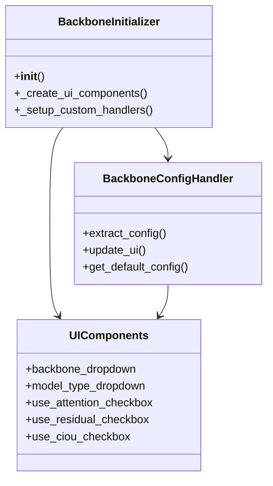
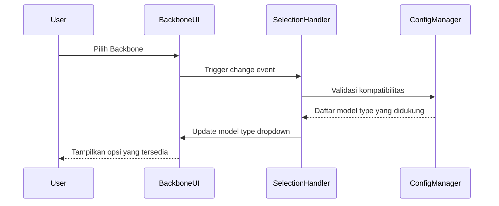
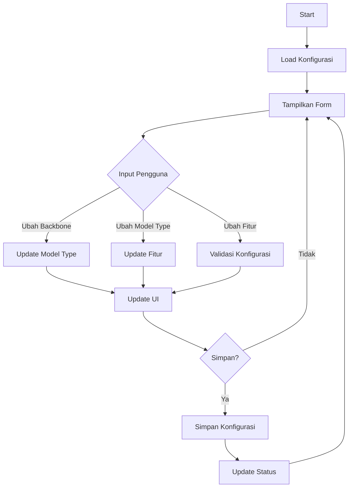

# Modul Backbone Configuration

**Versi Dokumen**: 1.0.0  
**Terakhir Diperbarui**: 4 Juli 2024  
**Kompatibilitas**: SmartCash v1.0.0+

## Daftar Isi
- [Gambaran Umum](#gambaran-umum)
- [Struktur Direktori](#struktur-direktori)
- [Komponen Utama](#komponen-utama)
- [Alur Kerja](#alur-kerja)
- [Diagram](#diagram)
- [Best Practices](#best-practices)
- [Troubleshooting](#troubleshooting)

## Gambaran Umum
Modul Backbone Configuration menyediakan antarmuka untuk mengkonfigurasi arsitektur model deep learning yang digunakan dalam SmartCash. Modul ini memungkinkan pemilihan dan penyesuaian berbagai komponen model seperti backbone, tipe model, dan fitur tambahan.

## Struktur Direktori
```
smartcash/ui/backbone/
├── __init__.py
├── backbone_init.py           # Inisialisasi modul
├── components/               # Komponen UI
│   ├── __init__.py
│   ├── selection_change.py   # Handler perubahan selection
│   ├── ui_form.py           # Form input dan konfigurasi
│   └── ui_layout.py         # Tataletak UI
└── handlers/                # Penangan logika bisnis
    ├── __init__.py
    ├── config_handler.py    # Handler konfigurasi
    └── defaults.py         # Nilai default dan mapping
```

## Komponen Utama

### 1. BackboneInitializer
- **Lokasi**: `backbone_init.py`
- **Fungsi**: Inisialisasi modul backbone
- **Fitur**:
  - Membuat komponen UI
  - Mengatur handler
  - Mengelola konfigurasi

### 2. UI Components
- **Lokasi**: `components/`
- **Fitur**:
  - Dropdown pemilihan backbone
  - Dropdown tipe model
  - Checkbox fitur tambahan
  - Panel status

### 3. Selection Handlers
- **Lokasi**: `components/selection_change.py`
- **Fungsi**: Menangani interaksi antar komponen
- **Fitur**:
  - Sinkronisasi antar dropdown
  - Validasi input
  - Update status otomatis

### 4. Config Handler
- **Lokasi**: `handlers/config_handler.py`
- **Fungsi**: Mengelola konfigurasi
- **Fitur**:
  - Ekstraksi konfigurasi dari UI
  - Update UI dari konfigurasi
  - Validasi input

## Alur Kerja

1. **Inisialisasi**
   - Memuat konfigurasi default
   - Membuat komponen UI
   - Menyiapkan handler interaksi

2. **Konfigurasi**
   - Pilih backbone model
   - Pilih tipe model
   - Aktifkan fitur tambahan
   - Simpan konfigurasi

3. **Validasi**
   - Pastikan kompatibilitas komponen
   - Validasi input
   - Tampilkan pesan status

4. **Penyimpanan**
   - Simpan konfigurasi
   - Update status
   - Beri umpan balik ke pengguna

## Diagram

### Class Diagram


### Sequence Diagram - Perubahan Backbone


### Flow Diagram


## Best Practices

1. **Manajemen State**
   - Gunakan suppression flag untuk menghindari event cascade
   - Implementasikan debouncing untuk update status
   - Sinkronkan state antar komponen

2. **Validasi**
   - Validasi kompatibilitas komponen
   - Beri umpan balik yang jelas
   - Cegah konfigurasi yang tidak valid

3. **Pengalaman Pengguna**
   - Update UI secara responsif
   - Tampilkan status operasi
   - Beri konfirmasi untuk perubahan penting

4. **Kode**
   - Gunakan mapping untuk konfigurasi
   - Pisahkan logika bisnis dari UI
   - Dokumentasikan dependensi

## Troubleshooting

### Dropdown Tidak Update
1. Periksa suppression flag
2. Verifikasi mapping konfigurasi
3. Cek event handler

### Konfigurasi Tidak Tersimpan
1. Periksa izin penyimpanan
2. Verifikasi format konfigurasi
3. Cek log error

### UI Tidak Responsif
1. Periksa event loop
2. Cek blocking operations
3. Verifikasi resource yang digunakan

---

Dokumentasi terakhir diperbarui: 21 Juni 2025
