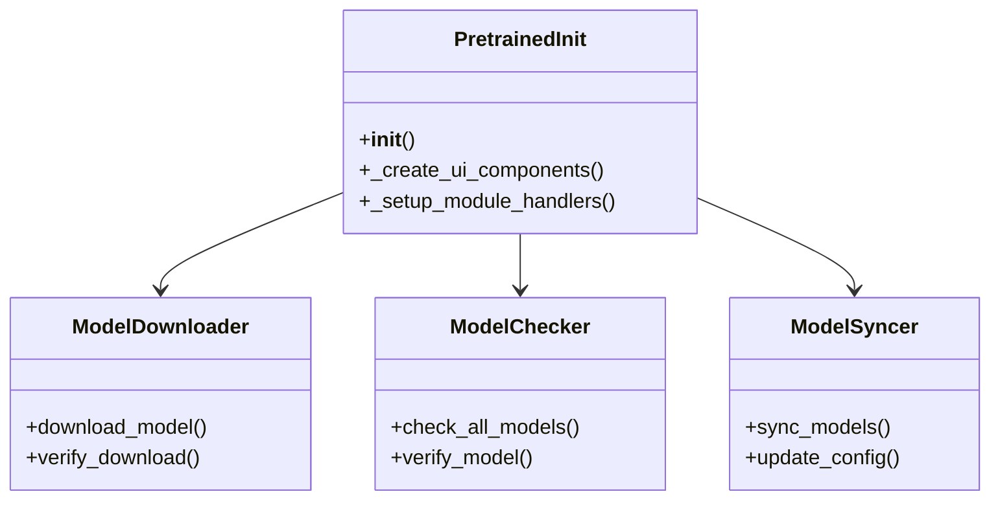
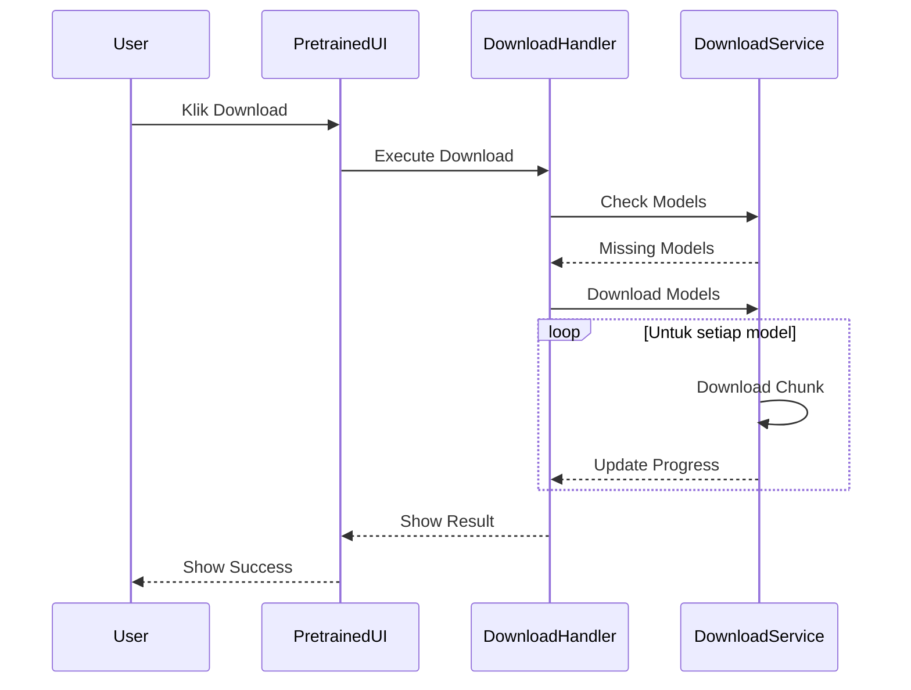
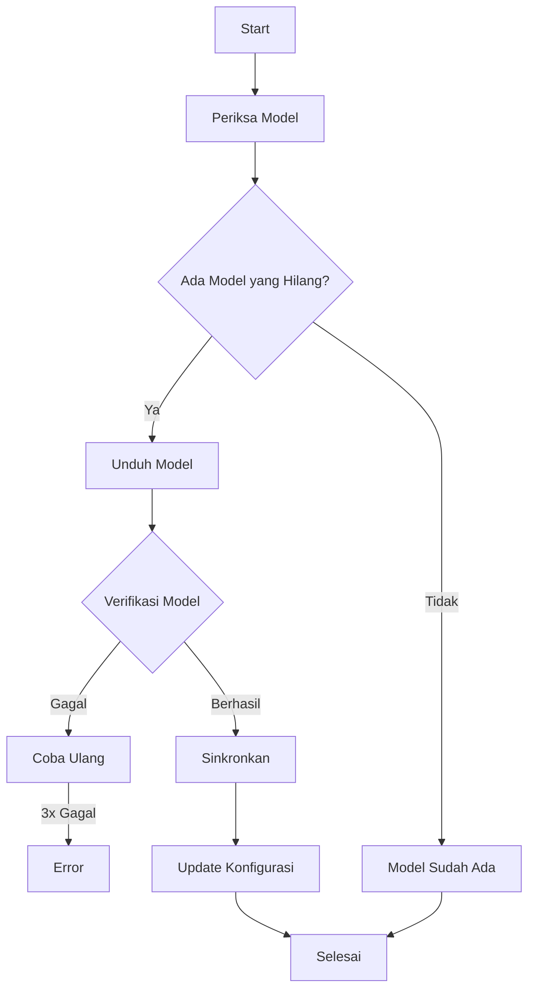

# Modul Pretrained Model

**Versi Dokumen**: 1.0.0  
**Terakhir Diperbarui**: 4 Juli 2024  
**Kompatibilitas**: SmartCash v1.0.0+

## Daftar Isi
- [Gambaran Umum](#gambaran-umum)
- [Struktur Direktori](#struktur-direktori)
- [Komponen Utama](#komponen-utama)
- [Alur Kerja](#alur-kerja)
- [Diagram](#diagram)
- [Best Practices](#best-practices)
- [Troubleshooting](#troubleshooting)

## Gambaran Umum
Modul Pretrained Model menyediakan antarmuka untuk mengunduh, memeriksa, dan menyinkronkan model YOLOv5 dan EfficientNet-B4 yang diperlukan untuk SmartCash. Modul ini menangani seluruh siklus hidup model, mulai dari pengunduhan hingga verifikasi integritas file.

## Struktur Direktori
```
smartcash/ui/pretrained_model/
├── __init__.py
├── pretrained_init.py       # Inisialisasi modul
├── components/             # Komponen UI
│   ├── __init__.py
│   └── ui_components.py    # Komponen antarmuka pengguna
├── operations/             # Operasi bisnis
│   ├── __init__.py
│   ├── manager.py          # Manajer operasi
│   ├── download_operation.py  # Operasi download model
│   ├── check_operation.py     # Operasi pemeriksaan model
│   └── reset_operation.py     # Operasi reset konfigurasi
├── services/               # Layanan backend
│   ├── __init__.py
│   ├── model_checker.py    # Pemeriksa model
│   ├── model_downloader.py # Pengunduh model
│   └── model_syncer.py     # Sinkronisasi model
└── utils/                  # Utilitas
    └── model_utils.py      # Fungsi bantu model
```

## Komponen Utama

### 1. PretrainedInit
- **Lokasi**: `pretrained_init.py`
- **Fungsi**: Inisialisasi modul pretrained model
- **Fitur**:
  - Membuat komponen UI
  - Mengatur handler
  - Menangani siklus hidup modul

### 2. UI Components
- **Lokasi**: `components/ui_components.py`
- **Fitur**:
  - Form konfigurasi model
  - Tombol aksi (download, sync, reset)
  - Panel status dan log
  - Progress tracker

### 3. Operation Manager
- **Lokasi**: `operations/manager.py`
- **Fungsi**: Mengelola semua operasi model pretrained
- **Fitur**:
  - Mengkoordinasikan operasi download, check, dan reset
  - Manajemen status UI
  - Penanganan error terpusat
  - Integrasi dengan komponen UI

### 4. Operation Handlers
- **Lokasi**: `operations/`
- **Fitur**:
  - `download_operation.py`: Menangani logika pengunduhan model
  - `check_operation.py`: Memeriksa ketersediaan dan integritas model
  - `reset_operation.py`: Menangani reset konfigurasi model

## Alur Kerja

1. **Inisialisasi**
   - Muat konfigurasi
   - Siapkan komponen UI
   - Atur handler interaksi

2. **Pemeriksaan Model**
   - Periksa model yang tersedia
   - Tandai model yang hilang
   - Tampilkan status model

3. **Pengunduhan**
   - Unduh model yang dibutuhkan
   - Tampilkan progres
   - Verifikasi integritas file

4. **Sinkronisasi**
   - Sinkronkan model dengan sistem
   - Update konfigurasi
   - Beri umpan balik

## Diagram

### Class Diagram


### Sequence Diagram - Download Model


### Flow Diagram


## Best Practices

1. **Manajemen Unduhan**
   - Gunakan progress tracking
   - Validasi checksum file
   - Dukung resume download

2. **Manajemen Status**
   - Tampilkan status jelas
   - Log setiap operasi
   - Beri umpan balik visual

3. **Error Handling**
   - Tangani error jaringan
   - Beri opsi retry
   - Log error detail

4. **Optimasi**
   - Gunakan threading untuk operasi I/O
   - Batasi ukuran buffer
   - Cache hasil pemeriksaan

## Troubleshooting

### Gagal Mengunduh
1. Periksa koneksi internet
2. Cek ruang disk
3. Verifikasi URL unduhan

### Checksum Tidak Cocok
1. Ulangi unduhan
2. Periksa versi model
3. Hapus file korup

### Izin Ditolak
1. Periksa izin direktori
2. Jalankan sebagai admin
3. Verifikasi kepemilikan file

### Sinkronisasi Gagal
1. Periksa konfigurasi
2. Verifikasi path model
3. Cek log error

---

Dokumentasi terakhir diperbarui: 21 Juni 2025
