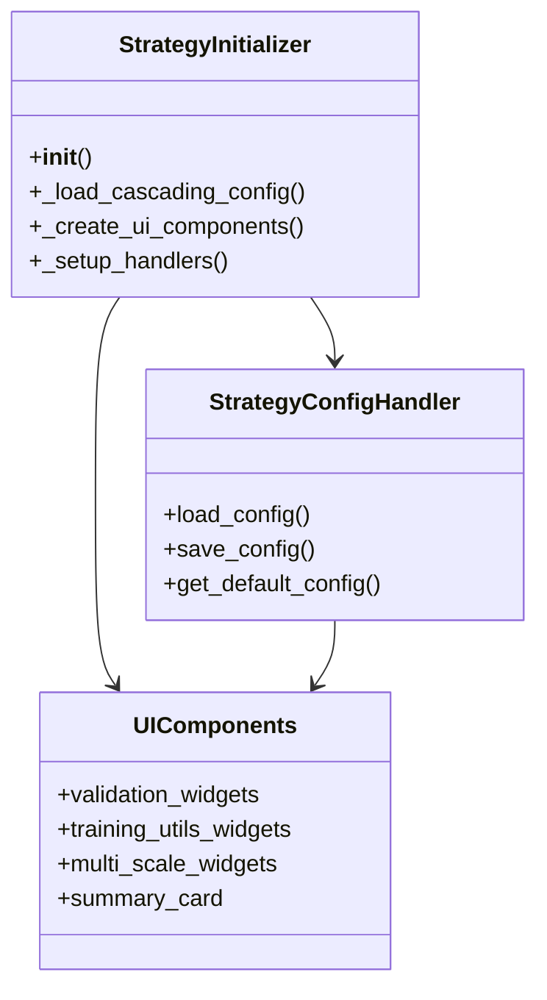
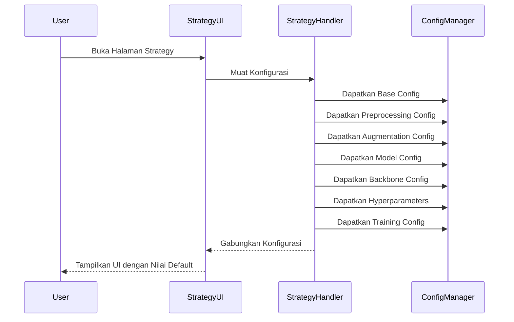
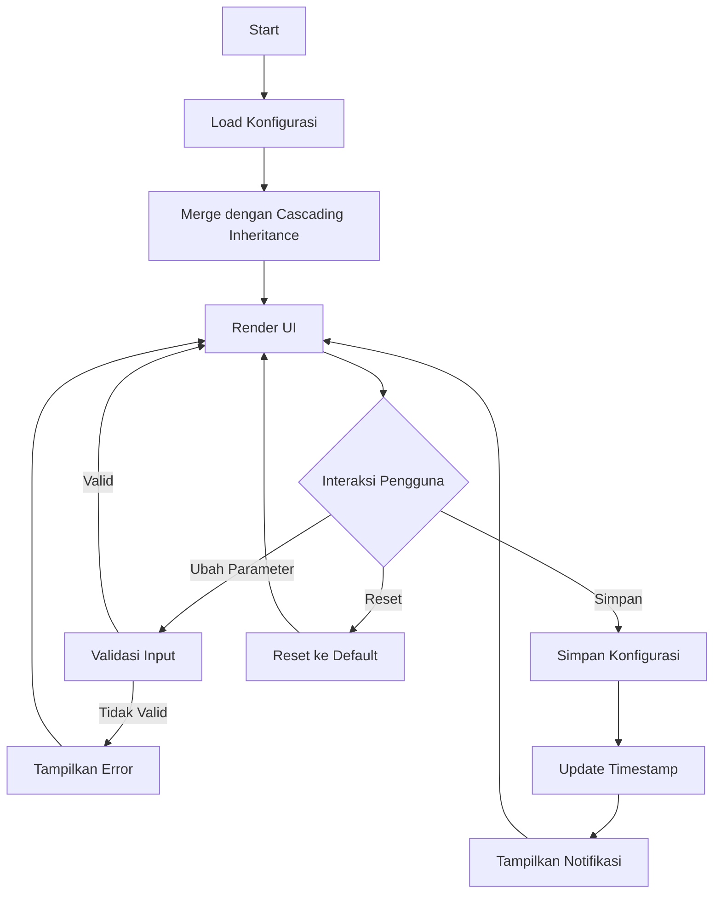

# Modul Strategy Configuration

**Versi Dokumen**: 1.0.0  
**Terakhir Diperbarui**: 4 Juli 2024  
**Kompatibilitas**: SmartCash v1.0.0+

## Daftar Isi
- [Gambaran Umum](#gambaran-umum)
- [Struktur Direktori](#struktur-direktori)
- [Komponen Utama](#komponen-utama)
- [Alur Kerja](#alur-kerja)
- [Diagram](#diagram)
- [Best Practices](#best-practices)
- [Troubleshooting](#troubleshooting)

## Gambaran Umum
Modul Strategy Configuration menyediakan antarmuka untuk mengatur strategi pelatihan dan validasi model. Modul ini mendukung cascading inheritance konfigurasi, memungkinkan pewarisan nilai dari konfigurasi lain (seperti preprocessing, augmentation, model, dll) dengan urutan prioritas yang jelas.

## Struktur Direktori
```
smartcash/ui/strategy/
├── __init__.py
├── strategy_init.py        # Inisialisasi modul
├── components/            # Komponen UI
│   ├── __init__.py
│   ├── ui_form.py        # Form input parameter
│   └── ui_layout.py      # Tataletak UI
├── handlers/              # Penangan logika bisnis
│   ├── __init__.py
│   ├── config_handler.py # Handler konfigurasi
│   └── defaults.py       # Nilai default
└── utils/                 # Utilitas
    └── __init__.py
```

## Komponen Utama

### 1. StrategyInitializer
- **Lokasi**: `strategy_init.py`
- **Fungsi**: Inisialisasi modul strategy
- **Fitur**:
  - Mengelola cascading inheritance konfigurasi
  - Membuat komponen UI
  - Menangani pembaruan konfigurasi

### 2. UI Components
- **Lokasi**: `components/`
- **Fitur**:
  - Form input parameter validasi
  - Pengaturan utilitas pelatihan
  - Opsi multi-scale training
  - Ringkasan konfigurasi

### 3. StrategyConfigHandler
- **Lokasi**: `handlers/config_handler.py`
- **Fungsi**: Menangani logika konfigurasi
- **Fitur**:
  - Cascading inheritance konfigurasi
  - Validasi parameter
  - Manajemen penyimpanan/load konfigurasi

### 4. Default Configuration
- **Lokasi**: `handlers/defaults.py`
- **Fungsi**: Menyediakan nilai default
- **Fitur**:
  - Nilai default untuk semua parameter
  - Preset konfigurasi
  - Validasi nilai default

## Alur Kerja

1. **Inisialisasi**
   - Muat konfigurasi dengan cascading inheritance
   - Buat komponen UI
   - Siapkan handler interaksi

2. **Konfigurasi**
   - Atur parameter validasi (IoU threshold, confidence threshold)
   - Konfigurasi utilitas pelatihan (log interval, visualisasi)
   - Aktifkan/matikan fitur (multi-scale, tensorboard)
   - Sesuaikan parameter lanjutan

3. **Validasi**
   - Validasi nilai parameter
   - Pastikan kompatibilitas antar parameter
   - Tampilkan ringkasan konfigurasi

4. **Penyimpanan**
   - Simpan konfigurasi
   - Update timestamp
   - Beri umpan balik visual

## Diagram

### Class Diagram


### Sequence Diagram - Load Config


### Flow Diagram


## Best Practices

1. **Manajemen Konfigurasi**
   - Gunakan cascading inheritance untuk menghindari duplikasi
   - Validasi konfigurasi sebelum disimpan
   - Sertakan timestamp pada konfigurasi yang disimpan

2. **Pengalaman Pengguna**
   - Beri umpan balik visual untuk perubahan konfigurasi
   - Sediakan ringkasan konfigurasi yang jelas
   - Validasi input secara real-time

3. **Optimasi**
   - Gunakan deep merge yang efisien
   - Batasi pembaruan UI yang tidak perlu
   - Cache konfigurasi yang sering diakses

4. **Pemeliharaan**
   - Dokumentasikan alur inheritance
   - Sertakan logging yang informatif
   - Tangani error dengan tepat

## Troubleshooting

### Konfigurasi Tidak Tersimpan
1. Periksa izin file
2. Verifikasi path penyimpanan
3. Cek log error

### Nilai Tidak Sesuai
1. Periksa cascading inheritance
2. Verifikasi nilai default
3. Cek konflik konfigurasi

### UI Lambat
1. Optimalkan deep merge
2. Batasi pembaruan UI
3. Gunakan lazy loading

### Error Validasi
1. Periksa rentang nilai
2. Verifikasi tipe data
3. Cek dependensi parameter

---

Dokumentasi terakhir diperbarui: 21 Juni 2025
