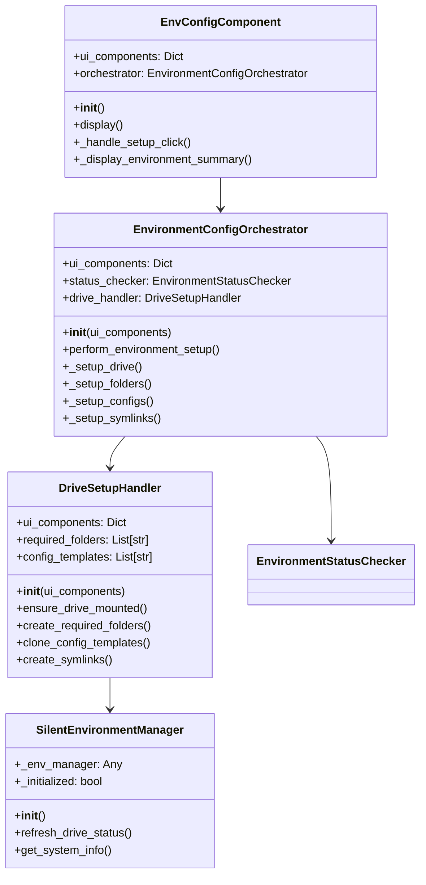
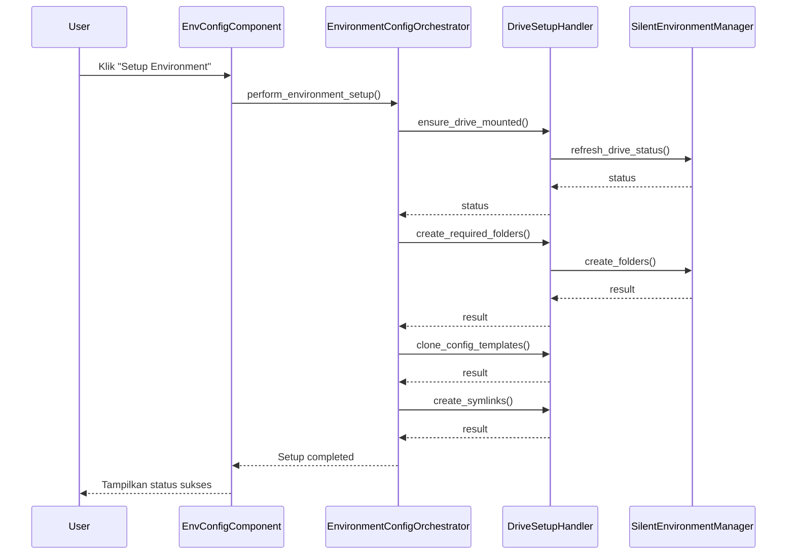
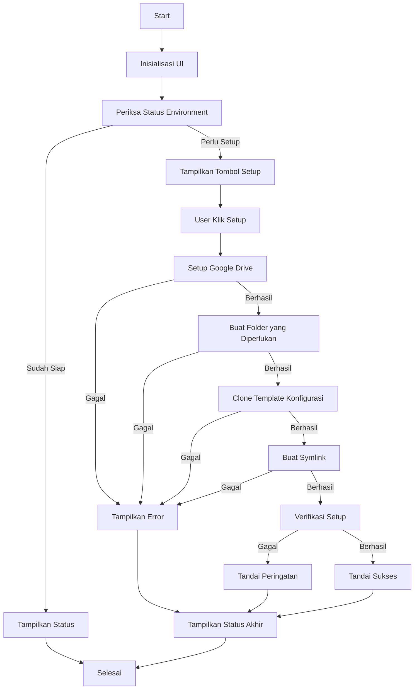

# Modul Colab Environment Configuration

**Versi Dokumen**: 1.0.0  
**Terakhir Diperbarui**: 4 Juli 2024  
**Kompatibilitas**: SmartCash v1.0.0+

## Daftar Isi
- [Gambaran Umum](#gambaran-umum)
- [Struktur Direktori](#struktur-direktori)
- [Komponen Utama](#komponen-utama)
- [Alur Kerja](#alur-kerja)
- [Diagram](#diagram)
- [Penggunaan](#penggunaan)
- [Best Practices](#best-practices)

## Gambaran Umum
Modul Environment Configuration bertanggung jawab untuk mengatur dan mengkonfigurasi environment yang dibutuhkan oleh aplikasi SmartCash. Modul ini menangani setup Google Drive, pembuatan folder yang diperlukan, cloning template konfigurasi, dan pembuatan symlink.

## Struktur Direktori
```
ui/setup/env_config/
├── __init__.py
├── components/           # Komponen UI
│   ├── __init__.py
│   ├── env_config_component.py  # Komponen utama
│   └── ui_factory.py            # Factory untuk komponen UI
├── constants.py          # Konstanta yang digunakan
├── env_config_initializer.py  # Inisialisasi UI
├── handlers/             # Handler logika bisnis
│   ├── __init__.py
│   ├── drive_setup_handler.py  # Handler setup Google Drive
│   └── environment_config_orchestrator.py  # Orkestrator utama
└── helpers/              # Utility helpers
    ├── __init__.py
    ├── silent_environment_manager.py  # Manager environment
    └── system_info_helper.py          # Helper info sistem
```

## Komponen Utama

### 1. EnvConfigComponent
- **Lokasi**: `components/env_config_component.py`
- **Fungsi**: Komponen UI utama yang menangani tampilan dan interaksi pengguna
- **Fitur**:
  - Menampilkan ringkasan environment
  - Menyediakan tombol setup
  - Menampilkan log dan progress

### 2. EnvironmentConfigOrchestrator
- **Lokasi**: `handlers/environment_config_orchestrator.py`
- **Fungsi**: Mengkoordinasikan proses setup environment
- **Fitur**:
  - Mengelola alur setup
  - Berkoordinasi dengan handler lainnya
  - Menangani error dan retry

### 3. DriveSetupHandler
- **Lokasi**: `handlers/drive_setup_handler.py`
- **Fungsi**: Menangani setup Google Drive
- **Fitur**:
  - Mount Google Drive
  - Membuat folder yang diperlukan
  - Mengkloning template konfigurasi

### 4. SilentEnvironmentManager
- **Lokasi**: `helpers/silent_environment_manager.py`
- **Fungsi**: Wrapper untuk environment manager yang menekan output
- **Fitur**:
  - Menyediakan akses ke environment manager
  - Menangani error secara graceful
  - Menyediakan informasi sistem

## Diagram

### Class Diagram


### Sequence Diagram


### Flow Diagram


## Best Practices

1. **Error Handling**
   - Selalu gunakan try-except untuk operasi yang berpotensi gagal
   - Berikan pesan error yang jelas dan informatif
   - Log semua error untuk keperluan debugging

2. **Progress Feedback**
   - Berikan umpan balik progress yang jelas
   - Update status secara berkala
   - Tampilkan estimasi waktu penyelesaian jika memungkinkan

3. **Resource Management**
   - Pastikan koneksi dan resource dibersihkan dengan benar
   - Gunakan context manager untuk manajemen resource
   - Handle kasus timeout dengan baik

4. **Testing**
   - Test semua alur penggunaan
   - Verifikasi integritas file setelah setup
   - Pastikan kompatibilitas dengan berbagai environment

5. **Dokumentasi**
   - Dokumentasikan semua fungsi publik
   - Sertakan contoh penggunaan
   - Jelaskan parameter dan return value dengan jelas

## Troubleshooting

### Google Drive Gagal Terhubung
1. Pastikan sudah login ke akun Google yang benar
2. Periksa koneksi internet
3. Verifikasi izin akses ke Google Drive

### Folder Tidak Terbuat
1. Pastikan ada cukup ruang penyimpanan
2. Verifikasi izin akses ke Google Drive
3. Periksa log untuk pesan error yang lebih detail

### Konfigurasi Gagal Disalin
1. Pastikan template konfigurasi tersedia
2. Verifikasi path tujuan dapat ditulisi
3. Periksa konflik nama file

---

Dokumentasi terakhir diperbarui: 21 Juni 2025
